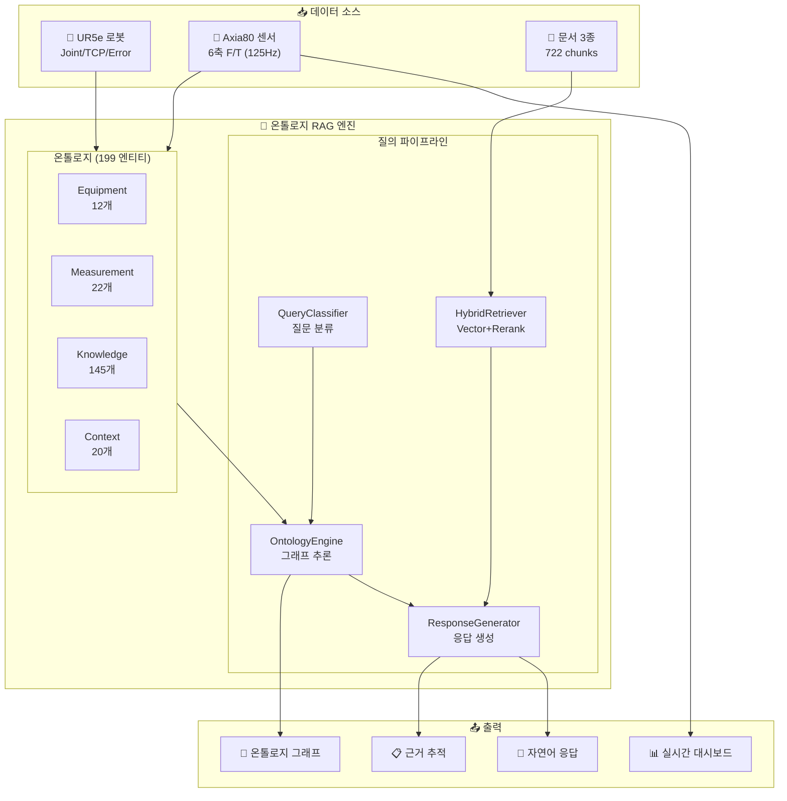
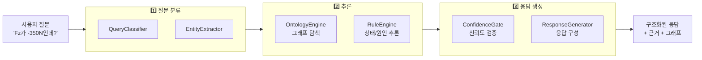
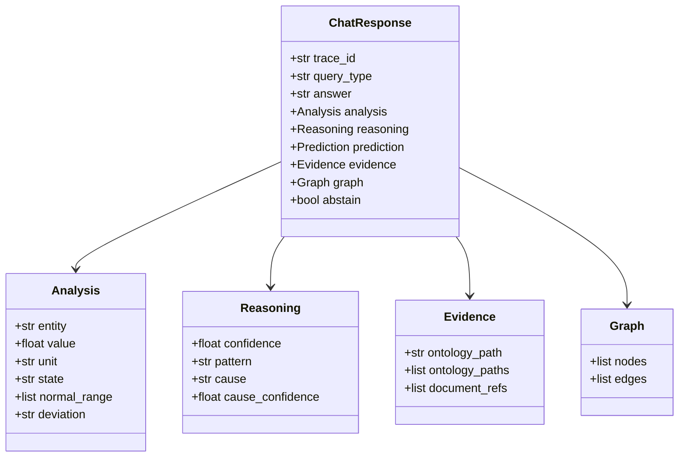
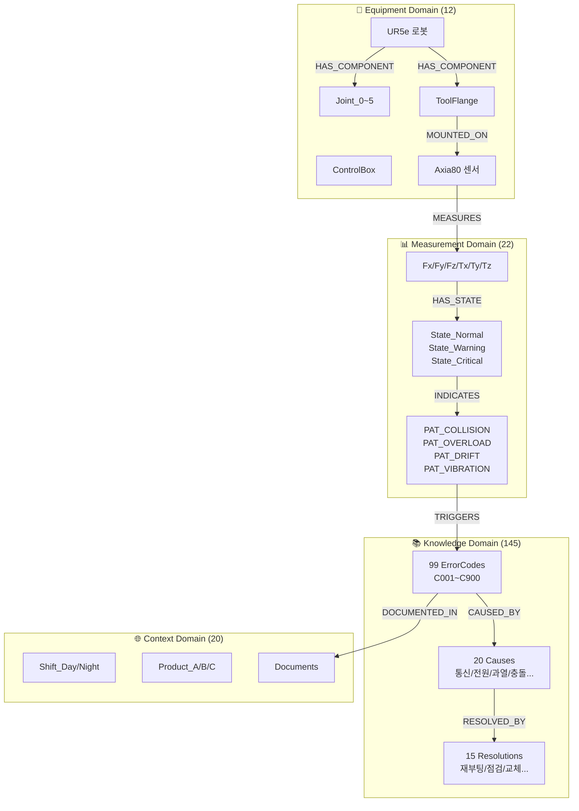
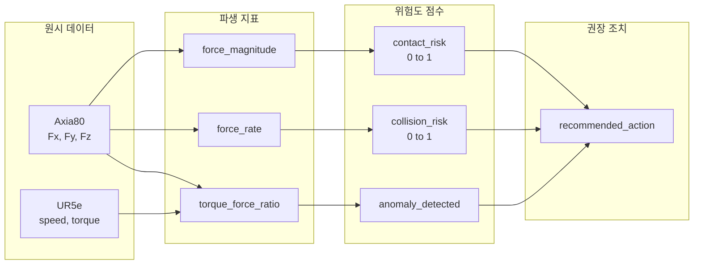

<div align="center">

# 제조 AX를 위한 온톨로지 기반 지능형 진단 시스템

**UR5e 협동로봇 + Axia80 힘/토크 센서의 이기종 데이터를 온톨로지로 연결하여,<br/>
관계 기반 추론과 예지보전을 실현하는 PoC(Proof of Concept) 시스템**

<br/>

[](https://python.org)
[](https://fastapi.tiangolo.com)
[](https://nextjs.org)
[](tests/)
[](LICENSE)
<br>
[](https://www.anthropic.com/)
[](https://openai.com/)
[](https://deepmind.google/technologies/gemini/)

</div>

<div align="center">

<!-- 메인 화면 스크린샷 -->

<br/>

<!-- GIF 데모 -->


<sub>▲ 질의응답 → 온톨로지 추론 → 근거 기반 응답 생성 과정</sub>

<br/>

</div>

---

## 프로젝트 배경 및 목적

### 왜 이 프로젝트인가?

대한민국 제조업의 미래는 **AX(AI Transformation)** 에 있습니다.<br> 기존 룰베이스(IF-THEN) 시스템은 단순 임계값 판단만 가능하지만, 실제 현장에서 필요한 것은 아래와 같습니다.

| 기존 시스템 | 이 프로젝트 |
|------------|-----------|
| "Fz가 -350N이면 경고" | "**왜** 이런 상황이 발생했는가?" (원인 추론) |
| 사후 대응만 가능 | "**내일** 어떤 문제가 생길까?" (예측) |
| 단일 데이터 분석 | "**지금 이 맥락**에서 최선의 조치는?" (맥락 기반 판단) |

### 프로젝트 목표

| 목표 | 내용 |
|------|------|
| **이기종 데이터 통합** | UR5e 로봇 + Axia80 센서 → 온톨로지로 관계 정의 |
| **관계 기반 추론** | "Fz=-350N" → 충돌 패턴 → C153 에러 가능성 → 권장 조치 |
| **근거 있는 예측** | 모든 응답에 온톨로지 경로 + 문서 출처 제시 |
| **PoC로 가치 입증** | 룰베이스 → 온톨로지 전환의 실질적 이점 검증 |

---

## 시스템 개요



---

## 프로젝트 현황 (v2.0)

| 항목 | v1.0 | v2.0 (현재) | 비고 |
|------|------|-------------|------|
| **온톨로지 엔티티** | 54개 | **199개** | +269% |
| **온톨로지 관계** | 62개 | **176개** | +184% |
| **에러 코드** | 14개 | **99개** | C001~C900 |
| **원인(Cause)** | 6개 | **20개** | 카테고리별 분류 |
| **해결책(Resolution)** | 5개 | **15개** | 단계별 가이드 |
| **패턴(Pattern)** | 4개 | **8개** | 충돌/과부하/진동 등 |
| **문서 청크** | 722개 | 722개 | 임베딩 완료 |
| **테스트 케이스** | - | **164개** | 100% 통과 |

---

## 핵심 기능

### 1. 챗봇 질의응답 파이프라인



### 2. 질문 유형별 처리

| 질문 유형 | 트리거 조건 | 처리 방식 | 예시 |
|----------|------------|----------|------|
| **ONTOLOGY** | 측정축 + 수치값 | 온톨로지 추론 우선 | "Fz가 -350N인데 이게 뭐야?" |
| **HYBRID** | 에러코드 + 해결 요청 | 온톨로지 + RAG 결합 | "C153 에러 해결 방법 알려줘" |
| **RAG** | 일반 문서 질의 | 벡터 검색 + 리랭킹 | "UR5e 조인트 설정 방법" |
| **DEFINITION** | 정의 질문 | 엔티티 속성 조회 | "Fz가 뭐야?", "UR5e 페이로드?" |
| **RELATION** | 관계 질문 | 그래프 탐색 | "Fz는 어떤 센서가 측정해?" |

### 3. 응답 구조



---

## 온톨로지 구조 (4-Domain)



### 관계 타입

| 관계 | 설명 | 예시 |
|------|------|------|
| `HAS_COMPONENT` | 장비 구성 | UR5e → Joint_0~5 |
| `MOUNTED_ON` | 장착 위치 | Axia80 → ToolFlange |
| `MEASURES` | 측정 대상 | Axia80 → Fz |
| `HAS_STATE` | 상태 보유 | Fz → State_Warning |
| `INDICATES` | 상태→패턴 | State_Critical → PAT_COLLISION |
| `TRIGGERS` | 패턴→에러 | PAT_COLLISION → C153 |
| `CAUSED_BY` | 원인 관계 | C153 → CAUSE_COLLISION |
| `RESOLVED_BY` | 해결 방법 | CAUSE_COLLISION → RES_CHECK_OBSTACLE |

---

## 이기종 데이터 상세

### Axia80 힘/토크 센서 데이터

> **ATI Axia80**: 미국 ATI사의 6축 힘/토크 센서. UR5e 툴플랜지에 장착되어 로봇 끝단의 힘과 토크를 125Hz로 실시간 측정.

| 필드명 | 타입 | 단위 | 정상 범위 | 설명 |
|--------|------|------|----------|------|
| `Fx` | float | N | -20 ~ +20 | X축 방향 힘 (수평) |
| `Fy` | float | N | -20 ~ +20 | Y축 방향 힘 (수평) |
| `Fz` | float | N | -60 ~ 0 | Z축 방향 힘 (수직, 가장 중요) |
| `Tx` | float | Nm | -2 ~ +2 | X축 회전 토크 |
| `Ty` | float | Nm | -2 ~ +2 | Y축 회전 토크 |
| `Tz` | float | Nm | -0.5 ~ +0.5 | Z축 회전 토크 |

**이상 패턴 임계값:**
| 패턴 | 조건 | 의미 |
|------|------|------|
| 충돌(Collision) | Fz < -350N (100ms 이내 급락) | 급격한 외부 충격 |
| 과부하(Overload) | \|Fz\| > 150N (5초 이상) | 지속적 과부하 |
| 드리프트(Drift) | baseline 대비 10%+ (30분 이상) | 센서 드리프트 |
| 진동(Vibration) | 표준편차 2배+ (10초 이상) | 비정상 진동 |

### UR5e 로봇 텔레메트리 (합성)

> **Universal Robots UR5e**: 덴마크 UR사의 6축 협동로봇. 페이로드 5kg, 리치 850mm. 본 PoC에서는 실제 연결 대신 시나리오 기반 합성 데이터를 사용.

| 필드명 | 타입 | 단위 | 범위 | 설명 |
|--------|------|------|------|------|
| `tcp_speed` | float | m/s | 0 ~ 1.0 | 툴 끝단(TCP) 이동 속도 |
| `tcp_acceleration` | float | m/s² | -5 ~ +5 | TCP 가속도 |
| `joint_torque_sum` | float | Nm | 0 ~ 150 | 6개 관절 토크 합계 |
| `joint_current_avg` | float | A | 0.5 ~ 5.0 | 평균 모터 전류 |
| `safety_mode` | enum | - | normal/reduced/protective_stop | 안전 모드 |
| `program_state` | enum | - | running/paused/stopped | 프로그램 상태 |
| `protective_stop` | bool | - | true/false | 보호정지 발생 여부 |

### 파생 지표 (상관분석 엔진 계산)

| 필드명 | 계산식 | 범위 | 설명 |
|--------|--------|------|------|
| `force_magnitude` | sqrt(Fx² + Fy² + Fz²) | 0~500 N | 합성 힘 크기 |
| `force_rate` | d\|F\|/dt | N/s | 힘 변화율 |
| `torque_force_ratio` | joint_torque_sum / max(\|F\|, 1) | - | 토크/힘 비율 |
| `contact_risk_score` | 복합 계산 | 0~1 | 접촉 위험도 |
| `collision_risk_score` | 복합 계산 | 0~1 | 충돌 위험도 |
| `anomaly_detected` | 토크↑ but 힘→ | bool | 이상 징후 (마모 등) |
| `recommended_action` | 위험도 기반 | enum | maintain/slow_down/stop/inspect |

---

## 이기종 실시간 상관분석

### 데이터 흐름



### 시나리오 기반 시뮬레이션

| 시나리오 | Fz 범위 | tcp_speed | 위험도 | 설명 |
|----------|---------|-----------|--------|------|
| `normal` | -30 ~ -10N | 0.2~0.4 m/s | 0.1~0.2 | 정상 작동 |
| `high_force` | -80 ~ -50N | 0.3~0.5 m/s | 0.4~0.6 | 힘 증가 |
| `contact` | -150 ~ -80N | 0.1~0.3 m/s | 0.6~0.8 | 접촉 감지 |
| `collision` | -350 ~ -200N | 0~0.1 m/s | 0.8~1.0 | 충돌 |

### 상관분석의 의미

단일 장비만 분석하면 "힘이 급증했다"(Axia80) 또는 "속도가 줄었다"(UR5e)만 알 수 있고, **왜** 그런지는 알 수 없습니다. 두 이기종 데이터를 결합하면 "고속 이동 중(tcp_speed↑) 접촉 발생(Fz↓) → 충돌 패턴"처럼 **인과관계**를 파악할 수 있어, 패턴 기반 예측과 예방 보전이 가능해집니다.

---

## 백엔드 아키텍처

### 모듈 구조

```
src/
├── api/                    # FastAPI 라우터
│   ├── routes/
│   │   ├── chat.py         # 질의응답 API
│   │   ├── sensors.py      # 센서 데이터 API
│   │   ├── ontology.py     # 온톨로지 탐색 API
│   │   └── correlation.py  # 상관분석 API
│   └── schemas/            # Pydantic 스키마
│
├── rag/                    # RAG 파이프라인 (2,400+ 줄)
│   ├── query_classifier.py # 질문 분류 (406줄)
│   ├── entity_extractor.py # 엔티티 추출 (599줄)
│   ├── confidence_gate.py  # 신뢰도 게이트 (245줄)
│   ├── response_generator.py # 응답 생성 (920줄)
│   └── prompt_builder.py   # 프롬프트 구성 (220줄)
│
├── ontology/               # 온톨로지 엔진 (3,800+ 줄)
│   ├── ontology_engine.py  # 추론 엔진 (1,940줄)
│   ├── rule_engine.py      # 규칙 엔진 (960줄)
│   ├── graph_traverser.py  # 그래프 탐색 (599줄)
│   └── loader.py           # 온톨로지 로더 (216줄)
│
├── sensor/                 # 센서 처리
│   ├── sensor_store.py     # 시계열 저장소
│   ├── pattern_detector.py # 패턴 감지
│   └── correlation_engine.py # 상관분석
│
└── embedding/              # 벡터 검색
    ├── vector_store.py     # ChromaDB (400줄)
    ├── embedder.py         # OpenAI 임베딩 (163줄)
    └── reranker.py         # Cross-Encoder (241줄)
```

### API 엔드포인트

| 엔드포인트 | 메서드 | 설명 |
|-----------|--------|------|
| `/health` | GET | 헬스체크 |
| `/api/chat` | POST | 질의응답 |
| `/api/evidence/{trace_id}` | GET | 근거 상세 |
| `/api/ontology/entities` | GET | 전체 엔티티 (199개) |
| `/api/ontology/graph` | GET | 서브그래프 조회 |
| `/api/ontology/neighbors/{id}` | GET | 이웃 노드 |
| `/api/sensors/readings` | GET | 센서 측정값 |
| `/api/sensors/patterns` | GET | 감지된 패턴 |
| `/api/sensors/stream` | GET | SSE 실시간 스트림 |
| `/api/correlation/data` | GET | 상관분석 데이터 |
| `/api/correlation/stream` | GET | 상관분석 SSE |

---

## 프론트엔드 아키텍처

### 컴포넌트 구조

```
frontend/src/
├── app/                    # Next.js App Router
│   └── page.tsx            # 메인 대시보드
│
├── components/
│   ├── chat/               # 챗봇 UI
│   │   ├── ChatPanel.tsx   # 채팅 패널
│   │   ├── MessageBubble.tsx
│   │   └── ExampleButtons.tsx # 예시 질문 (38개)
│   │
│   ├── graph/              # 온톨로지 그래프
│   │   ├── GraphView.tsx   # D3.js 시각화
│   │   └── NodeDetail.tsx
│   │
│   ├── live/               # 실시간 모니터링
│   │   ├── LiveMonitor.tsx
│   │   ├── SensorChart.tsx
│   │   └── CorrelationTable.tsx
│   │
│   └── ui/                 # shadcn/ui 컴포넌트
│
└── hooks/
    └── useApi.ts           # React Query 훅
```

### 주요 화면

| 탭 | 기능 | 컴포넌트 |
|-----|------|---------|
| **Chat** | 자연어 질의응답 | ChatPanel, MessageBubble |
| **Graph** | 온톨로지 탐색 | GraphView (D3.js) |
| **Live** | 실시간 모니터링 | LiveMonitor, SensorChart |
| **Correlation** | 이기종 상관분석 | CorrelationTable |
| **History** | 이벤트/패턴 이력 | EventList, PatternList |

---

## 테스트 현황

| 테스트 유형 | 개수 | 통과율 | 커버리지 |
|------------|------|--------|---------|
| **Unit Tests** | 136개 | 100% | 백엔드 핵심 모듈 |
| **Integration Tests** | 14개 | 100% | API 통합 테스트 |
| **예시 질문** | 38개 | 100% | 전체 질문 유형 |
| **합계** | **164개** | **100%** | - |

### 예시 질문 카테고리

| 카테고리 | 개수 | 예시 |
|----------|------|------|
| 센서 값 분석 | 6개 | "Fz가 -350N인데 이게 뭐야?" |
| 패턴 질문 | 5개 | "최근 충돌 패턴이 있어?" |
| 에러코드 | 6개 | "C153 에러 해결 방법" |
| 정의 질문 | 8개 | "Fz가 뭐야?", "UR5e 페이로드?" |
| 비교 질문 | 4개 | "Fx와 Fy 차이가 뭐야?" |
| 관계 질문 | 5개 | "Fz는 어떤 센서가 측정해?" |
| RAG 질문 | 4개 | "조인트 설정 방법" |

---

## 시작하기

### 요구사항

- Python 3.10+
- Node.js 18+
- OpenAI API Key

### 설치

```bash
# 1. 저장소 클론
git clone https://github.com/your-username/ur5e-ontology-rag.git
cd ur5e-ontology-rag

# 2. Python 가상환경
python -m venv venv
source venv/bin/activate  # Windows: venv\Scripts\activate
pip install -r requirements.txt

# 3. 환경변수 설정
cp .env.example .env
# .env 파일에 OPENAI_API_KEY 입력

# 4. 프론트엔드 의존성
cd frontend && npm install && cd ..
```

### 실행

```bash
# 백엔드 (포트 8000)
python scripts/run_api.py

# 프론트엔드 (포트 3000) - 새 터미널
cd frontend && npm run dev
```

브라우저에서 http://localhost:3000 접속

---

## 기술 스택

### Backend

| 기술 | 버전 | 용도 |
|------|------|------|
| Python | 3.10+ | 런타임 |
| FastAPI | 0.100+ | REST API 서버 |
| ChromaDB | 0.4+ | 벡터 데이터베이스 |
| Pandas | 2.0+ | 데이터 처리 |
| PyArrow | - | Parquet I/O |
| sentence-transformers | - | Cross-Encoder 리랭킹 |

### Frontend

| 기술 | 버전 | 용도 |
|------|------|------|
| Next.js | 16 | React 프레임워크 |
| TypeScript | 5.0+ | 타입 안전성 |
| Tailwind CSS | 3.0+ | 스타일링 |
| shadcn/ui | - | UI 컴포넌트 |
| D3.js | 7.0+ | 그래프 시각화 |
| TanStack Query | 5.0+ | 데이터 페칭/캐싱 |

### AI/ML

| 기술 | 용도 |
|------|------|
| GPT-4o-mini | 추론 및 응답 생성 |
| text-embedding-3-small | 문서 임베딩 (1536차원) |
| ms-marco-MiniLM-L-6-v2 | Cross-Encoder 리랭킹 |

---

## 문서 구조

### 핵심 설계 (docs/core/)

| 문서 | 설명 |
|------|------|
| [Unified_Spec.md](docs/core/Unified_Spec.md) | 전체 기술 설계서 |
| [Unified_ROADMAP.md](docs/core/Unified_ROADMAP.md) | 개발 로드맵 |
| [온톨로지_스키마_설계.md](docs/core/온톨로지_스키마_설계.md) | 4-Domain 온톨로지 스키마 |
| [시스템_파이프라인_아키텍처.md](docs/core/시스템_파이프라인_아키텍처.md) | 백엔드/프론트엔드 파이프라인 상세 |
| [이기종_데이터_및_이벤트_명세.md](docs/core/이기종_데이터_및_이벤트_명세.md) | Axia80+UR5e 데이터/이벤트 상세 |

### 개발 단계 (docs/steps/)

| Step | 설계 | 완료 |
|------|------|------|
| 01. 환경설정 | [설계](docs/steps/step_01_환경설정_설계.md) | [완료](docs/steps/step_01_환경설정_완료.md) |
| 02. 데이터준비 | [설계](docs/steps/step_02_데이터준비_설계.md) | [완료](docs/steps/step_02_데이터준비_완료.md) |
| 03. 문서인덱싱 | [설계](docs/steps/step_03_문서인덱싱_설계.md) | [완료](docs/steps/step_03_문서인덱싱_완료.md) |
| 04. 온톨로지스키마 | [설계](docs/steps/step_04_온톨로지스키마_설계.md) | [완료](docs/steps/step_04_온톨로지스키마_완료.md) |
| 05. 엔티티관계구축 | [설계](docs/steps/step_05_엔티티관계구축_설계.md) | [완료](docs/steps/step_05_엔티티관계구축_완료.md) |
| 06. 추론규칙 | [설계](docs/steps/step_06_추론규칙_설계.md) | [완료](docs/steps/step_06_추론규칙_완료.md) |
| 07. 센서데이터처리 | [설계](docs/steps/step_07_센서데이터처리_설계.md) | [완료](docs/steps/step_07_센서데이터처리_완료.md) |
| 08. 패턴감지 | [설계](docs/steps/step_08_패턴감지_설계.md) | [완료](docs/steps/step_08_패턴감지_완료.md) |
| 09. 온톨로지연결 | [설계](docs/steps/step_09_온톨로지연결_설계.md) | [완료](docs/steps/step_09_온톨로지연결_완료.md) |
| 10. 질문분류기 | - | [완료](docs/steps/step_10_질문분류기_완료.md) |
| 11. 온톨로지추론 | - | [완료](docs/steps/step_11_온톨로지추론_완료.md) |
| 12. 응답생성 | [설계](docs/steps/step_12_응답생성_설계.md) | [완료](docs/steps/step_12_응답생성_완료.md) |
| 13. UI/API계약 | [설계](docs/steps/step_13_UI및API계약_설계.md) | [완료](docs/steps/step_13_UI및API계약_완료.md) |
| 14. 프론트엔드구현 | [설계](docs/steps/step_14_프론트엔드구현_설계.md) | [완료](docs/steps/step_14_프론트엔드구현_완료.md) |
| 15. 센서실시간검증 | [설계](docs/steps/step_15_센서실시간및검증_설계.md) | [완료](docs/steps/step_15_센서실시간및검증_완료.md) |
| 16. 통합테스트 | [설계](docs/steps/step_16_통합테스트_설계.md) | [완료](docs/steps/step_16_통합테스트_완료.md) |
| 17. 데모시나리오 | [설계](docs/steps/step_17_데모시나리오_설계.md) | [완료](docs/steps/step_17_데모시나리오_완료.md) |

| 추가 문서 | 설명 |
|----------|------|
| [step_14_하이브리드검색기_통합.md](docs/steps/step_14_하이브리드검색기_통합.md) | HybridRetriever 통합 |
| [step_15_파이프라인_최적화.md](docs/steps/step_15_파이프라인_최적화.md) | 파이프라인 최적화 |
| [step_16_RAG_시스템_종합분석.md](docs/steps/step_16_RAG_시스템_종합분석.md) | RAG 시스템 분석 |
| [step_17_온톨로지_개선.md](docs/steps/step_17_온톨로지_개선.md) | 온톨로지 개선 |
| [step_18_시스템_종합점검.md](docs/steps/step_18_시스템_종합점검.md) | 시스템 종합 점검 |
| [step_19_종합테스트_보고서.md](docs/steps/step_19_종합테스트_보고서.md) | 종합 테스트 결과 |

### 챗봇 문서 (docs/ontology-chatbot/)

| 문서 | 설명 |
|------|------|
| [챗봇_파이프라인_아키텍처.md](docs/ontology-chatbot/챗봇_파이프라인_아키텍처.md) | 질의응답 파이프라인 설계 |
| [챗봇_문제해결_로그.md](docs/ontology-chatbot/챗봇_문제해결_로그.md) | 개발 중 문제 해결 기록 |
| [온톨로지_확장_v2.0.md](docs/ontology-chatbot/온톨로지_확장_v2.0.md) | 온톨로지 v2.0 확장 내역 |
| [온톨로지_그래프_탐색_API.md](docs/ontology-chatbot/온톨로지_그래프_탐색_API.md) | 그래프 탐색 API 명세 |
| [온톨로지_그래프_사용자_가이드.md](docs/ontology-chatbot/온톨로지_그래프_사용자_가이드.md) | 그래프 UI 사용 가이드 |

### UI 기능 (docs/ui-features/)

| 문서 | 설명 |
|------|------|
| [이기종_실시간_상관분석_설계.md](docs/ui-features/이기종_실시간_상관분석_설계.md) | Axia80+UR5e 상관분석 설계 |

### 참조 문서 (docs/references/)

| 문서 | 설명 |
|------|------|
| [SoT_백엔드_API_가이드.md](docs/references/SoT_백엔드_API_가이드.md) | 백엔드 API 레퍼런스 |
| [SoT_UI_설계_명세서.md](docs/references/SoT_UI_설계_명세서.md) | UI 설계 명세 |
| [SoT_재현성_가이드.md](docs/references/SoT_재현성_가이드.md) | 환경 재현 가이드 |
| [SoT_스모크테스트_결과.md](docs/references/SoT_스모크테스트_결과.md) | 스모크 테스트 결과 |
| [SoT_백엔드_검증_리포트.md](docs/references/SoT_백엔드_검증_리포트.md) | 백엔드 검증 결과 |
| [SoT_프론트엔드_검증_리포트.md](docs/references/SoT_프론트엔드_검증_리포트.md) | 프론트엔드 검증 결과 |
| [SoT_프론트엔드_구현_리포트.md](docs/references/SoT_프론트엔드_구현_리포트.md) | 프론트엔드 구현 결과 |

### 분석 보고서 (docs/reports/)

| 문서 | 설명 |
|------|------|
| [UR5e_로봇_분석_보고서.md](docs/reports/domain/robot/UR5e_로봇_분석_보고서.md) | UR5e 로봇 도메인 분석 |
| [Axia80_센서_분석_보고서.md](docs/reports/domain/sensor/Axia80_센서_분석_보고서.md) | Axia80 센서 도메인 분석 |

---

## 라이선스

MIT License

---

## 기여

이 프로젝트는 제조 AX의 가능성을 탐구하기 위한 PoC입니다.
피드백과 제안은 언제나 환영합니다.
