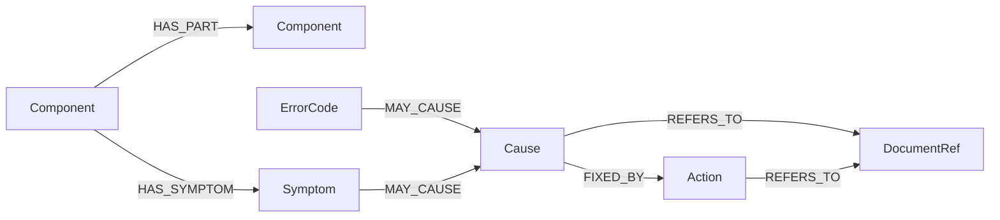
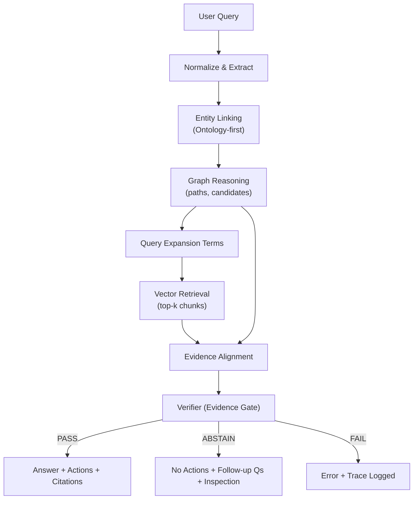
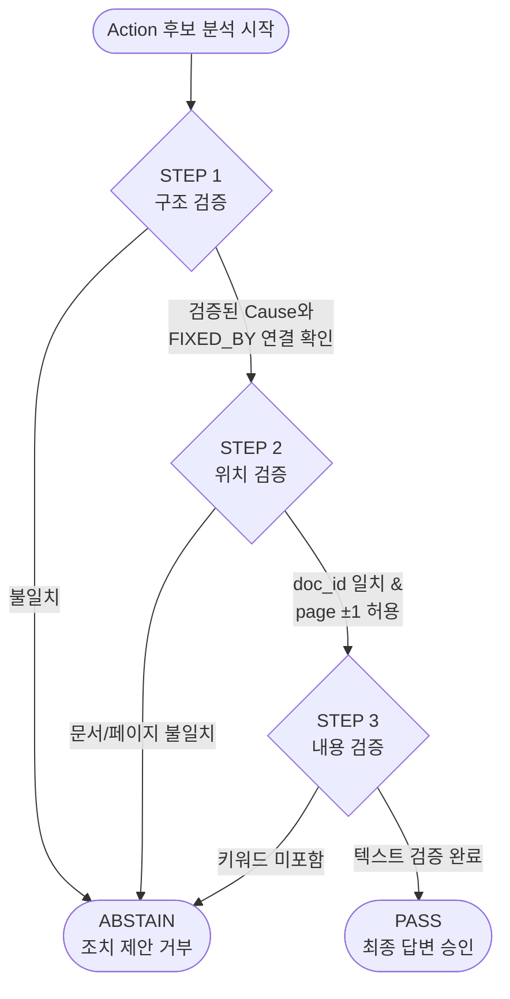

# UR5e Ontology RAG 시스템 - 기술 설계서

---

## 📋 목차
1. 프로젝트 개요  
2. 타겟 디바이스 선정  
3. 공식 문서 데이터 (Ground Truth)  
4. 시스템 아키텍처(System Architecture)  
5. 폴더 구조 *(TBD)*  
6. 구성요소별 기술 스택 및 역할 *(TBD)*  
7. API Contract: 인터페이스 명세 *(TBD)*  
8. 온톨로지 구조 설계 *(TBD)*  
9. 근거 검증 규칙 *(TBD)*  
10. 정량적 성능 평가 계획 *(TBD)*  
11. 예외 처리 및 보안정책 *(TBD)*  

---

## 1. 프로젝트 개요

### 1.1 배경 및 문제점
- 설비 매뉴얼/에러코드 문서가 방대하고, 버전 및 형식(PDF/Web)이 분산되어 있어 현장에서 정보 탐색 시간이 큼
- 현장 엔지니어의 서술(구어체/약어/별칭)이 통일되지 않아 키워드 검색 및 RAG 품질이 흔들릴 수 있음
- 근거 없는 조치(Action) 제안은 안전/품질 리스크로 이어질 수 있음

### 1.2 프로젝트 목적
- **공식 Document Set을 단일 근거(Ground Truth)로 사용**
- 모호한 질의에 대해 **“증상-부품-원인-조치” 구조로 정규화(온톨로지 기반)**
- 답변마다 **근거(문서: doc/page/chunk)** + **추론 경로(그래프 path)**를 함께 제공하여 신뢰성 확보
- 초보 엔지니어가 **1차 진단/점검을 수행**할 수 있는 수준의 가이드 제공

### 1.3 핵심 가치
- 근거 우선: 근거가 없으면 답변을 제한하고 추가 질문으로 정보 보강
- 추적 가능성: “왜 이 결론?”을 온톨로지 경로와 근거로 설명
- 운영 가능: 도메인 지식은 `ontology.json`으로 지속 추가/수정 가능
- 현장 효율: 시나리오/매뉴얼 탐색 시간을 절감

### 1.4 최종 산출물
- **대시보드(Demo)**: 질문/답변 + 근거 문서 미리보기 + 그래프 추론 경로 시각화
- **엔진(Core)**: Ontology Reasoning(Neo4j) + Hybrid RAG(ChromaDB) + Verifier(Evidence Gate) + LLM(요약/생성)
- **데이터팩(Data)**:
  - UR5e Official Document Set(PDF)
  - `ontology.json` (Neo4j 적재용)
  - `sources.yaml`, `chunk_manifest.jsonl` (근거 추적 메타데이터)
  - ChromaDB persisted index
  - `audit_trail.jsonl` (trace 기반 감사/평가 로그)

---

## 2. 타겟 디바이스 선정 (UR5e)

### 2.1 선정 이유 (WHY)
1) 공식 문서의 완전성  
- Service Manual 및 Error Codes Directory가 공개되어 Ground Truth 확보가 용이

2) 글로벌 협동로봇 시장에서의 높은 활용도  
- 현장 적용 시나리오(고장/점검/수리)가 풍부하고 실무 활용도가 높음

3) 용어/인터페이스 표준이 잘 잡혀 있음  
- PolyScope 및 문서 체계가 비교적 정돈되어 있어 온톨로지 정규화/매핑에 유리

### 2.2 범위 설정 (Scope)
- 핵심 부품: 5~10개 핵심 부품 우선 집중 (예: Joint, Controller, Safety 등)
- 유지보수 시나리오: 10~20개 주요 고장/점검 시나리오 정의 (예: 특정 에러코드/증상 기반)

---

## 3. 공식 문서 데이터 (Ground Truth)

### 3.1 사용 문서
- Service Manual (e-Series): 문제 해결, 서비스 절차, 부품 교체 가이드
- Error Codes Directory (PolyScope): 에러 코드 → 설명 → 조치 매핑
- User Manual (UR5e): 운영 맥락, 안전 지침, 용어 정의 및 정렬
- Online Manuals Index (Support Site): 문서 간 상호참조 및 최신 업데이트 확인 (Reference)

> 원칙: **다음 3~4개 공식 PDF를 유일한 Ground Truth 소스로 사용**하여 신뢰성을 확보한다.

### 3.2 문서 식별자(doc_id) 정책 (권장)
- 모든 문서는 `doc_id`로 식별하며, 근거 조회/미리보기/감사로그에서 공통 키로 사용한다.
- 예: `UR_ServiceManual_eSeries_vX`, `UR_ErrorCodes_PolyScope_vY`, `UR5e_UserManual_vZ`

---

## 4. 시스템 아키텍처(System Architecture) — Ontology-first Hybrid RAG

### 4.1 설계 목표 (Ontology가 1번, RAG는 2번)
- **온톨로지 우선(Ontology-first)**: 사용자의 자연어 질의를 먼저 **온톨로지 엔티티/관계로 정규화**하고, 그래프 경로 기반으로 “가능한 원인/조치 후보”를 구성한다.
- **근거 우선(Evidence-first)**: 문서 근거(`doc/page/chunk`) 또는 그래프 경로가 없는 정보는 **강한 단정 출력 금지**(제한/추가질문으로 전환)한다.
- **추적 가능(Traceability)**: 모든 요청/응답은 `trace_id`로 재현 가능해야 한다. (입력 → 엔티티링킹 → 그래프경로 → 검색 → 검증 → 출력)
- **하이브리드 추론(Hybrid Reasoning)**:  
  - Graph(Neo4j) = 도메인 구조 + 인과/조치 논리의 뼈대  
  - Vector(ChromaDB) = 공식 문서 근거 확보(grounding)  
  - **원칙:** “그래프로 방향 잡고, 문서로 증명한다.”
- **안전한 조치(Action Safety)**: 조치(Action)는 **문서 인용(citation) 필수**. 근거 부족 시 **ABSTAIN(조치 제안 금지)** 한다.
- **운영 가능(Operability)**: 배치 인덱싱/그래프 적재/로그 수집이 분리되어 반복 운영 가능해야 한다.

---

### 4.2 전체 구성 (Offline + Online)

#### 4.2.1 Offline (One-time/Batch): Data Preparation
Offline 단계는 Online 단계가 “즉시 질의응답”할 수 있도록 아래 5가지를 준비한다.
1) **문서 텍스트 인덱스(Vector Store)**
2) **근거 추적 메타데이터(Evidence Metadata)**
3) **원본 PDF 저장소(PDF Repository)**
4) **온톨로지 그래프(Graph DB)**
5) **온톨로지 사전/동의어/정규화 룰(Ontology Lexicon)** *(온톨로지 중심을 위해 추가)*

#### 4.2.2 Online (Runtime): Inference & Serving
Online 단계는 UI → API → Core Logic 순으로 요청을 처리하며,
- 모든 처리 결과는 `trace_id`에 귀속된다.
- UI는 답변뿐 아니라 “근거 페이지 미리보기”와 “그래프 경로(왜 그런지)”를 함께 보여준다.
- 핵심 흐름은 **(자연어 → 온톨로지 정규화/추론) → (문서 근거로 검증/승인)** 이다.

---

### 4.3 Layer별 책임과 데이터 계약

#### 4.3.1 Layer 1 — UI (Streamlit Dashboard)
**책임**
- 엔지니어 질의 입력 및 결과 시각화
- 답변 “본문” + “근거 미리보기” + “그래프 경로(노드/관계)”를 한 화면 제공
- ABSTAIN 시: 조치 대신 **추가 질문 / 점검 체크리스트** 중심으로 UX 제공

**UI 핵심 데이터**
- `user_query`, `trace_id`
- `answer`
- `structured_data`: (증상-부품-원인-조치) 구조화 결과
- `evidence`: 문서 근거 목록(각 근거의 `doc/page/chunk` + `snippet`)
- `graph_path`: 그래프 추론 경로(노드/관계 시퀀스)
- `verifier_status`: PASS / ABSTAIN / FAIL
- (권장) `why_this`: “그래프 경로 요약 + 근거 요약” 한 줄 카드

---

#### 4.3.2 Layer 2 — API (FastAPI Server)
**책임**
- 외부 요청 단일 진입점(권한/입력 검증/레이트리밋/로깅)
- Core Logic 실행 트리거 및 결과 반환
- 근거/미리보기/헬스체크 등 부가 엔드포인트 제공

**권장 엔드포인트**
- `POST /query`
  - 입력: `user_query`, (optional) `session_id`, (optional) `filters`
  - 출력: `trace_id`, `verifier_status`, `answer`, `structured_data`, `verifier_result`
- `GET /evidence/{trace_id}`
  - 출력: `evidence`, `graph_path`, `ontology_debug(링킹결과)`, `retrieval_debug`, `audit_summary`
- `GET /preview?doc_id=...&page=...`
  - 출력: 해당 PDF 페이지 렌더(이미지/바이너리)
- `GET /health`
  - Neo4j/ChromaDB/파일스토어/LLM 연결 상태 점검

---

#### 4.3.3 Layer 3 — Core Logic (Ontology-first 질의 처리 파이프라인)
Core Logic은 “한 번의 질의”를 처리하는 고정된 파이프라인이다.  
핵심 컨셉은 다음과 같다.

- 자연어를 **온톨로지 엔티티/관계로 변환(정규화/링킹)** 해서 “추론 가능한 형태”로 만든다.
- 그래프가 생성한 후보(원인/조치/키워드)를 바탕으로 문서 검색을 수행하고,
- 문서 근거를 통해 최종 출력(특히 Action)을 **검증/승인**한다.

##### Step 0) Trace 생성 & 입력 정규화
- `trace_id` 발급(UUID 권장)
- 텍스트 정규화: 공백/기호/대소문자/한영 혼용/에러코드 표기(C-153, C153 등) 통일
- (선택) `session_id` 기반 최소 맥락 결합(최근 엔티티 유지 정도만)

##### Step 1) Entity Extraction (LLM-assisted) — 엔티티 “후보” 생성
- 질의에서 엔티티 후보를 추출한다. *(감지 단계)*
  - 예: `ErrorCode`, `Symptom`, `Component`, (선택) `Condition/Context`
- 이 결과는 아직 텍스트 후보이므로, 바로 Neo4j에 넣지 않고 Step 2에서 고정한다.

##### Step 2) Entity Linking (Ontology 핵심) — 후보를 그래프 노드 ID로 “고정”
- Step 1 후보를 **온톨로지 노드 ID**에 매핑한다. *(정규화/고정 단계)*
- 링크 방식(권장 혼합)
  - 사전/동의어 매칭: `ontology.json`의 `synonyms`
  - 정규표현식 룰: 에러코드/부품코드/표준 표기
  - (선택) 임베딩 유사도 기반 후보 보강
- 산출물
  - `linked_entities`: `{entity_type, node_id, confidence, matched_by}`
- 링크 실패 시 정책
  - 즉시 FAIL이 아니라, **추가 질문 후보 생성**(NEED_MORE_INFO)으로 전환  
    - 예: “에러코드가 C153 맞나요?”, “증상이 보호정지인가요, 브레이크 저항인가요?”

##### Step 3) Ontology Reasoning (Neo4j) — 그래프 경로로 “원인/조치 후보” 생성
- 링크된 엔티티를 seed로 Cypher 실행
- 산출물
  - `graph_paths`: 가능한 추론 경로들  
    - 예: `Symptom → MAY_CAUSE → Cause → FIXED_BY → Action`
  - `candidate_causes/actions`: 그래프 기반 Top-N 후보
  - `expansion_terms`: 관련 부품/동의어/연관 에러코드 등 검색 확장 키워드
- 중요한 규칙
  - 그래프는 “가능한 후보”를 낸다.
  - **확정/조치 제안은 문서 근거로만 한다.**

##### Step 4) Graph-guided Query Building — “그래프가 만든 검색 쿼리”
- `expanded_query = user_query + expansion_terms + (optional) doc_hint`
- (선택) `DocumentRef(REFERS_TO)`가 있다면 `doc_id` 힌트로 필터링 강화 가능  
  - 예: “이 조치는 Service Manual 섹션을 참조” 같은 힌트

##### Step 5) Vector Retrieval (ChromaDB) — 문서 근거 확보
- `expanded_query`를 embedding → top-k chunk 검색
- chunk 메타데이터(필수)
  - `doc_id`, `page`, `section`, `chunk_id`, `score`
- (권장) 그래프 힌트 기반 re-ranking
  - 그래프가 언급한 부품/원인/조치 키워드가 chunk에 포함되면 가점

##### Step 6) Evidence Alignment — 근거 정합성 정리
- retrieval 결과를 “근거 후보(evidence candidates)”로 정리한다.
- 같은 `doc_id/page`는 묶어서 미리보기/인용에 유리하게 만든다.
- (권장) Action 키워드가 chunk에 실제로 등장하는지 확인(헛인용 방지)

##### Step 7) Verifier (Evidence Gate) — 출력 제어(안전장치)
Verifier는 “출력 가능 여부”를 결정한다.
- **PASS**: 근거 충분 → 답변/조치 출력 허용
- **ABSTAIN**: 근거 부족 → 조치 금지 + 추가 질문/점검 후보 중심
- **FAIL**: 시스템 오류(DB 다운/타임아웃/내부 예외)

Verifier 핵심 규칙(요약)
- Cause(원인)
  - `graph_path` 존재 AND/OR 문서 근거 score 임계치 충족 시 “원인 후보”로 제시 가능  
  - 단, “확정” 표현은 금지하고 “가능성/후보” 톤 유지
- Action(조치)
  - **문서 citation(`doc_id/page/chunk`)이 반드시 있어야 출력 가능**
  - 그래프에 `FIXED_BY`가 있어도 문서 근거 없으면 **Action은 ABSTAIN**

##### Step 8) Answer Drafting (LLM) + Response Formatting
- LLM은 “문장화/요약/가독성” 역할에 집중(사실 생성 금지)
- 최종 출력은 구조화 포맷으로 고정한다.
  - Top causes (근거 + 그래프 경로)
  - Inspection steps (안전한 점검 순서)
  - Actions (Verifier 통과한 것만)
  - Evidence (`doc/page/chunk` + snippet)
  - Graph path (노드/관계 시퀀스)
  - `trace_id`, `verifier_status`

---

### 4.4 Layer 4 — Data Stores & Logging

#### 4.4.1 Neo4j (Graph DB) — 추론의 뼈대
- 역할: 온톨로지 기반 경로 탐색, 인과 구조 제공, query expansion 생성
- 저장 대상(예시)
  - Node: Component / Symptom / ErrorCode / Cause / Action / DocumentRef
  - Relationship: HAS_PART, HAS_SYMPTOM, MAY_CAUSE, FIXED_BY, REFERS_TO
- (권장) 무결성/인덱스
  - 고유 제약: `*_id UNIQUE`
  - 텍스트 검색: `name/synonyms` fulltext index

#### 4.4.2 ChromaDB Persisted Index (Vector Store) — 문서 근거
- 역할: 문서 chunk 임베딩 기반 top-k 검색
- 저장 대상
  - chunk text + embedding vector
  - metadata: `doc_id`, `page`, `section`, `chunk_id`, (optional) `source_url`

#### 4.4.3 Evidence Metadata Files — 근거 역추적(Preview/감사로그 핵심)
- `sources.yaml`: 문서 출처/식별자/버전 정보
- `chunk_manifest.jsonl`: `chunk_id -> (doc_id, page, section)` 매핑
- 목적: `/evidence`, `/preview`를 안정적으로 수행

#### 4.4.4 Source PDF Repository (Local Storage)
- 역할: 원본 PDF 보관 및 페이지 렌더 제공
- 조회 키: `(doc_id, page)` → PDF page 이미지 렌더

#### 4.4.5 Audit Store (`audit_trail.jsonl`) — 재현/평가의 연료
- 역할: 요청 단위 감사/재현/평가를 위한 로그 저장
- 최소 기록(권장)
  - `trace_id`, `timestamp`, `user_query`, (optional) `normalized_query`
  - `extracted_entities`, `linked_entities(node_id/confidence)`
  - `graph_paths(topN)`, `expansion_terms`
  - `retrieval_topk(doc_id/page/chunk_id/score)`
  - `verifier_status` + `decision_reason`
  - `final_answer` + `structured_data` 요약
- 활용
  - 재현(왜 이 답이 나왔는지)
  - 정량 평가(정확도/ABSTAIN 비율/근거정합률 등)

---

### 4.5 Layer 5 — External Services

#### 4.5.1 Embedding Service
- Offline: 문서 chunk embedding 생성
- Online: expanded query embedding 생성

#### 4.5.2 LLM Service
- Entity Extraction 보조
- 답변 문장화(요약/표현)
- 주의: 조치(Action)는 Verifier 통과한 문서 근거 기반만 허용

---

### 4.6 핵심 동작 시나리오(요약)
1) 사용자가 UI에 질의 입력  
2) API가 `trace_id` 발급 후 Core Logic 실행  
3) 엔티티 추출 → **온톨로지 링크(핵심)** → 그래프 경로 탐색/후보 생성  
4) 그래프 기반 확장 쿼리 → 벡터 검색(top-k) → 근거 정합성 정리  
5) Verifier가 PASS/ABSTAIN/FAIL 결정  
6) PASS면 조치 포함 답변 / ABSTAIN이면 조치 금지 + 추가 질문/점검 중심  
7) `/evidence/{trace_id}`로 근거/경로/로그 조회  
8) `/preview`로 근거 PDF 페이지를 UI에서 즉시 렌더링

---

## 5. 폴더 구조 (Repository Layout)

본 구조는 **Offline(배치 준비)** 와 **Online(실시간 서빙)** 를 엄격히 분리하고,  
Ontology-first 운영을 위해 **Entity Linking/정규화 룰(lexicon/rules)** 을 “구성요소로서” 명시한다.

### 5.1 설계 원칙
- **Offline/Online 분리**: 인덱싱/그래프 적재는 배치로, 질의응답은 런타임으로 운영한다.
- **온톨로지 운영 가능성**: 동의어/정규화/링킹 룰을 파일로 관리하여 지속 개선 가능해야 한다.
- **추적 가능성**: 모든 요청 결과는 `trace_id`로 재현 가능한 형태로 저장/조회된다.
- **DB 볼륨 분리**: Chroma/Neo4j/Audit 로그는 마운트 볼륨으로 운영한다.

### 5.2 주요 디렉토리 트리 (권장)
```plaintext
ur5e-ontology-rag/
├── README.md
├── docker-compose.yaml
├── .env.example                  # 환경변수 샘플(키/DB/경로)
├── .gitignore
├── Makefile                      # up/down/ingest/test 등 단축 명령
│
├── configs/
│   ├── settings.yaml             # chunk size, overlap, top-k, threshold 등
│   ├── ontology_rules.yaml       # (권장) 엔티티 정규화/링킹 룰(정규식/우선순위)
│   └── logging.yaml              # (선택) 로깅 포맷/레벨/핸들러
│
├── prompts/
│   ├── entity_extractor.md        # (선택) 엔티티 후보 추출 프롬프트
│   └── answer_formatter.md        # (선택) 답변 포맷 고정 프롬프트
│
├── data/
│   ├── raw/
│   │   └── pdf/                   # 원본 PDF 저장소
│   │       ├── service_manual.pdf
│   │       ├── error_codes_directory.pdf
│   │       └── user_manual.pdf
│   └── processed/
│       ├── metadata/              # 근거 추적 메타데이터
│       │   ├── sources.yaml
│       │   └── chunk_manifest.jsonl
│       └── ontology/              # 온톨로지 원천 + 사전
│           ├── ontology.json
│           └── lexicon.yaml        # (권장) synonyms/alias/표기변형 사전
│
├── stores/                        # 영속 볼륨 마운트(운영 데이터)
│   ├── chroma/                    # ChromaDB persisted index
│   ├── neo4j/                     # Neo4j data volume
│   └── audit/                     # trace 기반 로그 저장
│       └── audit_trail.jsonl
│
├── pipelines/                     # Offline Batch 파이프라인
│   ├── ingest_documents.py        # PDF 파싱/청킹/임베딩/업서트
│   ├── generate_metadata.py       # sources.yaml, chunk_manifest 생성
│   ├── ingest_ontology.py         # ontology.json -> Neo4j 적재
│   └── neo4j_schema.cypher        # 제약조건/인덱스(fulltext 포함) 정의
│
├── apps/
│   └── api/                       # Online Runtime (FastAPI)
│       ├── Dockerfile
│       ├── requirements.txt
│       └── src/
│           ├── main.py
│           ├── routes/
│           │   ├── query.py
│           │   ├── evidence.py
│           │   ├── preview.py
│           │   └── health.py
│           ├── models/            # Pydantic 스키마
│           │   ├── request.py
│           │   ├── response.py
│           │   └── evidence.py
│           ├── core/              # 핵심 파이프라인 로직
│           │   ├── orchestrator.py
│           │   ├── extractor.py
│           │   ├── linker.py      # ★ 핵심: 엔티티 링킹(자연어 → ontology node_id)
│           │   ├── reasoner.py
│           │   ├── retriever.py
│           │   ├── verifier.py
│           │   └── formatter.py
│           ├── services/          # 외부 서비스/DB 클라이언트
│           │   ├── openai_client.py
│           │   ├── chroma_client.py
│           │   ├── neo4j_client.py
│           │   └── audit_logger.py
│           └── utils/
│               ├── ids.py
│               ├── time.py
│               └── io.py
│
├── ui/                            # Streamlit Frontend
│   ├── Dockerfile
│   ├── requirements.txt
│   └── src/
│       ├── app.py
│       ├── api_client.py
│       └── components/
│           ├── evidence_view.py
│           ├── pdf_render.py
│           └── graph_viz.py
│
├── eval/
│   ├── testsuite_template.jsonl
│   ├── run_eval.py
│   └── metrics.md
│
└── tests/
    ├── unit/
    └── integration/
```
## 5.3 핵심 파일 설명 (Ontology-first 관점)

### configs/ontology_rules.yaml
- 에러코드/부품명/약어/표기 변형을 정규화하고, 링킹 우선순위를 정의한다.
- 예: C-153 / C153 / C 153 같은 표기 통일, 한/영 혼용 표기 정규화, 룰 적용 순서(Regex > Lexicon > Embedding 등)

### data/processed/ontology/lexicon.yaml
- 동의어/별칭/한영 변환 등 링킹 사전을 운영 데이터로 관리한다.
- 예: `protective stop` ↔ `보호정지`, `brake` ↔ `브레이크`, 현장 약어/별칭(슬랭)까지 수용

### apps/api/src/core/linker.py
- 후보 엔티티를 최종 `node_id`로 고정하는 엔진(프로젝트 핵심).
- 출력 예: `{type: "ErrorCode", text: "C153", node_id: "ERR_C153", confidence: 0.94, matched_by: "regex"}`

---

## 6. 구성요소별 기술 스택 및 역할

온톨로지가 추론의 뼈대를 만들고, RAG는 문서 근거로 증명하는 보조 역할을 수행한다.  
즉, **“그래프로 방향 잡고, 문서로 증명한다.”**

### 6.1 구성요소별 역할 요약
- **Ontology Layer(핵심)**: 자연어 → 온톨로지 노드/관계로 정규화(링킹) + 그래프 경로로 후보 생성
- **Semantic Search(RAG)**: 공식 문서에서 근거 chunk를 검색하여 답변을 grounding
- **Verifier(Evidence Gate)**: 근거 유무에 따라 출력 제어(`PASS`/`ABSTAIN`/`FAIL`)
- **Trace/Audit**: `trace_id` 단위로 입력→링킹→추론→검색→검증→출력 전 과정을 기록/재현

### 6.2 기술 스택 매핑 (권장)

#### Frontend (UI): Streamlit
- 역할: 질문 입력, 답변 표시, 근거 PDF 미리보기, 그래프 경로 시각화

#### Backend (API): FastAPI (ASGI)
- 역할: 인증/입력검증/로깅/레이트리밋, Core Logic 호출, `evidence/preview` 제공

#### Core Logic (Pipeline): Python 3.10+ (프로젝트 표준 버전으로 통일 권장)
- 역할: Orchestrator 중심으로 모듈(`Extractor/Linker/Reasoner/Retriever/Verifier`) 조합

#### Ontology Layer (핵심): Neo4j + Cypher + (Lexicon/Rules 파일)
- 구성: `ontology.json` + `lexicon.yaml` + `ontology_rules.yaml`
- 역할: 엔티티 링킹 + 그래프 경로 기반 후보 생성 + query expansion

#### Vector DB (Semantic Search): ChromaDB (Persisted)
- 역할: 문서 chunk 임베딩 저장, top-k 검색, 근거 메타데이터(`doc_id/page/chunk`) 반환

#### External AI: Embedding / LLM (선택)
- Embedding: OpenAI Embedding API 또는 로컬 임베딩(선택)
- LLM: OpenAI/Claude 등(선택)
- 역할: (1) 엔티티 후보 추출 보조, (2) 최종 문장화/요약(사실 생성 금지)

#### Data Processing: PDF Parser (예: PyMuPDF/fitz)
- 역할: PDF 텍스트/레이아웃/페이지 정보 추출(근거 추적 기반 마련)

#### Infra: Docker / Docker Compose
- 역할: Neo4j/Chroma/API/UI 컨테이너화, 단일 명령으로 재현 가능

#### Evaluation: RAGAS / Pytest (선택)
- 역할: RAG 품질 + Ontology 품질을 함께 측정

---

## 7. API Contract: 인터페이스 명세

API는 UI(현장 엔지니어)와 Core Logic 사이의 **단일 계약(Contract)**이며,  
`trace_id` 기반의 **추적 가능성**과 Verifier(Evidence Gate) 정책을 **강제**한다.

---

### 7.1 공통 정책

#### 7.1.1 Trace 정책
- 모든 요청은 서버에서 `trace_id`를 발급한다(UUID 권장).
- 모든 응답은 `trace_id`를 반드시 포함한다.
- `/evidence/{trace_id}`는 “해당 trace의 근거/경로/디버그”를 재현 가능하게 제공한다.

#### 7.1.2 Verifier Status 정책
- `PASS`: 근거 충분 → 답변(원인/점검/조치) 출력 허용
- `ABSTAIN`: 근거 부족/정보 부족/범위 밖 → **조치(Action) 출력 금지**, 추가 질문/점검 중심으로 제한 출력
- `FAIL`: 시스템 오류(DB/타임아웃 등) → 오류 응답 + `trace_id` 노출(추적/재현용)

#### 7.1.3 Action Safety (핵심 고정 규칙)
- **Action(조치)은 문서 citation(`doc_id/page/chunk_id`)이 없으면 절대 출력하지 않는다.**
- 그래프 경로(`FIXED_BY`)가 존재해도 **문서 근거가 없으면 Action은 비운다.**

#### 7.1.4 Debug 정책(권장)
- 기본: `options.debug=false` → `ontology_debug=null` 또는 요약만 제공
- 디버그: `options.debug=true` → 링킹 결과/그래프 경로 후보/확장 키워드 등 상세 제공
- 운영/보안/성능을 위해 **상세 디버그는 옵션으로만** 제공한다.

---

### 7.2 엔드포인트 목록 (권장 최소 셋)

- `POST /api/v1/query`
- `GET /api/v1/evidence/{trace_id}`
- `GET /api/v1/preview?doc_id=...&page=...`
- `GET /api/v1/health`

---

### 7.3 POST /api/v1/query — 질의응답

#### 7.3.1 Request Schema (예시)
```json
{
  "user_query": "UR5e에서 C153 에러 발생 시 조치 방법?",
  "session_id": "sess-01",
  "filters": {
    "doc_ids": ["UR_ErrorCodes_PolyScope_vY", "UR_ServiceManual_eSeries_vX"]
  },
  "options": {
    "top_k": 5,
    "debug": false
  }
}
```

---

### 7.3.2 Response Schema (PASS 예시)
```json
{
  "trace_id": "b3a1f9a6-2c10-4a3e-9b24-6a6c4a1c0c0a",
  "verifier_status": "PASS",
  "answer": "요약 답변(문장화)",
  "structured_data": {
    "symptom": ["..."],
    "component": ["..."],
    "causes": [
      {
        "title": "가능 원인 1",
        "confidence": 0.72,
        "evidence_refs": [
          {"doc_id": "UR_ErrorCodes_PolyScope_vY", "page": 12, "chunk_id": "c-001"}
        ],
        "graph_path_refs": ["p-01"]
      }
    ],
    "inspection_steps": ["..."],
    "actions": [
      {
        "title": "권장 조치 1",
        "requirement": "citation_required",
        "evidence_refs": [
          {"doc_id": "UR_ServiceManual_eSeries_vX", "page": 45, "chunk_id": "c-101"}
        ]
      }
    ]
  },
  "evidence_summary": {
    "citations": [
      {"doc_id": "UR_ErrorCodes_PolyScope_vY", "page": 12},
      {"doc_id": "UR_ServiceManual_eSeries_vX", "page": 45}
    ]
  },
  "graph_path_summary": [
    {
      "path_id": "p-01",
      "nodes": ["Symptom:보호정지", "Cause:브레이크 이상", "Action:점검/교체"],
      "rels": ["MAY_CAUSE", "FIXED_BY"]
    }
  ],
  "ontology_debug": null
}
```

---

### 7.3.3 Response Schema (ABSTAIN 예시)
```json
{
  "trace_id": "f1c2d3e4-aaaa-bbbb-cccc-1234567890ab",
  "verifier_status": "ABSTAIN",
  "answer": "현재 제공 가능한 문서 근거가 부족하여 조치(Action)는 제안하지 않습니다. 아래 추가 정보가 필요합니다.",
  "structured_data": {
    "followup_questions": [
      "에러코드가 정확히 C153이 맞나요? (표기: C-153/C153)",
      "발생 당시 증상은 보호정지/브레이크 저항 중 어떤 형태인가요?"
    ],
    "inspection_steps": [
      "안전 상태 확인 후 로그 화면에서 에러코드/타임스탬프 확인",
      "관련 부품(브레이크/조인트) 상태 점검(현장 체크리스트)"
    ],
    "actions": []
  },
  "evidence_summary": {"citations": []},
  "graph_path_summary": [],
  "ontology_debug": null
}
```

---

### 7.4 GET /api/v1/evidence/{trace_id} — 근거/경로 상세 조회

#### 7.4.1 Response Schema (예시)
```json
{
  "trace_id": "b3a1f9a6-2c10-4a3e-9b24-6a6c4a1c0c0a",
  "evidence": [
    {
      "doc_id": "UR_ErrorCodes_PolyScope_vY",
      "page": 12,
      "chunk_id": "c-001",
      "score": 0.89,
      "snippet": "..."
    }
  ],
  "graph_paths": [
    {
      "path_id": "p-01",
      "nodes": [
        {"type": "Symptom", "node_id": "SYM_PROTECT_STOP", "name": "보호정지"},
        {"type": "Cause", "node_id": "CAUSE_BRAKE_FAULT", "name": "브레이크 이상"},
        {"type": "Action", "node_id": "ACT_INSPECT_BRAKE", "name": "브레이크 점검"}
      ],
      "rels": [
        {"type": "MAY_CAUSE"},
        {"type": "FIXED_BY"}
      ]
    }
  ],
  "ontology_debug": {
    "extracted_entities": ["C153", "조치"],
    "linked_entities": [
      {"entity": "C153", "type": "ErrorCode", "node_id": "ERR_C153", "confidence": 0.94, "matched_by": "regex"}
    ],
    "expansion_terms": ["brake", "protective stop", "joint"]
  },
  "retrieval_debug": {
    "top_k": 5,
    "query_used": "..."
  },
  "audit_summary": {
    "verifier_status": "PASS",
    "decision_reason": "Action citation satisfied"
  }
}
```

---

### 7.5 GET /api/v1/preview?doc_id=...&page=... — PDF 페이지 미리보기

- 목적: UI에서 근거 페이지를 즉시 렌더링하기 위한 엔드포인트
- 입력: doc_id, page
- 출력: 이미지 또는 바이너리(PNG/JPEG 등)

---

### 7.6 GET /api/v1/health — 상태 점검

#### 7.6.1 점검 대상(권장)
- API 서버 프로세스
- Neo4j 연결
- ChromaDB 접근/쿼리
- PDF Repository 경로 접근
- (선택) Embedding/LLM 서비스 연결

#### 7.6.2 Response Schema (예시)
```json
{
  "status": "ok",
  "deps": {
    "neo4j": "ok",
    "chroma": "ok",
    "pdf_repo": "ok",
    "llm": "degraded"
  }
}
```

---

## 8. 온톨로지 구조 설계 (Ontology Schema)

### 8.0 수정/통일 포인트 (먼저 잡고 가자)
- **관계 타입 네이밍 통일**: `HAS_PART`, `HAS_SYMPTOM`, `MAY_CAUSE`, `FIXED_BY`, `REFERS_TO` 로 고정 (대소문자/언더스코어 포함)
- **ErrorCode 속성명 통일**: 노드 속성은 `code`(예: `C153`)를 **고정 키**로 사용하고, 사람이 읽는 설명은 `message`로 분리
- **DocumentRef의 역할 명확화**: “근거 노드”는 **정답을 만드는 용도**가 아니라, **증명(인용) 연결을 강제**하는 용도임을 명시  
  - Graph의 `DocumentRef.page`는 “정합성 힌트”로 사용하고, 최종 인용은 `chunk_manifest.jsonl`(doc/page/chunk) 기반으로 확정
- **Verifier 로직 위치**: 8장에서 “스키마 차원”의 규칙만 요약하고, 상세 검증 플로우/정책은 9장으로 내리는 게 문서 구조가 깔끔함

---

### 8.1 Node(Label) 정의

오프라인 단계에서 준비된 `ontology.json`을 기반으로 하며,  
설비 도메인의 표준(예: FMEA)을 **지식 그래프 형태로 정규화**한다.

| Node Label | 정의(Definition) | 주요 속성(Properties) | 예시(Example) |
|---|---|---|---|
| `Component` | 로봇의 물리적 구성 요소(아키텍처 Part 대응) | `component_id`(PK), `name`, `level`(Module/Part), `synonyms`(list) | `Joint_3`, `Controller`, `Fuse_F1` |
| `Symptom` | 엔지니어가 관찰한 이상 현상 | `symptom_id`(PK), `name`, `synonyms`(list) | `비정상 소음`, `보호정지`, `브레이크 전압 저하` |
| `ErrorCode` | 컨트롤러가 발생시킨 시스템 에러 코드 | `code`(PK), `message`, `synonyms`(list) | `C153`, `C204`, `A502` |
| `Cause` | 이상 현상을 유발한 기술적 원인 | `cause_id`(PK), `name`, `synonyms`(list) | `케이블 마모`, `릴레이 보드 불량` |
| `Action` | 문제 해결을 위해 수행할 구체적 조치 | `action_id`(PK), `name`, `risk_level`(low/med/high), `synonyms`(list) | `케이블 교체`, `퓨즈 점검` |
| `DocumentRef` | 지식의 원천이 되는 “공식 문서 근거 지점” | `docref_id`(PK), `doc_id`, `page`, `section`, `chunk_id`(optional) | `Service_Manual_P42` |

#### (권장) 속성 운영 가이드
- `*_id`는 **변하지 않는 고정 ID**(PK)로 두고, 표시용 텍스트는 `name`에 둔다.
- `synonyms`는 **엔티티 링킹/정규화의 핵심 연료**이므로 “운영 데이터”로 다룬다.
- `Action.risk_level`은 Verifier에서 “출력 톤/경고문”을 다르게 주는 데도 활용 가능.

---

### 8.2 Relationship(관계) 정의

| 관계 타입(Type) | 출발(Source) | 도착(Target) | 의미 및 역할(Role) |
|---|---|---|---|
| `HAS_PART` | `Component` | `Component` | 상위-하위 부품 계층 구조를 정의하여 부품 간 연관성을 파악 |
| `HAS_SYMPTOM` | `Component` | `Symptom` | 특정 부품에서 관찰 가능한 이상 징후를 매핑 |
| `MAY_CAUSE` | `Symptom` / `ErrorCode` | `Cause` | 증상/에러코드가 기술적 원인으로 이어지는 인과 추론 경로 형성 |
| `FIXED_BY` | `Cause` | `Action` | 도출된 원인을 해결하기 위한 수리/조치 로직 연결 |
| `REFERS_TO` | `Cause` / `Action` | `DocumentRef` | 지식의 신뢰성을 보장하는 공식 문서 근거(Citation) 연결 |

#### 온톨로지 구조 다이어그램 (요약)

## 8.3 (권장) `ontology.json` 구조 규칙 (운영 관점)

### 8.3.1 최소 스키마(예시)
> 목적: Loader가 **유일 매칭**으로 노드/관계를 안정적으로 적재할 수 있게 만든다.

```json
{
  "nodes": [
    {
      "label": "ErrorCode",
      "code": "C153",
      "message": "....",
      "synonyms": ["C-153", "c153"]
    },
    {
      "label": "Cause",
      "cause_id": "CAUSE_BRAKE_FAULT",
      "name": "브레이크 이상",
      "synonyms": ["brake fault"]
    }
  ],
  "edges": [
    {
      "type": "MAY_CAUSE",
      "from": {"label": "ErrorCode", "key": "code", "value": "C153"},
      "to":   {"label": "Cause",     "key": "cause_id", "value": "CAUSE_BRAKE_FAULT"}
    },
    {
      "type": "FIXED_BY",
      "from": {"label": "Cause",   "key": "cause_id", "value": "CAUSE_BRAKE_FAULT"},
      "to":   {"label": "Action",  "key": "action_id", "value": "ACT_INSPECT_BRAKE"}
    }
  ]
}
```

### 8.3.2 룰(중요)
- from / to는 **(label, key, value)**로 지정하여 Loader가 유일 매칭(Unique Match) 가능하게 한다.
- DocumentRef는 가능하면 doc_id + page + section 기반으로 docref_id를 생성한다(재현성↑).
- chunk_id는 그래프에 “고정”하지 않고, 필요 시에만 optional로 둔다(청킹 변경에 취약).

---

## 8.4 Neo4j 무결성(Constraints) & 검색 인덱스(Indexes)
목표: (1) 중복 적재 방지, (2) 링킹/검색 성능 확보

### 8.4.1 유일 제약(Neo4j 5.x 문법)
```cypher
// 1) Uniqueness Constraints (중복 적재 방지)
CREATE CONSTRAINT component_id_unique IF NOT EXISTS
FOR (n:Component) REQUIRE n.component_id IS UNIQUE;

CREATE CONSTRAINT symptom_id_unique IF NOT EXISTS
FOR (n:Symptom) REQUIRE n.symptom_id IS UNIQUE;

CREATE CONSTRAINT error_code_unique IF NOT EXISTS
FOR (n:ErrorCode) REQUIRE n.code IS UNIQUE;

CREATE CONSTRAINT cause_id_unique IF NOT EXISTS
FOR (n:Cause) REQUIRE n.cause_id IS UNIQUE;

CREATE CONSTRAINT action_id_unique IF NOT EXISTS
FOR (n:Action) REQUIRE n.action_id IS UNIQUE;

CREATE CONSTRAINT docref_id_unique IF NOT EXISTS
FOR (n:DocumentRef) REQUIRE n.docref_id IS UNIQUE;
```

### 8.4.2 성능 인덱스 + Fulltext(링킹/검색 속도)
```cypher
// 2) Property Index (정확 매칭/필터링)
CREATE INDEX component_name_idx IF NOT EXISTS FOR (n:Component) ON (n.name);
CREATE INDEX symptom_name_idx IF NOT EXISTS FOR (n:Symptom) ON (n.name);

// 3) Fulltext Index (name/synonyms 텍스트 링킹용)
CREATE FULLTEXT INDEX entity_search_index IF NOT EXISTS
FOR (n:Component|Symptom|Cause|Action) ON EACH [n.name, n.synonyms];
```

### 8.4.3 운영 팁(주의)
- synonyms는 list여도 Fulltext 인덱싱이 가능하지만, 타입을 항상 문자열/문자열 리스트로 통일해야 한다.
- ErrorCode는 fulltext보다 정규식/룰 기반 링크(예: C-?\d+)가 더 안정적이다.

---

## 8.5 (권장) 그래프 경로 탐색 패턴(Cypher)

### 8.5.1 ErrorCode → Cause → Action (기본)
```cypher
MATCH (e:ErrorCode {code: $code})-[:MAY_CAUSE]->(c:Cause)-[:FIXED_BY]->(a:Action)
OPTIONAL MATCH (c)-[:REFERS_TO]->(cd:DocumentRef)
OPTIONAL MATCH (a)-[:REFERS_TO]->(ad:DocumentRef)
RETURN e, c, a,
       collect(DISTINCT cd) AS cause_docs,
       collect(DISTINCT ad) AS action_docs
LIMIT $top_n;
```

### 8.5.2 Symptom/Component 기반 확장(핵심: Query Expansion)
```cypher
MATCH (comp:Component {component_id: $component_id})-[:HAS_SYMPTOM]->(s:Symptom)
MATCH (s)-[:MAY_CAUSE]->(c:Cause)
RETURN
  s.name AS symptom,
  c.name AS cause,
  s.synonyms AS symptom_synonyms,
  c.synonyms AS cause_synonyms
LIMIT $top_n;
```

---

## 8.6 Verifier “스키마 관점” 요약(8장 수준)
- Cause 출력 허용(요약): graph_path 존재 OR retrieval_score 임계치 충족
- Action 출력 허용(요약): REFERS_TO 문서 힌트 + 실제 문서 citation(doc_id/page/chunk) 정합 확보 시만
- 상세 정책/플로우(AND Gate)는 9장에서 정의

---

## 9. 근거 검증 규칙 (Evidence Verification Policy)

### 9.1 규칙 개요: Graph vs Vector “상호대조”
- **Graph(Neo4j)**: 도메인 논리(원인/조치 후보의 뼈대) 제공
- **Vector(ChromaDB)**: 공식 문서 근거(grounding) 제공
- **Verifier**: 둘을 대조해 **PASS / ABSTAIN / FAIL** 결정



### 9.2 원인 추정(Cause) 등급화 정책 (3단계)

| 등급(Label) | 판단 기준(Criteria) | 운영 원칙(Policy) |
|---|---|---|
| GRAPH_SUPPORTED | 지식 그래프 내 유효 경로 존재 (권장: 3 hops 이내) | 전문가 논리 기반 “유력 후보”로 제시(단정 금지) |
| DOC_SUPPORTED | ChromaDB 검색 결과 score >= threshold (예: 0.70) + 인용 가능 | 공식 매뉴얼 근거 기반 “근거 있는 후보”로 제시 |
| HYPOTHESIS | 엔티티는 감지되었으나 그래프/문서 근거 모두 부족 | “점검 후보”로만 사용, Action 추천 금지 |

- 안전 수칙(Safety Rule): HYPOTHESIS 등급 원인은 Inspection 후보로만 활용하며, 이를 근거로 수리 조치(Action) 추천은 금지한다.

---

## 9.3 수리 조치(Action) 검증: Safety Gate (AND Logic)
조치(Action)는 사고/품질 리스크로 직결되므로 3단계 AND Gate를 통과해야만 출력한다.

| 단계 | 검증 항목 | 세부 규칙(Rule) | 도입 이유 |
|---|---|---|---|
| Step 1 | 구조 검증 | 검증된 Cause와 FIXED_BY로 연결된 Action만 후보로 인정 | “원인-해결책” 논리 정합성 확보 |
| Step 2 | 위치 검증 | doc_id 일치 + page 오차 ±1 허용 AND Graph의 DocumentRef와 Retrieval 메타데이터 대조 | PDF 파싱/레이아웃 오차 흡수 |
| Step 3 | 내용 검증 | Action 키워드/동의어가 chunk 텍스트에 실제 존재(정규화 적용) | 유사도 검색 “엉뚱한 페이지” 최종 차단 |

---

## 9.4 Action Validation Flow (Verifier) — 플로우차트


### 9.4.1 구현 체크리스트(실수 방지)
- Step 1에서 “검증된 Cause” 정의를 고정: 최소 GRAPH_SUPPORTED 또는 DOC_SUPPORTED
- Step 2에서 page tolerance를 쓰더라도, 최종 인용은 chunk_manifest 기준으로 확정
- Step 3에서 lexicon.yaml 기반 정규화(한영/약어/표기 흔들림) 적용 후 포함 여부 검사

---

## 9.5 최종 Verifier Status 정책
- PASS  
  - 근거 충분 → 답변(원인/점검/조치) 출력 허용
  - 원인은 등급(GRAPH_SUPPORTED / DOC_SUPPORTED) 병기 권장

- ABSTAIN  
  - 근거 부족 → 조치(Action) 출력 금지  
  - 대신 출력:
    - followup_questions
    - inspection_steps
    - 가능한 원인 후보(단정 금지, 등급 표시)

- FAIL  
  - 인프라 오류(Neo4j/Chroma 타임아웃 등)
  - 오류 응답 + trace_id 기반 audit 로그 기록

---

## 9.6 (권장) Verifier 출력 데이터 모델(요약)
- Cause는 등급/근거/경로를 항상 포함
- Action은 citation이 있을 때만 포함

```json
{
  "verifier_status": "PASS",
  "causes": [
    {
      "label": "DOC_SUPPORTED",
      "title": "가능 원인 1",
      "evidence_refs": [{"doc_id": "...", "page": 12, "chunk_id": "c-001"}],
      "graph_path_refs": ["p-01"]
    }
  ],
  "actions": [
    {
      "title": "권장 조치 1",
      "evidence_refs": [{"doc_id": "...", "page": 45, "chunk_id": "c-101"}]
    }
  ]
}
```

---

# 10. 정량적 성능 평가 계획 - 평가 계획 (Evaluation Plan)

## 10.1 평가 목표: Retrieval / Generation / Verifier 안전성 3축으로 분리 측정

### 10.1.1 Retrieval 품질
- 필요 근거를 top-k로 가져오는가?
- 정답 근거 청크/페이지가 검색 결과에 포함되는지 측정

### 10.1.2 Generation 신뢰성
- 근거 밖 환각을 줄였는가?
- 답변이 근거 문장 범위 내에서 생성되는지 평가

### 10.1.3 Verifier 안전성
- 근거 없는 Action이 0으로 통제되는가?
- Evidence Gate가 안전 정책을 강제하는지 검증
- 핵심 KPI: Action Safety Leak Rate = 0

## 10.2 평가 지표 (Metrics)

### Retrieval / Recall@3/5
- 정답 근거 회수율
- Ground-truth(정답) 근거 청크가 검색 결과 상위 k개(3/5) 내에 포함되는지 비율로 측정

### Groundedness / Citation Coverage
- 근거 기반 답변 비율
- 최종 답변(Action)에 공식 문서 인용(Citation)이 포함된 비율(환각 방지 핵심 지표)

### Attribution / Source Match Acc.
- 인용 정확도
- 제시된 근거 메타데이터(doc_id, page, chunk_id)가 실제 정답 근거와 일치하는지 확인

### Efficiency / Latency / Cost
- 응답 효율성
- 평균 응답 지연 시간(초) 및 입력/출력 토큰 비용 측정(개선 전략 효율성 검증)

### Safety / Verifier Reject Rate
- 안전성 검증
- 사전 정의된 안전 정책 위반으로 인해 검증자(Verifier)가 응답을 거부한 비율 측정

## 10.3 시스템 특화 지표 (Custom Metrics)

### Verifier Pass Rate (VPR)
- 정의(고정): 전체 질의 중 business_status=PASS 비율
- 왜 중요?: “완전한 근거 기반 조치”가 가능한 질문 커버리지

### ABSTAIN Precision
- 정의(고정): ABSTAIN으로 반환한 것 중 실제로 Action 근거(Citation)가 부족했던 비율
- 왜 중요?: “괜히 기권”이 아니라 정당한 기권인지 품질 확인

### Citation Coverage
- 정의(고정): PASS 응답에서 문서 출처(doc/page/chunk)가 포함된 항목 비율
- 왜 중요?: “근거 추적형” 시스템의 핵심 품질

### Action Safety Leak Rate (핵심)
- 정의(고정): 근거 없는 Action이 출력된 비율 (목표: 0)
- 왜 중요?: 제조/정비 도메인에서 가장 설득력 있는 안전 지표

---

# 11. 예외처리 및 보안정책

## 11.1 안정성 확보 및 데이터 무결성 보호

### 11.1.1 Exception Handling
- 시스템 내에서 발생할 수 있는 장애 유형을 사전에 정의하고, 사용자에게 명확한 상태를 전달
- FAIL Boundary: 인프라 장애와 비즈니스 예외(검증 실패)를 분리
- Graceful Failover: 치명적 오류 시에도 제한된 기능 제공

### 11.1.2 Fault Tolerance (Fallback)
- 핵심 서비스(LLM, DB) 장애 시, 대체 로직을 통해 서비스 연속성 보장
- Neo4j Down: 그래프 추론 생략 후 문서 검색(Vector)로 대체
- LLM Timeout: 재시도(Retry) 및 지수 백오프(Exponential Backoff) 적용

### 11.1.3 Security & Audit
- 데이터 접근 및 처리 과정의 투명성을 확보하고 보안 위협을 차단
- Trace ID: 전 구간 요청 추적 및 로그 연계
- Audit Trail: 모든 질의/응답을 JSONL로 기록하여 사후 감사
- Input Validation: 프롬프트 주입 방지