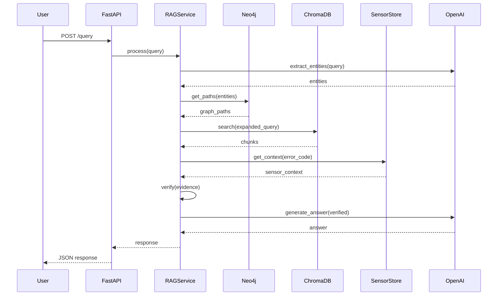
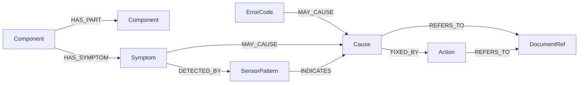
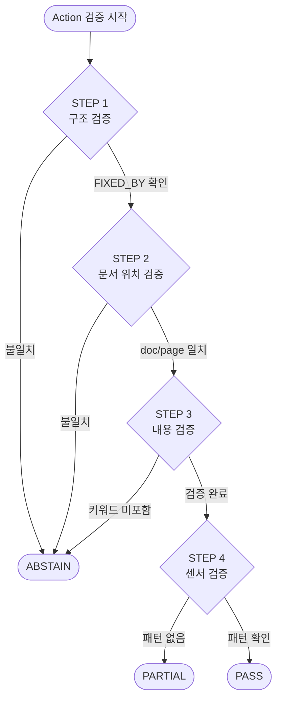

# UR5e Multi-Modal RAG 시스템 - 2Phase 기술 설계서

---

## 📋 목차
1. [프로젝트 개요](#1-프로젝트-개요)
2. [타겟 디바이스 선정](#2-타겟-디바이스-선정)
3. [데이터 소스 (Ground Truth)](#3-데이터-소스-ground-truth)
4. [시스템 아키텍처](#4-시스템-아키텍처)
5. [폴더 구조](#5-폴더-구조)
6. [구성요소별 기술 스택](#6-구성요소별-기술-스택)
7. [API Contract](#7-api-contract)
8. [온톨로지 구조 설계](#8-온톨로지-구조-설계)
9. [센서 데이터 스키마](#9-센서-데이터-스키마)
10. [Context Enricher 설계](#10-context-enricher-설계)
11. [근거 검증 규칙](#11-근거-검증-규칙)
12. [정량적 성능 평가 계획](#12-정량적-성능-평가-계획)
13. [예외처리 및 보안정책](#13-예외처리-및-보안정책)
14. [Phase별 구현 체크리스트](#14-phase별-구현-체크리스트)

---

## 1. 프로젝트 개요

### 1.1 배경 및 문제점

#### 1Phase (베이스라인) 한계
- 문서 근거만으로는 **실시간 설비 상태**를 반영하지 못함
- 동일 에러코드라도 **센서 패턴에 따라 원인이 다를 수 있음**
- 현장 엔지니어가 "지금 이 상황"을 설명하기 어려움

#### 2Phase에서 해결할 점
- **문서 근거 + 센서 데이터 근거**의 융합
- 시계열 패턴 분석을 통한 **맥락 기반 진단**
- "이 에러가 발생했을 때 센서 데이터는 어땠나?"에 대한 답변 가능

### 1.2 프로젝트 목적

#### 핵심 목표
1. **Multi-Modal RAG**: 문서(텍스트) + 센서(시계열) 데이터 통합 추론
2. **Context-Aware 진단**: 센서 패턴이 질의 맥락을 보강
3. **이중 근거 검증**: 문서 citation + 센서 evidence 동시 제공

#### 차별점 (vs 1Phase)
| 구분 | 1Phase (베이스라인) | 2Phase (심화) |
|------|---------------------|---------------|
| 데이터 소스 | 문서 (PDF) | 문서 + 센서 (F/T) |
| 근거 유형 | doc/page/chunk | doc/page/chunk + sensor_context |
| 진단 방식 | 에러코드 → 조치 | 에러코드 + 센서패턴 → 조치 |
| 장비 연동 | UR5e 단독 | UR5e + ATI Axia80 |

### 1.3 핵심 가치

1. **이중 근거(Dual Evidence)**: "문서에서도, 센서에서도 확인됨"
2. **맥락 인식(Context-Aware)**: 발생 시점의 센서 상태가 답변에 반영
3. **추적 가능성(Traceability)**: 문서 경로 + 센서 구간 동시 기록
4. **운영 가능성(Operability)**: 센서 데이터는 주기적 수집, 문서는 배치 인덱싱

### 1.4 최종 산출물

#### 시스템 컴포넌트
- **Dashboard**: 질문/답변 + 문서 근거 + 센서 차트 시각화
- **Engine**: Ontology Reasoning + Hybrid RAG + Sensor Context Enricher + Verifier
- **Data Pack**:
  - UR5e Official Documents (PDF) + Processed Chunks
  - ATI Axia80 Sensor Data (1개월 시뮬레이션)
  - `ontology.json`, `sensor_patterns.json`
  - ChromaDB Index, Neo4j Graph
  - `audit_trail.jsonl`

---

## 2. 타겟 디바이스 선정

### 2.1 UR5e 협동로봇

#### 선정 이유
1. **공식 문서 완전성**: Service Manual, Error Codes Directory 공개
2. **글로벌 시장 점유율**: 협동로봇 시장 Top 3
3. **표준화된 인터페이스**: PolyScope 기반 일관된 문서 체계

#### UR5e 사양 요약
| 항목 | 값 |
|------|-----|
| 가반하중 | 5 kg |
| 작업반경 | 850 mm |
| 관절 수 | 6축 |
| 반복정밀도 | ±0.03 mm |
| 컨트롤러 | e-Series Control Box |

### 2.2 ATI Axia80 Force/Torque 센서

#### 선정 이유
1. **UR+ 인증**: UR 로봇과 공식 호환
2. **현장 활용도**: 조립, 삽입, 연마 등 접촉 작업에 필수
3. **풍부한 진단 정보**: 6축 힘/토크로 충돌, 마모, 오정렬 감지

#### Axia80 사양 요약
| 항목 | 값 |
|------|-----|
| 측정축 | 6축 (Fx, Fy, Fz, Tx, Ty, Tz) |
| 힘 범위 | ±500 N (Fx, Fy), ±1000 N (Fz) |
| 토크 범위 | ±20 Nm (Tx, Ty), ±20 Nm (Tz) |
| 샘플링 레이트 | 125 Hz (기본), 최대 7812 Hz |
| 분해능 | 0.025 N / 0.0005 Nm |
| 인터페이스 | Ethernet (EtherNet/IP, Modbus TCP) |

### 2.3 통합 시나리오

#### 시나리오 1: 충돌 감지 + 에러 진단
```
[상황] UR5e에서 C119 에러 발생 (Safety Limit Violation)
[센서] Axia80에서 Fz 급증 패턴 감지 (500N → 800N, 50ms 내)
[진단] "문서상 C119는 안전 한계 초과, 센서 데이터상 Z축 충돌 확인됨"
[조치] "충돌 원인 제거 후 Safety Reset 수행 (Service Manual p.45)"
```

#### 시나리오 2: 그리퍼 마모 감지
```
[상황] 조립 공정에서 삽입 실패 빈도 증가
[센서] Axia80 Tx/Ty 노이즈 증가, 기준 대비 20% 상승
[진단] "삽입 토크 불안정, 그리퍼 핑거 마모 가능성"
[조치] "그리퍼 핑거 상태 점검, 마모 시 교체 (Gripper Manual)"
```

---

## 3. 데이터 소스 (Ground Truth)

### 3.1 문서 데이터

#### 공식 문서 목록
| doc_id | 문서명 | 용도 |
|--------|--------|------|
| `service_manual` | UR e-Series Service Manual | 수리/점검 절차 |
| `error_codes` | Error Codes Directory | 에러코드 → 조치 매핑 |
| `user_manual` | UR5e User Manual | 운영/안전 지침 |

#### 문서 처리 결과 (1Phase 완료)
- **총 청크 수**: ~6,900개
- **에러코드 수**: 99개 (매핑 완료)
- **저장소**: ChromaDB (Persist)

### 3.2 센서 데이터

#### ATI Axia80 시뮬레이션 데이터
| 항목 | 값 |
|------|-----|
| 기간 | 1개월 (30일) |
| 샘플링 | 125 Hz → 1초 평균 (저장용) |
| 레코드 수 | ~2,592,000 (초 단위) |
| 이상 패턴 | 충돌, 진동, 과부하 등 삽입 |

#### 센서 데이터 스키마
```json
{
  "timestamp": "2024-01-15T10:30:00.000Z",
  "Fx": 12.5,
  "Fy": -3.2,
  "Fz": 45.8,
  "Tx": 0.15,
  "Ty": -0.08,
  "Tz": 0.02,
  "status": "normal",
  "anomaly_flag": false
}
```

### 3.3 데이터 식별 정책

#### 문서 식별자 (doc_id)
- 형식: `{source}_{type}_{version}`
- 예: `ur_service_manual_v5`, `ur_error_codes_v3`

#### 센서 식별자 (sensor_id)
- 형식: `{device}_{sensor}_{instance}`
- 예: `ur5e_axia80_001`

---

## 4. 시스템 아키텍처

### 4.1 설계 원칙

#### 2Phase 핵심 원칙
1. **Ontology-first**: 자연어 → 온톨로지 노드 정규화
2. **Evidence-first**: 근거 없으면 조치 제안 금지
3. **Context-Aware**: 센서 맥락이 검색/검증에 영향
4. **Dual-Grounding**: 문서 + 센서 이중 근거

### 4.2 전체 아키텍처

```
┌─────────────────────────────────────────────────────────────────────┐
│                         User Interface (Streamlit)                  │
│   [질의 입력] [답변 표시] [문서 근거] [센서 차트] [그래프 경로]    │
└─────────────────────────────────────────────────────────────────────┘
                                    │
                                    ▼
┌─────────────────────────────────────────────────────────────────────┐
│                         API Layer (FastAPI)                         │
│   POST /query    GET /evidence    GET /sensor    GET /health       │
└─────────────────────────────────────────────────────────────────────┘
                                    │
                                    ▼
┌─────────────────────────────────────────────────────────────────────┐
│                      RAG Service (Orchestrator)                     │
│  ┌───────────┐  ┌──────────────┐  ┌──────────────┐  ┌───────────┐  │
│  │  Entity   │→│   Ontology   │→│    Vector    │→│  Context  │  │
│  │ Extractor │  │  Reasoner   │  │  Retriever   │  │ Enricher  │  │
│  └───────────┘  └──────────────┘  └──────────────┘  └───────────┘  │
│                                                            │        │
│                                                            ▼        │
│  ┌───────────────────────────────────────────────────────────────┐ │
│  │                    Verifier (Evidence Gate)                   │ │
│  │   [문서 검증] + [센서 패턴 검증] → PASS/PARTIAL/ABSTAIN/FAIL  │ │
│  └───────────────────────────────────────────────────────────────┘ │
│                                    │                                │
│                                    ▼                                │
│  ┌───────────────────────────────────────────────────────────────┐ │
│  │                 Answer Generator (LLM)                        │ │
│  │         문장화 + 구조화 출력 (사실 생성 금지)                 │ │
│  └───────────────────────────────────────────────────────────────┘ │
└─────────────────────────────────────────────────────────────────────┘
                                    │
         ┌──────────────────────────┼──────────────────────────┐
         ▼                          ▼                          ▼
┌─────────────────┐      ┌─────────────────┐      ┌─────────────────┐
│   Neo4j (Graph) │      │ ChromaDB (Vector)│      │  Sensor Store  │
│   온톨로지 추론  │      │   문서 검색      │      │  시계열 데이터  │
└─────────────────┘      └─────────────────┘      └─────────────────┘
```

### 4.3 파이프라인 단계 (Step-by-Step)

#### Step 0: Trace 생성 & 입력 정규화
```python
trace_id = uuid4()
normalized_query = normalize(user_query)  # 공백, 대소문자, 에러코드 표기 통일
```

#### Step 1: Entity Extraction (LLM-assisted)
```python
entities = extractor.extract(normalized_query)
# 결과: [{"type": "ErrorCode", "text": "C119"}, {"type": "Component", "text": "Joint"}]
```

#### Step 2: Entity Linking (Ontology)
```python
linked = linker.link(entities)
# 결과: [{"type": "ErrorCode", "node_id": "ERR_C119", "confidence": 0.95}]
```

#### Step 3: Ontology Reasoning (Neo4j)
```python
paths = reasoner.get_paths(linked)
expansion_terms = reasoner.get_expansion_terms(paths)
# paths: Symptom → MAY_CAUSE → Cause → FIXED_BY → Action
```

#### Step 4: Vector Retrieval (ChromaDB)
```python
chunks = retriever.search(expanded_query, top_k=10)
# chunks: [{doc_id, page, chunk_id, text, score}, ...]
```

#### Step 5: Context Enrichment (센서)
```python
sensor_context = enricher.get_context(
    query=user_query,
    error_code="C119",
    time_window="1h"
)
# sensor_context: {pattern: "collision", evidence: [...], chart_data: [...]}
```

#### Step 6: Verification (Evidence Gate)
```python
result = verifier.verify(
    causes=paths.causes,
    actions=paths.actions,
    doc_evidence=chunks,
    sensor_evidence=sensor_context
)
# result: {status: "PASS", verified_actions: [...], citations: [...]}
```

#### Step 7: Answer Generation
```python
answer = generator.generate(
    query=user_query,
    verified_data=result,
    template="structured"
)
```

### 4.4 데이터 흐름 (Mermaid)



---

## 5. 폴더 구조

### 5.1 설계 원칙
- **실제 구현과 일치**: 1Phase에서 실제 생성된 구조 기반
- **src 중심**: 모든 소스코드는 `src/` 하위에 위치
- **data 분리**: 원본/처리/인덱스 데이터 명확히 분리

### 5.2 디렉토리 구조

```plaintext
ur5e-ontology-rag/
├── README.md
├── requirements.txt
├── .env                          # 환경변수 (API 키, DB 설정)
├── .gitignore
│
├── configs/
│   └── settings.yaml             # chunk_size, top_k, threshold 등
│
├── data/
│   ├── raw/
│   │   └── pdf/                  # 원본 PDF
│   │       ├── service_manual.pdf
│   │       └── user_manual.pdf
│   │
│   ├── processed/
│   │   ├── chunks/               # 청크 JSON
│   │   │   ├── error_codes_chunks.json
│   │   │   └── service_manual_chunks.json
│   │   └── ontology/
│   │       └── ontology.json     # 그래프 원천 데이터
│   │
│   ├── sensor/                   # [2Phase 신규] 센서 데이터
│   │   ├── raw/
│   │   │   └── axia80_2024_01.parquet
│   │   ├── processed/
│   │   │   └── anomaly_patterns.json
│   │   └── metadata/
│   │       └── sensor_config.yaml
│   │
│   ├── benchmark/                # 평가용 QA 데이터셋
│   │   ├── error_code_qa.json
│   │   ├── component_qa.json
│   │   └── sensor_qa.json        # [2Phase 신규]
│   │
│   └── evaluation/
│       └── results/
│           └── latest.json
│
├── stores/                       # 영속 데이터
│   ├── chroma/                   # ChromaDB persist
│   └── neo4j/                    # Neo4j data (Docker volume)
│
├── src/
│   ├── __init__.py
│   │
│   ├── config/                   # 설정 관리
│   │   ├── __init__.py
│   │   └── settings.py
│   │
│   ├── data_processing/          # 데이터 전처리
│   │   ├── __init__.py
│   │   ├── pdf_parser.py
│   │   ├── chunker.py
│   │   └── sensor_processor.py   # [2Phase 신규]
│   │
│   ├── ontology/                 # 온톨로지 관리
│   │   ├── __init__.py
│   │   ├── graph_manager.py
│   │   ├── schema.py
│   │   └── queries.py
│   │
│   ├── vectorstore/              # 벡터 DB 관리
│   │   ├── __init__.py
│   │   ├── chroma_manager.py
│   │   └── embeddings.py
│   │
│   ├── sensor/                   # [2Phase 신규] 센서 관리
│   │   ├── __init__.py
│   │   ├── data_generator.py     # 시뮬레이션 데이터 생성
│   │   ├── pattern_detector.py   # 이상 패턴 감지
│   │   └── context_provider.py   # 센서 맥락 제공
│   │
│   ├── rag/                      # RAG 핵심 로직
│   │   ├── __init__.py
│   │   ├── service.py            # RAGService (Orchestrator)
│   │   ├── entity_extractor.py
│   │   ├── entity_linker.py
│   │   ├── retriever.py
│   │   ├── context_enricher.py   # [2Phase 신규]
│   │   ├── verifier.py
│   │   └── generator.py
│   │
│   ├── api/                      # FastAPI 서버
│   │   ├── __init__.py
│   │   ├── main.py
│   │   ├── routes/
│   │   │   ├── __init__.py
│   │   │   ├── query.py
│   │   │   ├── evidence.py
│   │   │   ├── sensor.py         # [2Phase 신규]
│   │   │   └── health.py
│   │   └── models/
│   │       ├── __init__.py
│   │       ├── request.py
│   │       └── response.py
│   │
│   ├── dashboard/                # Streamlit UI
│   │   ├── __init__.py
│   │   ├── app.py
│   │   ├── pages/
│   │   │   ├── chat.py
│   │   │   ├── explorer.py
│   │   │   ├── sensor.py         # [2Phase 신규]
│   │   │   └── performance.py
│   │   ├── components/
│   │   │   ├── charts.py
│   │   │   └── evidence_card.py
│   │   ├── services/
│   │   │   └── api_client.py
│   │   └── utils/
│   │       └── formatters.py
│   │
│   └── evaluation/               # 평가 시스템
│       ├── __init__.py
│       ├── benchmark.py
│       ├── metrics.py
│       ├── evaluator.py
│       └── report.py
│
├── scripts/                      # 실행 스크립트
│   ├── run_api.py
│   ├── run_dashboard.py
│   ├── run_indexing.py
│   ├── run_evaluation.py
│   └── generate_sensor_data.py   # [2Phase 신규]
│
├── tests/                        # 테스트
│   ├── unit/
│   └── integration/
│
└── docs/                         # 문서
    ├── Spec.md                   # 1Phase 기술 설계서
    ├── 2Phase_Spec.md            # 2Phase 기술 설계서 (본 문서)
    ├── 2Phase_00_ROADMAP.md      # 2Phase 로드맵
    └── Phase10_평가시스템_완료보고서.md
```

### 5.3 핵심 파일 설명

#### src/sensor/ (2Phase 신규)
| 파일 | 역할 |
|------|------|
| `data_generator.py` | 1개월 Axia80 시뮬레이션 데이터 생성 |
| `pattern_detector.py` | 충돌, 진동, 과부하 패턴 감지 알고리즘 |
| `context_provider.py` | 에러 발생 시점 전후 센서 맥락 제공 |

#### src/rag/context_enricher.py (2Phase 신규)
- 벡터 검색 결과에 **센서 맥락**을 추가
- 에러코드와 연관된 센서 패턴을 식별
- Verifier에 `sensor_evidence` 전달

---

## 6. 구성요소별 기술 스택

### 6.1 기술 스택 매핑

| 레이어 | 기술 | 버전 | 역할 |
|--------|------|------|------|
| Frontend | Streamlit | 1.40+ | 대시보드 UI |
| API | FastAPI | 0.100+ | REST API 서버 |
| Core | Python | 3.10+ | 비즈니스 로직 |
| Graph DB | Neo4j | 5.x | 온톨로지 추론 |
| Vector DB | ChromaDB | 0.4+ | 문서 검색 |
| Sensor Store | Parquet + DuckDB | - | 시계열 조회 |
| Embedding | OpenAI | text-embedding-3-small | 문서 임베딩 |
| LLM | OpenAI | gpt-4o-mini | 엔티티 추출, 답변 생성 |

### 6.2 역할 분담

```
┌─────────────────────────────────────────────────────────────────┐
│                        역할 분담 원칙                           │
├─────────────────────────────────────────────────────────────────┤
│ Ontology (Neo4j)    → 추론의 뼈대 (원인/조치 후보 생성)         │
│ Vector (ChromaDB)   → 문서 근거 (grounding)                    │
│ Sensor (Parquet)    → 맥락 근거 (context enrichment)           │
│ Verifier            → 출력 제어 (PASS/ABSTAIN 결정)            │
│ LLM                 → 문장화 (사실 생성 금지, 요약만)           │
└─────────────────────────────────────────────────────────────────┘
```

### 6.3 의존성 관리

```
# requirements.txt (2Phase 추가 패키지)
pandas>=2.0.0
pyarrow>=14.0.0
duckdb>=0.9.0
scipy>=1.11.0        # 신호 처리
plotly>=5.18.0       # 센서 차트
```

---

## 7. API Contract

### 7.1 공통 정책

#### Trace 정책
- 모든 요청에 `trace_id` (UUID) 발급
- 모든 응답에 `trace_id` 포함
- `/evidence/{trace_id}`로 전체 추적 정보 조회

#### Verifier Status (2Phase 확장)
| Status | 설명 | 조치 출력 |
|--------|------|----------|
| `PASS` | 문서 + 센서 근거 충분 | 허용 |
| `PARTIAL` | 문서 근거만 있음 (센서 없음) | 허용 (경고 표시) |
| `ABSTAIN` | 근거 부족 | 금지 |
| `FAIL` | 시스템 오류 | 금지 |

### 7.2 엔드포인트 목록

| Method | Path | 설명 |
|--------|------|------|
| POST | `/api/v1/query` | 질의응답 |
| GET | `/api/v1/evidence/{trace_id}` | 근거 상세 조회 |
| GET | `/api/v1/sensor/context` | 센서 맥락 조회 |
| GET | `/api/v1/sensor/chart` | 센서 차트 데이터 |
| GET | `/api/v1/health` | 상태 점검 |

### 7.3 POST /api/v1/query

#### Request
```json
{
  "user_query": "C119 에러가 발생했습니다. 원인이 뭔가요?",
  "options": {
    "top_k": 5,
    "include_sensor": true,
    "sensor_time_window": "1h",
    "debug": false
  }
}
```

#### Response (PASS)
```json
{
  "trace_id": "550e8400-e29b-41d4-a716-446655440000",
  "verifier_status": "PASS",
  "answer": "C119 에러는 Safety Limit Violation으로, 로봇이 안전 한계를 초과했습니다...",
  "structured_data": {
    "error_code": "C119",
    "symptom": ["보호정지", "비상정지"],
    "causes": [
      {
        "title": "외부 충돌",
        "confidence": 0.85,
        "evidence_type": "DOC_AND_SENSOR",
        "doc_refs": [{"doc_id": "error_codes", "page": 23, "chunk_id": "c-119"}],
        "sensor_refs": [{"pattern": "collision", "time": "2024-01-15T10:30:00Z"}]
      }
    ],
    "actions": [
      {
        "title": "충돌 원인 제거 후 Safety Reset",
        "doc_refs": [{"doc_id": "service_manual", "page": 45}]
      }
    ]
  },
  "sensor_context": {
    "pattern_detected": "collision",
    "peak_force": {"Fz": 850.5, "timestamp": "2024-01-15T10:30:00.123Z"},
    "chart_url": "/api/v1/sensor/chart?trace_id=550e8400..."
  }
}
```

### 7.4 GET /api/v1/sensor/context

#### Request
```
GET /api/v1/sensor/context?error_code=C119&time=2024-01-15T10:30:00Z&window=1h
```

#### Response
```json
{
  "error_code": "C119",
  "time_range": {
    "start": "2024-01-15T09:30:00Z",
    "end": "2024-01-15T11:30:00Z"
  },
  "patterns": [
    {
      "type": "collision",
      "confidence": 0.92,
      "timestamp": "2024-01-15T10:30:00.123Z",
      "details": {
        "peak_Fz": 850.5,
        "rise_time_ms": 45,
        "direction": "Z+"
      }
    }
  ],
  "statistics": {
    "Fx": {"mean": 12.3, "std": 2.1, "max": 45.6},
    "Fy": {"mean": -5.2, "std": 1.8, "max": 22.1},
    "Fz": {"mean": 120.5, "std": 15.3, "max": 850.5}
  }
}
```

---

## 8. 온톨로지 구조 설계

### 8.1 Node 정의 (2Phase 확장)

| Label | 정의 | 주요 속성 | 예시 |
|-------|------|----------|------|
| `Component` | 물리적 구성요소 | component_id, name, synonyms | Joint_3, F/T_Sensor |
| `Symptom` | 관찰된 이상현상 | symptom_id, name, synonyms | 보호정지, 토크과부하 |
| `ErrorCode` | 시스템 에러코드 | code, message, severity | C119, C153 |
| `Cause` | 기술적 원인 | cause_id, name, synonyms | 외부충돌, 케이블마모 |
| `Action` | 수리/조치 | action_id, name, risk_level | Safety Reset, 교체 |
| `SensorPattern` | **[신규]** 센서 이상패턴 | pattern_id, type, threshold | collision, vibration |
| `DocumentRef` | 문서 근거 | docref_id, doc_id, page | SM_p45 |

### 8.2 Relationship 정의 (2Phase 확장)

| 관계 | Source | Target | 의미 |
|------|--------|--------|------|
| `HAS_PART` | Component | Component | 부품 계층 |
| `HAS_SYMPTOM` | Component | Symptom | 부품→증상 |
| `MAY_CAUSE` | Symptom/ErrorCode | Cause | 인과 추론 |
| `FIXED_BY` | Cause | Action | 원인→조치 |
| `REFERS_TO` | Cause/Action | DocumentRef | 문서 인용 |
| `INDICATES` | **[신규]** SensorPattern | Cause | 센서패턴→원인 |
| `DETECTED_BY` | **[신규]** Symptom | SensorPattern | 증상→센서패턴 |

### 8.3 확장된 온톨로지 다이어그램



### 8.4 SensorPattern 노드 예시

```json
{
  "label": "SensorPattern",
  "pattern_id": "PAT_COLLISION_Z",
  "type": "collision",
  "axis": "Fz",
  "threshold": {
    "peak_force": 500,
    "rise_time_ms": 100
  },
  "description": "Z축 급격한 힘 증가 (충돌 패턴)"
}
```

### 8.5 Cypher 쿼리 예시 (센서 통합)

```cypher
// 에러코드 + 센서패턴으로 원인 추론
MATCH (e:ErrorCode {code: $code})-[:MAY_CAUSE]->(c:Cause)
OPTIONAL MATCH (sp:SensorPattern)-[:INDICATES]->(c)
WHERE sp.type = $sensor_pattern
RETURN e, c, sp,
       CASE WHEN sp IS NOT NULL THEN 'SENSOR_CONFIRMED' ELSE 'DOC_ONLY' END AS evidence_level
```

---

## 9. 센서 데이터 스키마

### 9.1 Raw Data Schema (Parquet)

| Column | Type | 설명 |
|--------|------|------|
| timestamp | datetime64[ns] | UTC 타임스탬프 |
| Fx | float32 | X축 힘 (N) |
| Fy | float32 | Y축 힘 (N) |
| Fz | float32 | Z축 힘 (N) |
| Tx | float32 | X축 토크 (Nm) |
| Ty | float32 | Y축 토크 (Nm) |
| Tz | float32 | Z축 토크 (Nm) |
| status | string | normal/warning/error |

### 9.2 Pattern Detection Schema

```json
{
  "pattern_id": "PAT_001",
  "type": "collision",
  "timestamp": "2024-01-15T10:30:00.123Z",
  "duration_ms": 150,
  "metrics": {
    "peak_axis": "Fz",
    "peak_value": 850.5,
    "rise_time_ms": 45,
    "baseline": 120.3
  },
  "confidence": 0.92,
  "related_error_codes": ["C119", "C153"]
}
```

### 9.3 센서 패턴 유형

| Pattern Type | 감지 조건 | 연관 에러코드 |
|--------------|----------|---------------|
| `collision` | Fz 급증 (>500N, <100ms) | C119, C153 |
| `vibration` | FFT 고주파 성분 증가 | C204, C207 |
| `overload` | 지속적 힘/토크 초과 | C189, C190 |
| `drift` | 점진적 baseline 이동 | C103, C104 |

### 9.4 시뮬레이션 데이터 생성 사양

```python
# scripts/generate_sensor_data.py
config = {
    "duration_days": 30,
    "sampling_rate_hz": 125,
    "storage_resolution": "1s",  # 1초 평균으로 저장
    "normal_operation": {
        "Fx_range": [-50, 50],
        "Fy_range": [-50, 50],
        "Fz_range": [0, 200],
        "noise_std": 2.0
    },
    "anomaly_injection": {
        "collision": {"count": 15, "Fz_peak": [500, 900]},
        "vibration": {"count": 10, "frequency_hz": [50, 100]},
        "overload": {"count": 8, "duration_min": [5, 30]}
    }
}
```

---

## 10. Context Enricher 설계

### 10.1 역할

Context Enricher는 **문서 검색 결과에 센서 맥락을 추가**하는 모듈이다.

```
Vector Retrieval → Context Enricher → Verifier
     (문서)              (센서)         (통합)
```

### 10.2 인터페이스

```python
class ContextEnricher:
    def enrich(
        self,
        query: str,
        doc_chunks: List[Chunk],
        error_code: Optional[str] = None,
        timestamp: Optional[datetime] = None,
        time_window: str = "1h"
    ) -> EnrichedContext:
        """
        문서 청크에 센서 맥락을 추가

        Args:
            query: 사용자 질의
            doc_chunks: 벡터 검색 결과
            error_code: 추출된 에러코드 (있으면)
            timestamp: 에러 발생 시점 (있으면)
            time_window: 센서 조회 범위

        Returns:
            EnrichedContext: 문서 + 센서 통합 맥락
        """
```

### 10.3 출력 구조

```python
@dataclass
class EnrichedContext:
    doc_evidence: List[DocEvidence]      # 문서 근거
    sensor_evidence: Optional[SensorEvidence]  # 센서 근거
    correlation: CorrelationResult       # 문서-센서 상관관계

@dataclass
class SensorEvidence:
    patterns: List[PatternMatch]         # 감지된 패턴
    statistics: Dict[str, AxisStats]     # 축별 통계
    time_range: TimeRange                # 조회 범위
    chart_data: List[Dict]               # 시각화용 데이터
```

### 10.4 상관관계 분석

```python
class CorrelationResult:
    """문서 내용과 센서 패턴의 상관관계"""

    level: str  # "STRONG", "MODERATE", "WEAK", "NONE"
    reason: str
    supporting_evidence: List[str]

# 예시
correlation = CorrelationResult(
    level="STRONG",
    reason="문서의 '충돌' 언급과 센서의 collision 패턴이 일치",
    supporting_evidence=[
        "doc: 'C119는 충돌로 인해 발생할 수 있습니다'",
        "sensor: Fz=850N 충돌 패턴 감지 (10:30:00)"
    ]
)
```

---

## 11. 근거 검증 규칙

### 11.1 2Phase 검증 원칙

```
┌───────────────────────────────────────────────────────────────┐
│                    Verification Policy                        │
├───────────────────────────────────────────────────────────────┤
│ 1. 문서 근거 필수: Action은 반드시 doc citation 필요          │
│ 2. 센서 근거 보강: 센서 패턴이 있으면 신뢰도 상승             │
│ 3. 이중 검증 우대: 문서+센서 모두 확인되면 PASS               │
│ 4. 센서만으로는 불충분: 센서 근거만으로는 PARTIAL             │
└───────────────────────────────────────────────────────────────┘
```

### 11.2 Cause 검증 등급 (확장)

| 등급 | 조건 | 신뢰도 |
|------|------|--------|
| `DOC_AND_SENSOR` | 문서 + 센서 모두 지지 | 0.9+ |
| `DOC_SUPPORTED` | 문서 근거만 있음 | 0.7~0.9 |
| `SENSOR_INDICATED` | 센서 패턴만 있음 | 0.5~0.7 |
| `HYPOTHESIS` | 둘 다 부족 | <0.5 |

### 11.3 Action 검증 플로우 (확장)



### 11.4 Verifier Status 결정 로직

```python
def determine_status(doc_verified: bool, sensor_verified: Optional[bool]) -> str:
    if not doc_verified:
        return "ABSTAIN"  # 문서 근거 필수

    if sensor_verified is None:
        return "PASS"  # 센서 없는 질문은 문서만으로 PASS

    if sensor_verified:
        return "PASS"  # 이중 검증 완료
    else:
        return "PARTIAL"  # 문서만 확인, 센서는 불일치
```

---

## 12. 정량적 성능 평가 계획

### 12.1 평가 축 (3+1)

| 축 | 측정 대상 | 핵심 지표 |
|----|----------|----------|
| Retrieval | 문서 검색 품질 | Recall@5, MRR |
| Generation | 답변 품질 | Accuracy, Hallucination Rate |
| Verification | 안전성 | Action Safety Leak Rate |
| **Sensor (신규)** | 센서 활용 품질 | Pattern Detection F1, Context Relevance |

### 12.2 2Phase 추가 지표

#### Sensor Pattern Detection F1
- 정의: 실제 이상 패턴 중 정확히 감지한 비율
- 목표: > 0.85

#### Sensor Context Relevance
- 정의: 제공된 센서 맥락이 질문과 관련 있는 비율
- 측정: LLM Judge 또는 Human Eval

#### Dual Evidence Rate
- 정의: PASS 응답 중 문서+센서 이중 근거가 있는 비율
- 목표: 센서 관련 질문에서 > 70%

### 12.3 벤치마크 데이터셋 확장

```json
// data/benchmark/sensor_qa.json (신규)
[
  {
    "id": "sen_001",
    "question": "C119 에러와 함께 Fz가 급증했습니다. 원인이 뭔가요?",
    "expected_answer": "충돌로 인한 안전 한계 초과",
    "expected_pattern": "collision",
    "expected_verification": "PASS",
    "category": "sensor_integrated"
  }
]
```

---

## 13. 예외처리 및 보안정책

### 13.1 센서 관련 예외 처리

| 예외 상황 | 처리 정책 |
|----------|----------|
| 센서 데이터 없음 | 문서 기반으로만 응답 (PARTIAL) |
| 패턴 감지 실패 | 통계 정보만 제공 |
| 시간 범위 불일치 | 가장 가까운 데이터 사용 |
| 센서 DB 다운 | Graceful Degradation (문서만 사용) |

### 13.2 Fallback 정책

```python
class SensorFallback:
    """센서 서비스 장애 시 대체 로직"""

    def get_context_fallback(self, error_code: str) -> Optional[SensorEvidence]:
        # 1. 캐시된 패턴 통계 사용
        cached = self.cache.get(f"pattern_stats:{error_code}")
        if cached:
            return SensorEvidence(
                patterns=[],
                statistics=cached,
                note="캐시된 통계 사용 (실시간 데이터 없음)"
            )

        # 2. 일반적인 패턴 정보만 제공
        return SensorEvidence(
            patterns=[],
            statistics=None,
            note="센서 데이터를 사용할 수 없습니다"
        )
```

### 13.3 Audit 확장

```json
// audit_trail.jsonl (2Phase 확장)
{
  "trace_id": "...",
  "timestamp": "...",
  "user_query": "...",
  "extracted_entities": [...],
  "linked_entities": [...],
  "retrieval_results": [...],
  "sensor_context": {
    "patterns_detected": ["collision"],
    "query_time_range": "2024-01-15T10:00:00Z ~ 2024-01-15T11:00:00Z",
    "data_availability": true
  },
  "verifier_status": "PASS",
  "evidence_type": "DOC_AND_SENSOR"
}
```

---

## 14. Phase별 구현 체크리스트

### 14.1 구현 순서

```
Phase 2-1: 센서 데이터 생성 및 저장 구조
Phase 2-2: 센서 패턴 감지 알고리즘
Phase 2-3: Context Enricher 구현
Phase 2-4: 온톨로지 확장 (SensorPattern)
Phase 2-5: Verifier 확장 (이중 검증)
Phase 2-6: API 확장 (/sensor/*)
Phase 2-7: Dashboard 센서 시각화
Phase 2-8: 통합 테스트 및 평가
```

### 14.2 Phase별 체크리스트

#### Phase 2-1: 센서 데이터 생성
- [ ] `scripts/generate_sensor_data.py` 구현
- [ ] 1개월 시뮬레이션 데이터 생성
- [ ] Parquet 저장 구조 확정
- [ ] 데이터 검증 (통계, 분포)

#### Phase 2-2: 패턴 감지
- [ ] `src/sensor/pattern_detector.py` 구현
- [ ] 충돌 패턴 감지 (Fz 급증)
- [ ] 진동 패턴 감지 (FFT)
- [ ] 과부하 패턴 감지 (지속적 초과)
- [ ] 단위 테스트 작성

#### Phase 2-3: Context Enricher
- [ ] `src/rag/context_enricher.py` 구현
- [ ] RAGService 통합
- [ ] 문서-센서 상관관계 분석
- [ ] 통합 테스트

#### Phase 2-4: 온톨로지 확장
- [ ] `SensorPattern` 노드 추가
- [ ] `INDICATES`, `DETECTED_BY` 관계 추가
- [ ] `ontology.json` 업데이트
- [ ] Neo4j 스키마 마이그레이션

#### Phase 2-5: Verifier 확장
- [ ] 이중 검증 로직 구현
- [ ] `PARTIAL` 상태 추가
- [ ] 센서 근거 포함 검증
- [ ] 회귀 테스트

#### Phase 2-6: API 확장
- [ ] `GET /api/v1/sensor/context` 구현
- [ ] `GET /api/v1/sensor/chart` 구현
- [ ] Response 스키마 확장
- [ ] API 문서 업데이트

#### Phase 2-7: Dashboard 확장
- [ ] 센서 차트 컴포넌트
- [ ] 센서 맥락 표시 카드
- [ ] 통합 근거 뷰
- [ ] 사용자 테스트

#### Phase 2-8: 평가
- [ ] 센서 통합 벤치마크 추가
- [ ] 평가 지표 확장
- [ ] 전체 시스템 평가
- [ ] 결과 리포트 생성

### 14.3 코드 리뷰 체크포인트

각 Phase 완료 시 다음 항목을 검토:

1. **Spec 일치**: 본 문서의 스키마/인터페이스와 일치하는가?
2. **테스트 커버리지**: 핵심 로직에 테스트가 있는가?
3. **에러 처리**: 예외 상황이 처리되는가?
4. **문서화**: 코드 주석과 docstring이 충분한가?
5. **성능**: 불필요한 연산이나 쿼리가 없는가?

---

## 부록 A: 용어 정의

| 용어 | 정의 |
|------|------|
| Ground Truth | 신뢰할 수 있는 원천 데이터 (공식 문서, 실제 센서) |
| Context Enrichment | 검색 결과에 추가 맥락을 더하는 과정 |
| Dual Evidence | 문서와 센서 두 가지 근거가 모두 확인된 상태 |
| Pattern Detection | 시계열 데이터에서 특정 패턴을 식별하는 과정 |
| Evidence Gate | 근거 유무에 따라 출력을 제어하는 검증 단계 |

---

## 부록 B: 참고 자료

1. UR e-Series Service Manual
2. UR Error Codes Directory (PolyScope)
3. ATI Industrial Automation - Axia80 F/T Sensor Datasheet
4. ATI URCap Integration Guide

---

**문서 버전**: 2Phase v1.0
**작성일**: 2024-01-21
**작성자**: Claude (AI Assistant)
**검토자**: (검토 후 기재)
