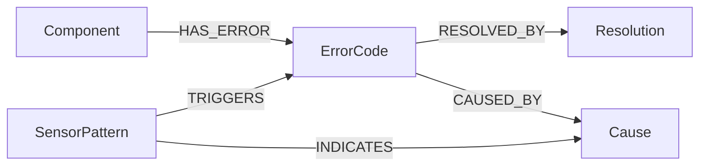

# UR5e Multi-Modal RAG 시스템 - 통합 기술 설계서

> **Version**: 1.0 (Unified)
> **최종 수정**: 2026-01-22
> **문서 목적**: Foundation + Main 통합, 실제 구현된 시스템 기준

---

## 목차

1. [프로젝트 개요](#1-프로젝트-개요)
2. [대상 장비](#2-대상-장비)
3. [데이터 소스](#3-데이터-소스)
4. [시스템 아키텍처](#4-시스템-아키텍처)
5. [폴더 구조](#5-폴더-구조)
6. [기술 스택](#6-기술-스택)
7. [핵심 모듈 설계](#7-핵심-모듈-설계)
8. [온톨로지 스키마](#8-온톨로지-스키마)
9. [API 명세](#9-api-명세)
10. [검증 정책](#10-검증-정책)
11. [평가 계획](#11-평가-계획)

---

# 1. 프로젝트 개요

## 1.1 배경 및 문제점

### 현장의 문제
- 설비 매뉴얼/에러코드 문서가 방대하고 분산되어 있음
- 현장 엔지니어의 구어체/약어/별칭이 통일되지 않음
- 근거 없는 조치(Action) 제안은 안전/품질 리스크 유발
- **동일 에러코드라도 센서 패턴에 따라 원인이 다를 수 있음**

### 기존 시스템의 한계
| 문제점 | 설명 |
|--------|------|
| 단일 데이터 소스 | 문서만 사용, 실시간 센서 데이터 미반영 |
| 단순 엔티티 링킹 | 정규식만 사용, 동의어/한영 변환 미지원 |
| 불완전한 추적 시스템 | trace_id 기반 재현 불가 |
| 근거 추적 어려움 | chunk → 원본 문서/페이지 역추적 불가 |

## 1.2 핵심 목표

1. **Multi-Modal RAG**: 문서(텍스트) + 센서(시계열) 데이터 통합 추론
2. **Ontology-first**: 질의를 온톨로지 엔티티로 정규화 후 추론
3. **Evidence-first**: 근거 없으면 답변 제한, 추가 질문으로 전환
4. **Dual Evidence**: "문서에서도, 센서에서도 확인됨" 이중 검증
5. **Traceability**: trace_id로 전체 파이프라인 재현 가능

## 1.3 핵심 가치

```
┌─────────────────────────────────────────────────────────────┐
│                      핵심 가치 (Core Values)                 │
├─────────────────────────────────────────────────────────────┤
│ 1. 근거 우선 (Evidence-first)                               │
│    → 근거 없으면 답변 제한, 추가 질문으로 정보 보강          │
│                                                             │
│ 2. 추적 가능 (Traceability)                                 │
│    → "왜 이 결론?"을 온톨로지 경로와 근거로 설명             │
│    → trace_id로 전체 파이프라인 재현 가능                   │
│                                                             │
│ 3. 이중 근거 (Dual Evidence)                                │
│    → 문서 근거 + 센서 근거 교차 검증                        │
│                                                             │
│ 4. 운영 가능 (Operability)                                  │
│    → 도메인 지식은 ontology.json, lexicon.yaml로 관리       │
│    → 센서 데이터는 주기적 수집, 문서는 배치 인덱싱          │
└─────────────────────────────────────────────────────────────┘
```

## 1.4 최종 산출물

### 시스템 컴포넌트
- **Dashboard**: 질문/답변 + 문서 근거 + 센서 차트 시각화
- **Engine**: Ontology Reasoning + Hybrid RAG + Context Enricher + Verifier
- **Data Pack**:
  - UR5e Official Documents (PDF) + Processed Chunks
  - ATI Axia80 Sensor Data (7일 시뮬레이션)
  - `ontology.json`, `lexicon.yaml`, `rules.yaml`
  - ChromaDB Index, Neo4j Graph
  - `audit_trail.jsonl`

---

# 2. 대상 장비

## 2.1 UR5e 협동로봇

### 선정 이유
1. 공식 문서 완전성: Service Manual, Error Codes Directory 공개
2. 글로벌 시장 점유율: 협동로봇 시장 Top 3
3. 표준화된 인터페이스: PolyScope 기반 일관된 문서 체계

### 사양 요약
| 항목 | 값 |
|------|-----|
| 가반하중 | 5 kg |
| 작업반경 | 850 mm |
| 관절 수 | 6축 |
| 반복정밀도 | ±0.03 mm |
| 컨트롤러 | e-Series Control Box |

## 2.2 ATI Axia80 힘/토크 센서

### 선정 이유
1. UR+ 인증: UR 로봇과 공식 호환
2. 현장 활용도: 조립, 삽입, 연마 등 접촉 작업에 필수
3. 풍부한 진단 정보: 6축 힘/토크로 충돌, 마모, 오정렬 감지

### 사양 요약
| 항목 | 값 |
|------|-----|
| 측정축 | 6축 (Fx, Fy, Fz, Tx, Ty, Tz) |
| 힘 범위 | ±500 N (Fx, Fy), ±1000 N (Fz) |
| 토크 범위 | ±20 Nm |
| 샘플링 레이트 | 125 Hz |
| 인터페이스 | Ethernet |

---

# 3. 데이터 소스

## 3.1 문서 데이터 (Ground Truth)

### 공식 문서 목록
| doc_id | 문서명 | 용도 | 청크 수 |
|--------|--------|------|---------|
| `service_manual` | UR e-Series Service Manual | 수리/점검 절차 | ~400 |
| `error_codes` | Error Codes Directory | 에러코드 → 조치 매핑 | ~220 |
| `user_manual` | UR5e User Manual | 운영/안전 지침 | ~100 |

### 문서 처리 결과 (실제 구현)
- **총 청크 수**: 722개
- **에러코드 수**: C0~C55 (56개 기본 코드 + 변형)
- **저장소**: ChromaDB (Persisted)

## 3.2 센서 데이터

### ATI Axia80 시뮬레이션 데이터
| 항목 | 값 |
|------|-----|
| 기간 | 7일 |
| 샘플링 | 125 Hz → 1초 평균 (저장) |
| 레코드 수 | 604,800개 |
| 파일 크기 | 34.15 MB |
| 저장 형식 | Parquet |

### 센서 데이터 스키마
| Column | Type | 설명 |
|--------|------|------|
| timestamp | datetime64[ns] | UTC 타임스탬프 |
| Fx, Fy, Fz | float32 | 힘 (N) |
| Tx, Ty, Tz | float32 | 토크 (Nm) |
| status | string | normal / warning / error |

### 이상 패턴 유형
| Pattern | 설명 | 감지 조건 |
|---------|------|----------|
| `collision` | 충돌 | Fz 급증 (>500N, <100ms) |
| `vibration` | 진동 | 고주파 성분 증가 |
| `overload` | 과부하 | 지속적 힘 초과 (>300N, 5s) |
| `drift` | 드리프트 | 점진적 baseline 이동 |

---

# 4. 시스템 아키텍처

## 4.1 설계 원칙

### Ontology-first (온톨로지 우선)
```
자연어 질의 → 온톨로지 엔티티/관계로 정규화 → 그래프 경로 기반 후보 생성
```

### Evidence-first (근거 우선)
```
문서/센서 근거가 없는 정보 → 강한 단정 출력 금지 → 추가 질문으로 전환
```

### 하이브리드 추론
```
Graph(Neo4j) = 도메인 구조 + 인과/조치 논리의 뼈대
Vector(ChromaDB) = 공식 문서 근거 확보(grounding)
Sensor = 실시간 맥락 보강

원칙: "그래프로 방향 잡고, 문서로 증명하고, 센서로 확인한다."
```

## 4.2 전체 아키텍처 다이어그램

```
┌───────────────────────────────────────────────────────────────────────────┐
│                              OFFLINE (배치/준비)                           │
│                                                                           │
│  ┌─────────┐   ┌─────────┐   ┌─────────┐   ┌─────────────┐              │
│  │  PDF    │──▶│  Parse  │──▶│  Chunk  │──▶│  ChromaDB   │              │
│  │ 문서들   │   │ (텍스트) │  │ (조각화) │   │  (벡터DB)   │              │
│  └─────────┘   └─────────┘   └─────────┘   └─────────────┘              │
│                                                                           │
│  ┌─────────┐   ┌─────────┐   ┌─────────┐                                 │
│  │ontology │──▶│ lexicon │──▶│  Neo4j  │                                 │
│  │  .json  │   │  .yaml  │   │(그래프DB)│                                 │
│  └─────────┘   └─────────┘   └─────────┘                                 │
│                                                                           │
│  ┌─────────┐   ┌─────────┐   ┌─────────────┐                             │
│  │ Axia80  │──▶│ Pattern │──▶│ SensorStore │                             │
│  │시뮬레이션│   │ Detect  │   │ (Parquet)   │                             │
│  └─────────┘   └─────────┘   └─────────────┘                             │
└───────────────────────────────────────────────────────────────────────────┘
                                    │
                                    ▼
┌───────────────────────────────────────────────────────────────────────────┐
│                              ONLINE (실시간 서빙)                          │
│                                                                           │
│  사용자 질문                                                               │
│       │                                                                   │
│       ▼                                                                   │
│  ┌───────────────────────────────────────────────────────────────────┐   │
│  │                    Query Analyzer (질문 분석)                      │   │
│  └───────────────────────────────────────────────────────────────────┘   │
│       │                                                                   │
│       ▼                                                                   │
│  ┌──────────┐   ┌──────────┐   ┌──────────┐   ┌──────────┐              │
│  │  Entity  │──▶│  Graph   │──▶│  Vector  │──▶│ Context  │              │
│  │  Linker  │   │ Retriever│   │ Retriever│   │ Enricher │              │
│  └──────────┘   └──────────┘   └──────────┘   └──────────┘              │
│       │              │              │              │                      │
│       └──────────────┴──────────────┴──────────────┘                      │
│                              │                                            │
│                              ▼                                            │
│              ┌──────────────────────────────────┐                        │
│              │           Verifier               │                        │
│              │  (Document + Sensor + Ontology)  │                        │
│              └──────────────────────────────────┘                        │
│                              │                                            │
│                              ▼                                            │
│                    ┌──────────────────┐                                  │
│                    │    Generator     │                                  │
│                    │  (답변 생성/포맷) │                                  │
│                    └──────────────────┘                                  │
│                              │                                            │
│                              ▼                                            │
│                    최종 답변 + 근거 + 센서 차트                            │
└───────────────────────────────────────────────────────────────────────────┘
```

## 4.3 파이프라인 단계

### Step 0: Trace 생성 & 입력 정규화
```python
trace_id = uuid4()
normalized_query = normalize(user_query)
# 공백, 대소문자, 에러코드 표기(C-153, C153) 통일
```

### Step 1: Query Analysis (질문 분석)
```python
analysis = analyzer.analyze(query)
# error_codes: ['C10']
# components: ['Control Box']
# query_type: 'error_resolution'
# search_strategy: 'graph_first'
```

### Step 2: Entity Linking
```python
linked = linker.link(analysis.entities)
# 방식: Lexicon 매칭 → 정규식 룰 → (Embedding fallback)
# 결과: [{entity, node_id, confidence, matched_by}]
```

### Step 3: Graph Retrieval (Neo4j)
```python
graph_results = graph_retriever.search(linked_entities)
# RESOLVED_BY, HAS_ERROR, CAUSED_BY 관계 탐색
# expansion_terms 생성
```

### Step 4: Vector Retrieval (ChromaDB)
```python
vector_results = vector_retriever.search(expanded_query, top_k=5)
# 문서 청크 검색
```

### Step 5: Context Enrichment
```python
enriched = context_enricher.enrich(
    doc_results=vector_results,
    error_code=analysis.error_codes[0],
    time_window="1h"
)
# sensor_evidence 추가
```

### Step 6: Verification
```python
verified = verifier.verify(
    doc_evidence=vector_results,
    sensor_evidence=enriched.sensor_context,
    ontology_results=graph_results
)
# VERIFIED / PARTIAL_BOTH / PARTIAL_DOC_ONLY / INSUFFICIENT
```

### Step 7: Answer Generation
```python
answer = generator.generate(
    query=user_query,
    verified_data=verified,
    trace_id=trace_id
)
```

### Step 8: Audit Logging
```python
audit_logger.log(
    trace_id=trace_id,
    query=user_query,
    analysis=analysis,
    linked_entities=linked,
    graph_paths=graph_results.paths,
    retrieval_results=vector_results,
    sensor_context=enriched,
    verifier_status=verified.status,
    answer=answer
)
```

---

# 5. 폴더 구조

> **중요**: 실제 구현된 구조 기준으로 작성

```plaintext
ur5e-ontology-rag/
├── README.md
├── requirements.txt
├── .env
├── .gitignore
│
├── configs/                          # 설정 파일
│   ├── settings.yaml                 # 기본 설정 (chunk_size, top_k 등)
│   ├── rules.yaml                    # 엔티티 정규화/링킹 룰
│   ├── pattern_thresholds.yaml       # 센서 패턴 감지 임계값
│   ├── error_pattern_mapping.yaml    # 에러코드-패턴 매핑
│   └── logging.yaml                  # 로깅 설정
│
├── data/
│   ├── raw/
│   │   └── pdf/                      # 원본 PDF
│   │       ├── service_manual.pdf
│   │       ├── error_codes.pdf
│   │       └── user_manual.pdf
│   │
│   ├── processed/
│   │   ├── chunks/                   # 청크 JSON
│   │   │   ├── error_codes_chunks.json
│   │   │   └── service_manual_chunks.json
│   │   ├── ontology/
│   │   │   ├── ontology.json         # 그래프 원천 데이터
│   │   │   └── lexicon.yaml          # 동의어/별칭 사전
│   │   └── metadata/
│   │       ├── sources.yaml          # 문서 출처 정보
│   │       └── chunk_manifest.jsonl  # chunk → doc/page 매핑
│   │
│   ├── sensor/
│   │   ├── raw/
│   │   │   └── axia80_week_01.parquet
│   │   ├── processed/
│   │   │   ├── detected_patterns.json
│   │   │   └── anomaly_events.json
│   │   └── metadata/
│   │       └── sensor_config.yaml
│   │
│   ├── benchmark/                    # 평가용 QA 데이터셋
│   │   ├── error_code_qa.json
│   │   ├── component_qa.json
│   │   ├── general_qa.json
│   │   └── invalid_qa.json
│   │
│   └── evaluation/
│       └── results/
│
├── stores/                           # 영속 데이터
│   ├── chroma/                       # ChromaDB persist
│   ├── neo4j/                        # Neo4j data
│   └── audit/
│       └── audit_trail.jsonl         # 요청/응답 감사 로그
│
├── src/
│   ├── __init__.py
│   │
│   ├── config/
│   │   └── settings.py
│   │
│   ├── ingestion/                    # 데이터 전처리
│   │   ├── pdf_parser.py
│   │   ├── chunker.py
│   │   ├── manifest_generator.py
│   │   └── models.py
│   │
│   ├── embedding/
│   │   ├── embedder.py
│   │   └── vector_store.py
│   │
│   ├── ontology/
│   │   ├── graph_store.py
│   │   ├── schema.py
│   │   └── entity_extractor.py
│   │
│   ├── sensor/
│   │   ├── data_generator.py         # 시뮬레이션 데이터 생성
│   │   ├── pattern_detector.py       # 이상 패턴 감지
│   │   ├── sensor_store.py           # 데이터 조회 API
│   │   └── context_provider.py
│   │
│   ├── rag/
│   │   ├── query_analyzer.py         # 질문 분석
│   │   ├── entity_linker.py          # 엔티티 링킹
│   │   ├── graph_retriever.py        # 그래프 검색
│   │   ├── retriever.py              # 벡터 검색
│   │   ├── hybrid_retriever.py       # 하이브리드 검색
│   │   ├── context_enricher.py       # 센서 맥락 추가
│   │   ├── verifier.py               # 문서 검증
│   │   ├── sensor_verifier.py        # 센서 검증
│   │   ├── ontology_verifier.py      # 온톨로지 검증
│   │   ├── prompt_builder.py
│   │   └── generator.py
│   │
│   ├── api/
│   │   ├── main.py
│   │   ├── routes/
│   │   │   ├── query.py
│   │   │   ├── search.py
│   │   │   ├── evidence.py
│   │   │   ├── sensor.py
│   │   │   └── health.py
│   │   ├── schemas/
│   │   │   ├── request.py
│   │   │   ├── response.py
│   │   │   └── evidence.py
│   │   └── services/
│   │       ├── rag_service.py
│   │       ├── audit_logger.py
│   │       └── metadata_service.py
│   │
│   ├── dashboard/
│   │   ├── app.py
│   │   ├── pages/
│   │   │   ├── rag_query.py          # 메인 질의응답
│   │   │   ├── search_explorer.py
│   │   │   ├── knowledge_graph.py
│   │   │   ├── sensor_analysis.py    # 센서 분석
│   │   │   ├── performance.py
│   │   │   └── overview.py
│   │   ├── components/
│   │   │   ├── charts.py
│   │   │   ├── evidence.py
│   │   │   └── metrics.py
│   │   ├── services/
│   │   │   ├── api_client.py
│   │   │   └── graph_service.py
│   │   └── utils/
│   │       ├── config.py
│   │       └── formatters.py
│   │
│   └── evaluation/
│       ├── benchmark.py
│       ├── metrics.py
│       ├── llm_judge.py
│       ├── evaluator.py
│       └── report.py
│
├── scripts/
│   ├── run_api.py
│   ├── run_dashboard.py
│   ├── run_indexing.py
│   ├── run_evaluation.py
│   └── generate_sensor_data.py
│
├── tests/
│   ├── unit/
│   └── integration/
│
└── docs/
    ├── Unified_Spec.md               # 현재 문서
    ├── Unified_ROADMAP.md
    ├── Implementation_Summary.md
    ├── Improvement_Plan.md
    └── archive/                      # 기존 문서 보관
```

---

# 6. 기술 스택

## 6.1 기술 스택 매핑

| 레이어 | 기술 | 버전 | 역할 |
|--------|------|------|------|
| Frontend | Streamlit | 1.40+ | 대시보드 UI |
| API | FastAPI | 0.100+ | REST API 서버 |
| Core | Python | 3.10+ | 비즈니스 로직 |
| Graph DB | Neo4j | 5.x | 온톨로지 추론 |
| Vector DB | ChromaDB | 0.4+ | 문서 검색 |
| Sensor Store | Parquet + DuckDB | - | 시계열 조회 |
| Embedding | OpenAI | text-embedding-3-small | 문서 임베딩 |
| LLM | OpenAI | gpt-4o-mini | 엔티티 추출, 답변 생성 |

## 6.2 역할 분담 원칙

```
┌─────────────────────────────────────────────────────────────────┐
│                        역할 분담 원칙                           │
├─────────────────────────────────────────────────────────────────┤
│ Query Analyzer   → 질문 분석 (에러코드/부품 감지)               │
│ Entity Linker    → 엔티티 정규화/링킹 (Lexicon + Rules)        │
│ Graph (Neo4j)    → 추론의 뼈대 (관계 기반 후보 생성)           │
│ Vector (ChromaDB)→ 문서 근거 (grounding)                       │
│ Sensor (Parquet) → 맥락 근거 (context enrichment)              │
│ Verifier         → 출력 제어 (PASS/PARTIAL/ABSTAIN 결정)       │
│ LLM              → 문장화 (사실 생성 금지, 요약만)             │
└─────────────────────────────────────────────────────────────────┘
```

## 6.3 의존성 패키지

```
# Core
python>=3.10
fastapi>=0.100.0
uvicorn>=0.23.0
streamlit>=1.40.0

# Database
chromadb>=0.4.0
neo4j>=5.0.0

# AI/ML
openai>=1.0.0
langchain>=0.1.0

# Data Processing
pymupdf>=1.23.0
pandas>=2.0.0
pyarrow>=14.0.0
duckdb>=0.9.0

# Utilities
pyyaml>=6.0
python-dotenv>=1.0.0

# Visualization
plotly>=5.18.0
```

---

# 7. 핵심 모듈 설계

## 7.1 Entity Linker

### 역할
자연어 텍스트를 온톨로지 노드 ID에 매핑

### 구현 방식 (3단계)
1. **Lexicon 매칭**: `lexicon.yaml`의 동의어 사전
2. **Regex 룰 매칭**: `rules.yaml`의 정규식 패턴
3. **Embedding Fallback**: 임베딩 유사도 (준비됨, 미활성화)

### 인터페이스
```python
@dataclass
class LinkedEntity:
    entity: str           # 원본 텍스트
    canonical: str        # 정규화된 형태
    node_id: str          # 온톨로지 노드 ID
    entity_type: str      # ErrorCode, Component 등
    confidence: float     # 매칭 신뢰도
    matched_by: str       # lexicon, regex, embedding

class EntityLinker:
    def link(self, entities: List[str]) -> List[LinkedEntity]:
        """엔티티를 온톨로지 노드에 링킹"""
```

### lexicon.yaml 구조
```yaml
error_codes:
  C10:
    canonical: "C10"
    synonyms: ["C-10", "c10", "C 10"]
    node_id: "ERR_C10"

components:
  control_box:
    canonical: "Control Box"
    synonyms: ["컨트롤 박스", "컨트롤러", "controller", "제어기"]
    node_id: "COMP_CONTROL_BOX"
```

### rules.yaml 구조
```yaml
error_code:
  patterns:
    - regex: 'C-?(\d+)(?:A(\d+))?'
      normalize: 'C{base}A{sub}'
  validation:
    base_range: [0, 55]

component:
  matching:
    order: ["lexicon", "regex", "embedding"]
    min_confidence: 0.7
```

## 7.2 Context Enricher

### 역할
문서 검색 결과에 센서 맥락을 추가

### 인터페이스
```python
@dataclass
class EnrichedContext:
    doc_evidence: List[DocEvidence]
    sensor_evidence: Optional[SensorEvidence]
    correlation: CorrelationResult

@dataclass
class SensorEvidence:
    patterns: List[DetectedPattern]
    statistics: Dict[str, AxisStats]
    time_range: Tuple[datetime, datetime]
    chart_data: List[Dict]

@dataclass
class CorrelationResult:
    level: str  # STRONG, MODERATE, WEAK, NONE
    reason: str
    supporting_evidence: List[str]

class ContextEnricher:
    def enrich(
        self,
        query: str,
        doc_chunks: List[Chunk],
        error_code: Optional[str] = None,
        time_window: str = "1h"
    ) -> EnrichedContext:
        """문서 청크에 센서 맥락 추가"""
```

### 상관관계 레벨 정의
| Level | 조건 | 예시 |
|-------|------|------|
| `STRONG` | 문서 원인 + 센서 패턴 일치 | "C119 발생 + 충돌 패턴 감지" |
| `MODERATE` | 문서 원인만 또는 센서만 | "C119 문서 확인, 센서 미확인" |
| `WEAK` | 관련 가능성 있음 | "진동 패턴 있으나 원인 불명확" |
| `NONE` | 센서 데이터 없음 | "센서 데이터 조회 불가" |

## 7.3 Pattern Detector

### 역할
센서 데이터에서 이상 패턴 자동 감지

### 인터페이스
```python
@dataclass
class DetectedPattern:
    pattern_id: str
    type: str  # collision, vibration, overload, drift
    timestamp: datetime
    duration_ms: int
    metrics: Dict[str, float]
    confidence: float
    related_error_codes: List[str]

class PatternDetector:
    def detect(
        self,
        data: pd.DataFrame,
        pattern_types: List[str] = None
    ) -> List[DetectedPattern]:
        """센서 데이터에서 이상 패턴 감지"""
```

### 감지 알고리즘
| Pattern | 알고리즘 | 파라미터 |
|---------|---------|----------|
| `collision` | Spike Detection | threshold=500N, window=100ms |
| `vibration` | Rolling STD | threshold=50, window=60s |
| `overload` | Threshold Duration | threshold=300N, duration=5s |
| `drift` | Baseline Deviation | window=0.5h, deviation=10% |

## 7.4 Verifier (3중 검증)

### 역할
문서 + 센서 + 온톨로지 근거를 검증하여 출력 제어

### 검증 구성요소
1. **DocumentVerifier**: 문서 근거 검증
2. **SensorVerifier**: 센서 패턴 검증
3. **OntologyVerifier**: 온톨로지 관계 검증

### VerificationStatus
| Status | 조건 | 설명 |
|--------|------|------|
| `VERIFIED` | Doc + Sensor + Ontology 모두 확인 | 완전 검증 |
| `PARTIAL_BOTH` | Doc + Sensor 확인, Ontology 미확인 | 부분 검증 |
| `PARTIAL_DOC_ONLY` | Doc만 확인 | 문서만 검증 |
| `PARTIAL_SENSOR_ONLY` | Sensor만 확인 | 센서만 검증 |
| `INSUFFICIENT` | 근거 부족 | 검증 불가 |
| `UNVERIFIED` | 검증 실패 | 출력 금지 |

### 신뢰도 계산 공식
```
confidence = (doc_score × 0.50) + (sensor_score × 0.30) +
             (ontology_score × 0.15) + (correlation_bonus × 0.05~0.10)
```

---

# 8. 온톨로지 스키마

## 8.1 Node(Label) 정의

| Node Label | 정의 | 주요 속성 | 예시 |
|------------|------|----------|------|
| `ErrorCode` | 에러 코드 | `code`(PK), `message`, `category` | C10, C23, C35 |
| `Component` | 부품 | `name`(PK), `synonyms` | Control Box, Joint 3 |
| `Resolution` | 해결 방법 | `resolution_id`, `text` | "완전 재부팅 수행" |
| `Cause` | 원인 | `cause_id`, `description` | "통신 두절" |
| `SensorPattern` | 센서 패턴 | `pattern_id`, `type`, `threshold` | collision, vibration |

## 8.2 Relationship 정의

| 관계 타입 | Source | Target | 의미 |
|-----------|--------|--------|------|
| `RESOLVED_BY` | ErrorCode | Resolution | 에러 → 해결방법 |
| `HAS_ERROR` | Component | ErrorCode | 부품 → 에러 |
| `CAUSED_BY` | ErrorCode | Cause | 에러 → 원인 |
| `INDICATES` | SensorPattern | Cause | 센서패턴 → 원인 |
| `TRIGGERS` | SensorPattern | ErrorCode | 센서패턴 → 에러 |

## 8.3 온톨로지 다이어그램



## 8.4 Cypher 쿼리 예시

### 에러 해결 검색
```cypher
MATCH (e:ErrorCode {code: $code})-[:RESOLVED_BY]->(r:Resolution)
RETURN e.code, e.message, r.text
LIMIT 5
```

### 센서 패턴 기반 원인 검색
```cypher
MATCH (sp:SensorPattern {type: $pattern_type})-[:INDICATES]->(c:Cause)
RETURN sp.type, c.description
```

### 통합 경로 검색
```cypher
MATCH (sp:SensorPattern)-[:INDICATES]->(c:Cause)<-[:CAUSED_BY]-(e:ErrorCode)-[:RESOLVED_BY]->(r:Resolution)
WHERE sp.type = $pattern_type
RETURN sp, c, e, r
```

---

# 9. API 명세

## 9.1 공통 정책

### Trace 정책
- 모든 요청에 `trace_id` (UUID) 발급
- 모든 응답에 `trace_id` 포함
- `/evidence/{trace_id}`로 전체 추적 정보 조회

### Verifier Status
| Status | 설명 | 조치 출력 |
|--------|------|----------|
| `VERIFIED` | 이중 근거 충분 | 허용 |
| `PARTIAL` | 일부 근거만 있음 | 허용 (경고) |
| `INSUFFICIENT` | 근거 부족 | 금지 |
| `FAIL` | 시스템 오류 | 금지 |

## 9.2 엔드포인트 목록

| Method | Path | 설명 |
|--------|------|------|
| POST | `/api/v1/query` | 질의응답 |
| GET | `/api/v1/evidence/{trace_id}` | 근거 상세 조회 |
| GET | `/api/v1/search` | 문서 검색 |
| GET | `/api/v1/sensor/context` | 센서 맥락 조회 |
| GET | `/api/v1/sensor/chart` | 센서 차트 데이터 |
| GET | `/api/v1/health` | 상태 점검 |

## 9.3 POST /api/v1/query

### Request
```json
{
  "user_query": "C10 에러가 발생했습니다. 해결 방법을 알려주세요.",
  "options": {
    "top_k": 5,
    "include_sensor": true,
    "strategy": "hybrid"
  }
}
```

### Response (VERIFIED)
```json
{
  "trace_id": "550e8400-e29b-41d4-a716-446655440000",
  "verifier_status": "VERIFIED",
  "answer": "C10 에러는 로봇 비상정지 관련 문제입니다...",
  "structured_data": {
    "error_code": "C10",
    "causes": [
      {
        "title": "비상정지 버튼 활성화",
        "confidence": 0.92,
        "evidence_type": "DOC_AND_SENSOR"
      }
    ],
    "actions": [
      {
        "title": "비상정지 버튼 해제 후 재시작",
        "doc_refs": [{"doc_id": "error_codes", "page": 10}]
      }
    ]
  },
  "evidence_summary": {
    "doc_citations": [{"doc_id": "error_codes", "page": 10}],
    "sensor_patterns": ["collision"]
  }
}
```

---

# 10. 검증 정책

## 10.1 검증 원칙

```
┌───────────────────────────────────────────────────────────────┐
│                    Verification Policy                        │
├───────────────────────────────────────────────────────────────┤
│ 1. 문서 근거 우선: Action은 반드시 doc citation 필요          │
│ 2. 센서 근거 보강: 센서 패턴이 있으면 신뢰도 상승             │
│ 3. 이중 검증 우대: 문서+센서 모두 확인되면 VERIFIED           │
│ 4. 센서만으로는 불충분: 센서만 있으면 PARTIAL                 │
└───────────────────────────────────────────────────────────────┘
```

## 10.2 Cause 검증 등급

| 등급 | 조건 | 신뢰도 |
|------|------|--------|
| `DOC_AND_SENSOR` | 문서 + 센서 모두 지지 | 0.9+ |
| `DOC_SUPPORTED` | 문서 근거만 있음 | 0.7~0.9 |
| `SENSOR_INDICATED` | 센서 패턴만 있음 | 0.5~0.7 |
| `HYPOTHESIS` | 둘 다 부족 | <0.5 |

## 10.3 Verifier 플로우

```
┌─────────────────────────────────────────────────────────────┐
│                    Verifier Flow                             │
├─────────────────────────────────────────────────────────────┤
│                                                             │
│  ┌─────────────┐                                           │
│  │ 검증 시작   │                                           │
│  └──────┬──────┘                                           │
│         ▼                                                   │
│  ┌─────────────┐      아니오                                │
│  │ 문서 근거?  │─────────────► INSUFFICIENT                │
│  └──────┬──────┘                                           │
│         │ 예                                                │
│         ▼                                                   │
│  ┌─────────────┐      아니오                                │
│  │ 센서 근거?  │─────────────► PARTIAL_DOC_ONLY            │
│  └──────┬──────┘                                           │
│         │ 예                                                │
│         ▼                                                   │
│  ┌─────────────┐      아니오                                │
│  │ 온톨로지?   │─────────────► PARTIAL_BOTH                │
│  └──────┬──────┘                                           │
│         │ 예                                                │
│         ▼                                                   │
│  ┌─────────────┐                                           │
│  │  VERIFIED   │                                           │
│  └─────────────┘                                           │
│                                                             │
└─────────────────────────────────────────────────────────────┘
```

---

# 11. 평가 계획

## 11.1 평가 축

| 축 | 측정 대상 | 핵심 지표 |
|----|----------|----------|
| Retrieval | 문서 검색 품질 | Recall@5, MRR |
| Generation | 답변 품질 | Accuracy, Hallucination Rate |
| Verification | 안전성 | Action Safety Leak Rate |
| Sensor | 센서 활용 품질 | Pattern Detection F1, Context Relevance |

## 11.2 주요 지표

| 지표 | 정의 | 목표 |
|------|------|------|
| **Recall@5** | 정답 근거가 top-5에 포함된 비율 | > 80% |
| **Accuracy** | 정답과 일치하는 답변 비율 | > 80% |
| **Hallucination Rate** | 근거 없는 정보 생성 비율 | < 5% |
| **Action Safety Leak Rate** | 근거 없는 Action 출력 비율 | **0%** |
| **Pattern Detection F1** | 센서 패턴 감지 정확도 | > 85% |
| **Dual Evidence Rate** | 이중 근거 비율 | > 70% |

## 11.3 벤치마크 데이터셋

| 파일 | 질문 수 | 카테고리 |
|------|---------|----------|
| `error_code_qa.json` | 15 | 에러코드 질문 |
| `component_qa.json` | 10 | 부품 질문 |
| `general_qa.json` | 10 | 일반 질문 |
| `invalid_qa.json` | 5 | 환각 테스트 |

---

# 부록

## A. 용어 정의

| 용어 | 정의 |
|------|------|
| Ground Truth | 신뢰할 수 있는 원천 데이터 (공식 문서, 실제 센서) |
| Entity Linking | 자연어 텍스트를 온톨로지 노드 ID에 매핑하는 과정 |
| Context Enrichment | 검색 결과에 추가 맥락(센서 데이터)을 더하는 과정 |
| Dual Evidence | 문서와 센서 두 가지 근거가 모두 확인된 상태 |
| Evidence Gate | 근거 유무에 따라 출력을 제어하는 검증 단계 |
| Trace ID | 요청/응답을 추적하기 위한 고유 식별자 |

## B. 참조 문서

- `docs/archive/Foundation_Spec.md` - 최초 기술 설계서
- `docs/archive/Foundation_ROADMAP.md` - 최초 로드맵
- `docs/archive/Main__Spec.md` - Main 버전 설계서
- `docs/archive/Main__ROADMAP.md` - Main 버전 로드맵

---

**문서 버전**: Unified v1.0
**작성일**: 2026-01-22
**기반 문서**: Foundation_Spec.md, Main__Spec.md
