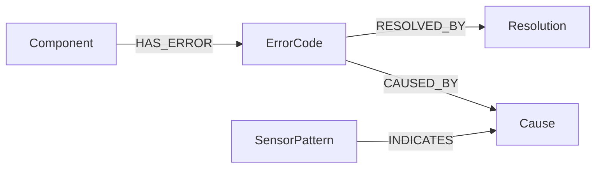
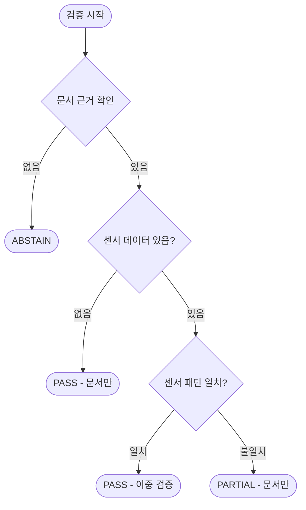

# UR5e Multi-Modal RAG 시스템 - 기술 설계서 (Main)

> **Main Version**: Foundation(Phase 0-10) 개선 + ATI Axia80 센서 통합
>
> 이 문서는 Foundation_Spec.md를 분석/검토하여 미비점을 개선하고,
> 센서 데이터 통합을 포함한 **완전판 기술 설계서**입니다.

---

## 📋 목차

### Part 1: 프로젝트 개요
1. [프로젝트 개요](#1-프로젝트-개요)
2. [타겟 디바이스 선정](#2-타겟-디바이스-선정)
3. [데이터 소스 (Ground Truth)](#3-데이터-소스-ground-truth)

### Part 2: 시스템 설계
4. [시스템 아키텍처](#4-시스템-아키텍처)
5. [폴더 구조](#5-폴더-구조)
6. [구성요소별 기술 스택](#6-구성요소별-기술-스택)

### Part 3: 인터페이스 명세
7. [API Contract](#7-api-contract)
8. [온톨로지 구조 설계](#8-온톨로지-구조-설계)
9. [센서 데이터 스키마](#9-센서-데이터-스키마)

### Part 4: 핵심 모듈 설계
10. [Entity Linker 설계](#10-entity-linker-설계)
11. [Context Enricher 설계](#11-context-enricher-설계)
12. [근거 검증 규칙 (Verifier)](#12-근거-검증-규칙-verifier)

### Part 5: 운영 및 평가
13. [정량적 성능 평가 계획](#13-정량적-성능-평가-계획)
14. [예외처리 및 보안정책](#14-예외처리-및-보안정책)
15. [Phase별 구현 체크리스트](#15-phase별-구현-체크리스트)

---

# Part 1: 프로젝트 개요

## 1. 프로젝트 개요

### 1.1 배경 및 문제점

#### Foundation(Phase 0-10)에서 발견된 한계
1. **문서 근거만으로는 실시간 설비 상태를 반영하지 못함**
   - 동일 에러코드라도 센서 패턴에 따라 원인이 다를 수 있음

2. **Entity Linker가 단순 정규식으로만 구현됨**
   - Spec에서 계획한 Lexicon/Rules 기반 링킹 미구현
   - 동의어, 한영 변환, 약어 처리 미흡

3. **폴더 구조가 Spec과 실제 구현이 불일치**
   - Spec: `apps/api/`, `ui/`, `pipelines/`
   - 실제: `src/api/`, `src/dashboard/`, `src/ingestion/`

4. **Trace ID 시스템 불완전**
   - `audit_trail.jsonl` 미구현
   - 요청/응답 추적 불가

5. **온톨로지 관계가 계획과 다르게 구현됨**
   - Spec: `MAY_CAUSE`, `FIXED_BY`, `REFERS_TO`
   - 실제: `RESOLVED_BY`, `HAS_ERROR`, `CAUSED_BY`

### 1.2 Main Version 목표

#### 핵심 개선 사항
| 영역 | Foundation 상태 | Main 목표 |
|------|-----------------|-----------|
| Entity Linker | 단순 정규식 | Lexicon + Rules + 임베딩 |
| 폴더 구조 | Spec ≠ 실제 | 실제 구조 기준으로 Spec 재정비 |
| Trace 시스템 | 불완전 | 완전한 audit_trail 구현 |
| 온톨로지 | 관계 불일치 | 실제 구현 기준 + DocumentRef 추가 |
| 데이터 소스 | 문서만 | 문서 + 센서 (Axia80) |

#### 핵심 목표
1. **Multi-Modal RAG**: 문서(텍스트) + 센서(시계열) 데이터 통합 추론
2. **개선된 Entity Linker**: Lexicon + Rules 기반 정규화
3. **완전한 Trace 시스템**: 모든 요청/응답 추적 가능
4. **이중 근거 검증**: 문서 citation + 센서 evidence

### 1.3 핵심 가치

1. **근거 우선(Evidence-first)**
   - 근거 없으면 답변 제한, 추가 질문으로 보강

2. **추적 가능성(Traceability)**
   - "왜 이 결론?"을 온톨로지 경로와 근거로 설명
   - `trace_id`로 전체 파이프라인 재현 가능

3. **운영 가능성(Operability)**
   - 도메인 지식은 `ontology.json`, `lexicon.yaml`로 지속 추가/수정
   - 센서 데이터는 주기적 수집, 문서는 배치 인덱싱

4. **이중 근거(Dual Evidence)** [Main 신규]
   - "문서에서도, 센서에서도 확인됨"

### 1.4 최종 산출물

#### 시스템 컴포넌트
- **Dashboard**: 질문/답변 + 문서 근거 + 센서 차트 시각화
- **Engine**: Ontology Reasoning + Hybrid RAG + Context Enricher + Verifier
- **Data Pack**:
  - UR5e Official Documents (PDF) + Processed Chunks
  - ATI Axia80 Sensor Data (1개월 시뮬레이션)
  - `ontology.json`, `lexicon.yaml`, `rules.yaml`
  - ChromaDB Index, Neo4j Graph
  - `audit_trail.jsonl`

---

## 2. 타겟 디바이스 선정

### 2.1 UR5e 협동로봇

#### 선정 이유
1. **공식 문서 완전성**: Service Manual, Error Codes Directory 공개
2. **글로벌 시장 점유율**: 협동로봇 시장 Top 3
3. **표준화된 인터페이스**: PolyScope 기반 일관된 문서 체계

#### UR5e 사양 요약
| 항목 | 값 |
|------|-----|
| 가반하중 | 5 kg |
| 작업반경 | 850 mm |
| 관절 수 | 6축 |
| 반복정밀도 | ±0.03 mm |
| 컨트롤러 | e-Series Control Box |

### 2.2 ATI Axia80 Force/Torque 센서 [Main 신규]

#### 선정 이유
1. **UR+ 인증**: UR 로봇과 공식 호환
2. **현장 활용도**: 조립, 삽입, 연마 등 접촉 작업에 필수
3. **풍부한 진단 정보**: 6축 힘/토크로 충돌, 마모, 오정렬 감지

#### Axia80 사양 요약
| 항목 | 값 |
|------|-----|
| 측정축 | 6축 (Fx, Fy, Fz, Tx, Ty, Tz) |
| 힘 범위 | ±500 N (Fx, Fy), ±1000 N (Fz) |
| 토크 범위 | ±20 Nm |
| 샘플링 레이트 | 125 Hz (기본) |
| 분해능 | 0.025 N / 0.0005 Nm |
| 인터페이스 | Ethernet |

### 2.3 통합 시나리오

#### 시나리오 1: 충돌 감지 + 에러 진단
```
[상황] UR5e에서 C119 에러 발생 (Safety Limit Violation)
[센서] Axia80에서 Fz 급증 패턴 감지 (500N → 800N, 50ms 내)
[진단] "문서상 C119는 안전 한계 초과, 센서 데이터상 Z축 충돌 확인됨"
[조치] "충돌 원인 제거 후 Safety Reset 수행 (Service Manual p.45)"
```

#### 시나리오 2: 그리퍼 마모 감지
```
[상황] 조립 공정에서 삽입 실패 빈도 증가
[센서] Axia80 Tx/Ty 노이즈 증가, 기준 대비 20% 상승
[진단] "삽입 토크 불안정, 그리퍼 핑거 마모 가능성"
[조치] "그리퍼 핑거 상태 점검, 마모 시 교체"
```

---

## 3. 데이터 소스 (Ground Truth)

### 3.1 문서 데이터

#### 공식 문서 목록
| doc_id | 문서명 | 용도 |
|--------|--------|------|
| `service_manual` | UR e-Series Service Manual | 수리/점검 절차 |
| `error_codes` | Error Codes Directory | 에러코드 → 조치 매핑 |
| `user_manual` | UR5e User Manual | 운영/안전 지침 |

#### 문서 처리 결과 (Foundation 완료)
- **총 청크 수**: ~6,900개
- **에러코드 수**: 99개 (202개 변형 포함)
- **저장소**: ChromaDB (Persist)

### 3.2 센서 데이터 [Main 신규]

#### ATI Axia80 시뮬레이션 데이터
| 항목 | 값 |
|------|-----|
| 기간 | 1개월 (30일) |
| 샘플링 | 125 Hz → 1초 평균 (저장용) |
| 레코드 수 | ~2,592,000 |
| 이상 패턴 | 충돌, 진동, 과부하 삽입 |

### 3.3 데이터 식별 정책

#### 문서 식별자 (doc_id)
```
형식: {source}_{type}
예: service_manual, error_codes, user_manual
```

#### 청크 식별자 (chunk_id)
```
형식: {doc_id}_{page}_{seq}
예: error_codes_15_001
```

#### 센서 식별자 (sensor_id) [Main 신규]
```
형식: {device}_{sensor}_{instance}
예: ur5e_axia80_001
```

---

# Part 2: 시스템 설계

## 4. 시스템 아키텍처

### 4.1 설계 원칙

#### Ontology-first (온톨로지 우선)
```
자연어 질의 → 온톨로지 엔티티/관계로 정규화 → 그래프 경로 기반 후보 생성
```

#### Evidence-first (근거 우선)
```
문서/센서 근거가 없는 정보 → 강한 단정 출력 금지 → 추가 질문으로 전환
```

#### 하이브리드 추론
```
Graph(Neo4j) = 도메인 구조 + 인과/조치 논리의 뼈대
Vector(ChromaDB) = 공식 문서 근거 확보(grounding)
Sensor = 실시간 맥락 보강 [Main 신규]

원칙: "그래프로 방향 잡고, 문서로 증명하고, 센서로 확인한다."
```

### 4.2 전체 아키텍처

```
┌───────────────────────────────────────────────────────────────────────────┐
│                              OFFLINE (배치/준비)                           │
│                                                                           │
│  ┌─────────┐   ┌─────────┐   ┌─────────┐   ┌─────────────┐              │
│  │  PDF    │──▶│  Parse  │──▶│  Chunk  │──▶│  ChromaDB   │              │
│  │ 문서들   │   │ (텍스트) │  │ (조각화) │   │  (벡터DB)   │              │
│  └─────────┘   └─────────┘   └─────────┘   └─────────────┘              │
│                                                                           │
│  ┌─────────┐   ┌─────────┐   ┌─────────┐                                 │
│  │ontology │──▶│ lexicon │──▶│  Neo4j  │                                 │
│  │  .json  │   │  .yaml  │   │(그래프DB)│                                 │
│  └─────────┘   └─────────┘   └─────────┘                                 │
│                                                                           │
│  ┌─────────┐   ┌─────────┐   ┌─────────────┐  [Main 신규]                │
│  │ Axia80  │──▶│ Pattern │──▶│ SensorStore │                             │
│  │시뮬레이션│   │ Detect  │   │ (Parquet)   │                             │
│  └─────────┘   └─────────┘   └─────────────┘                             │
└───────────────────────────────────────────────────────────────────────────┘
                                    │
                                    ▼
┌───────────────────────────────────────────────────────────────────────────┐
│                              ONLINE (실시간 서빙)                          │
│                                                                           │
│  사용자 질문                                                               │
│       │                                                                   │
│       ▼                                                                   │
│  ┌───────────────────────────────────────────────────────────────────┐   │
│  │                    Query Analyzer (질문 분석)                      │   │
│  │     에러코드 감지 / 부품명 감지 / 검색 전략 결정                    │   │
│  └───────────────────────────────────────────────────────────────────┘   │
│       │                                                                   │
│       ▼                                                                   │
│  ┌──────────┐   ┌──────────┐   ┌──────────┐   ┌──────────┐              │
│  │  Entity  │──▶│  Graph   │──▶│  Vector  │──▶│ Context  │              │
│  │  Linker  │   │ Retriever│   │ Retriever│   │ Enricher │  [Main 신규] │
│  └──────────┘   └──────────┘   └──────────┘   └──────────┘              │
│       │              │              │              │                      │
│       └──────────────┴──────────────┴──────────────┘                      │
│                              │                                            │
│                              ▼                                            │
│                    ┌──────────────────┐                                  │
│                    │     Verifier     │                                  │
│                    │  (근거 검증 Gate) │                                  │
│                    └──────────────────┘                                  │
│                              │                                            │
│                              ▼                                            │
│                    ┌──────────────────┐                                  │
│                    │    Generator     │                                  │
│                    │  (답변 생성/포맷) │                                  │
│                    └──────────────────┘                                  │
│                              │                                            │
│                              ▼                                            │
│                    최종 답변 + 근거 + 센서 차트                            │
└───────────────────────────────────────────────────────────────────────────┘
```

### 4.3 파이프라인 단계

#### Step 0: Trace 생성 & 입력 정규화
```python
trace_id = uuid4()
normalized_query = normalize(user_query)
# 공백, 대소문자, 에러코드 표기(C-153, C153) 통일
```

#### Step 1: Query Analysis (질문 분석)
```python
analysis = analyzer.analyze(query)
# error_codes: ['C4A15']
# components: ['Control Box']
# query_type: 'error_resolution'
# search_strategy: 'graph_first'
```

#### Step 2: Entity Linking [개선됨]
```python
linked = linker.link(analysis.entities)
# 방식: Lexicon 매칭 → 정규식 룰 → 임베딩 유사도
# 결과: [{entity, node_id, confidence, matched_by}]
```

#### Step 3: Graph Retrieval (Neo4j)
```python
graph_results = graph_retriever.search(linked_entities)
# RESOLVED_BY, HAS_ERROR, CAUSED_BY 관계 탐색
# expansion_terms 생성
```

#### Step 4: Vector Retrieval (ChromaDB)
```python
vector_results = vector_retriever.search(expanded_query, top_k=10)
# 문서 청크 검색
```

#### Step 5: Context Enrichment [Main 신규]
```python
enriched = context_enricher.enrich(
    doc_results=vector_results,
    error_code=analysis.error_codes[0],
    time_window="1h"
)
# sensor_evidence 추가
```

#### Step 6: Verification
```python
verified = verifier.verify(
    causes=graph_results.causes,
    actions=graph_results.actions,
    doc_evidence=vector_results,
    sensor_evidence=enriched.sensor_context  # [Main 신규]
)
# PASS / PARTIAL / ABSTAIN / FAIL
```

#### Step 7: Answer Generation
```python
answer = generator.generate(
    query=user_query,
    verified_data=verified,
    trace_id=trace_id
)
```

#### Step 8: Audit Logging [개선됨]
```python
audit_logger.log(
    trace_id=trace_id,
    query=user_query,
    analysis=analysis,
    linked_entities=linked,
    graph_paths=graph_results.paths,
    retrieval_results=vector_results,
    sensor_context=enriched,
    verifier_status=verified.status,
    answer=answer
)
```

---

## 5. 폴더 구조

### 5.1 설계 원칙

> **중요**: 이 폴더 구조는 **실제 구현된 구조**를 기준으로 작성됨
> Foundation Spec의 계획 구조(`apps/`, `ui/`)가 아닌 실제 `src/` 중심 구조

- **src 중심**: 모든 소스코드는 `src/` 하위에 위치
- **scripts 분리**: 실행 스크립트는 `scripts/` 하위
- **data 분리**: 원본/처리/인덱스 데이터 명확히 분리

### 5.2 디렉토리 구조

```plaintext
ur5e-ontology-rag/
├── README.md
├── requirements.txt
├── .env                          # 환경변수 (API 키, DB 설정)
├── .gitignore
│
├── configs/                      # [개선] 설정 파일들
│   ├── settings.yaml             # chunk_size, top_k, threshold 등
│   ├── rules.yaml                # [Main 신규] 엔티티 정규화/링킹 룰
│   └── logging.yaml              # 로깅 설정
│
├── data/
│   ├── raw/
│   │   └── pdf/                  # 원본 PDF
│   │
│   ├── processed/
│   │   ├── chunks/               # 청크 JSON
│   │   │   ├── error_codes_chunks.json
│   │   │   └── service_manual_chunks.json
│   │   ├── ontology/
│   │   │   ├── ontology.json     # 그래프 원천 데이터
│   │   │   └── lexicon.yaml      # [Main 신규] 동의어/별칭 사전
│   │   └── metadata/             # [개선] 근거 추적
│   │       ├── sources.yaml      # 문서 출처 정보
│   │       └── chunk_manifest.jsonl  # chunk → doc/page 매핑
│   │
│   ├── sensor/                   # [Main 신규]
│   │   ├── raw/
│   │   │   └── axia80_2024_01.parquet
│   │   ├── processed/
│   │   │   └── anomaly_patterns.json
│   │   └── metadata/
│   │       └── sensor_config.yaml
│   │
│   ├── benchmark/                # 평가용 QA 데이터셋
│   │   ├── error_code_qa.json
│   │   ├── component_qa.json
│   │   ├── general_qa.json
│   │   ├── invalid_qa.json
│   │   └── sensor_qa.json        # [Main 신규]
│   │
│   └── evaluation/
│       └── results/
│           └── latest.json
│
├── stores/                       # 영속 데이터
│   ├── chroma/                   # ChromaDB persist
│   ├── neo4j/                    # Neo4j data (Docker volume)
│   └── audit/                    # [개선]
│       └── audit_trail.jsonl     # 요청/응답 감사 로그
│
├── src/
│   ├── __init__.py
│   │
│   ├── config/                   # 설정 관리
│   │   ├── __init__.py
│   │   └── settings.py
│   │
│   ├── ingestion/                # 데이터 전처리 (= pipelines)
│   │   ├── __init__.py
│   │   ├── pdf_parser.py
│   │   ├── chunker.py
│   │   └── models.py
│   │
│   ├── embedding/                # 임베딩/벡터스토어
│   │   ├── __init__.py
│   │   ├── embedder.py
│   │   └── vector_store.py
│   │
│   ├── ontology/                 # 온톨로지 관리
│   │   ├── __init__.py
│   │   ├── graph_store.py
│   │   ├── schema.py
│   │   └── entity_extractor.py
│   │
│   ├── sensor/                   # [Main 신규]
│   │   ├── __init__.py
│   │   ├── data_generator.py     # 시뮬레이션 데이터 생성
│   │   ├── pattern_detector.py   # 이상 패턴 감지
│   │   └── context_provider.py   # 센서 맥락 제공
│   │
│   ├── rag/                      # RAG 핵심 로직
│   │   ├── __init__.py
│   │   ├── query_analyzer.py     # 질문 분석
│   │   ├── entity_linker.py      # [개선] 엔티티 링킹
│   │   ├── graph_retriever.py    # 그래프 검색
│   │   ├── retriever.py          # 벡터 검색
│   │   ├── hybrid_retriever.py   # 하이브리드 검색
│   │   ├── context_enricher.py   # [Main 신규]
│   │   ├── verifier.py           # 근거 검증
│   │   ├── prompt_builder.py     # 프롬프트 빌더
│   │   └── generator.py          # 답변 생성
│   │
│   ├── api/                      # FastAPI 서버
│   │   ├── __init__.py
│   │   ├── main.py
│   │   ├── routes/
│   │   │   ├── __init__.py
│   │   │   ├── query.py
│   │   │   ├── search.py
│   │   │   ├── info.py
│   │   │   ├── sensor.py         # [Main 신규]
│   │   │   └── health.py
│   │   ├── schemas/
│   │   │   ├── __init__.py
│   │   │   ├── request.py
│   │   │   └── response.py
│   │   └── services/
│   │       ├── __init__.py
│   │       ├── rag_service.py
│   │       └── audit_logger.py   # [개선]
│   │
│   ├── dashboard/                # Streamlit UI
│   │   ├── __init__.py
│   │   ├── app.py
│   │   ├── pages/
│   │   │   ├── __init__.py
│   │   │   ├── rag_query.py
│   │   │   ├── search_explorer.py
│   │   │   ├── knowledge_graph.py
│   │   │   ├── sensor.py         # [Main 신규]
│   │   │   ├── performance.py
│   │   │   └── overview.py
│   │   ├── components/
│   │   │   ├── __init__.py
│   │   │   ├── charts.py
│   │   │   ├── evidence.py
│   │   │   ├── metrics.py
│   │   │   └── sensor_chart.py   # [Main 신규]
│   │   ├── services/
│   │   │   ├── __init__.py
│   │   │   ├── api_client.py
│   │   │   └── graph_service.py
│   │   └── utils/
│   │       ├── __init__.py
│   │       ├── config.py
│   │       └── formatters.py
│   │
│   └── evaluation/               # 평가 시스템
│       ├── __init__.py
│       ├── benchmark.py
│       ├── metrics.py
│       ├── llm_judge.py
│       ├── evaluator.py
│       └── report.py
│
├── scripts/                      # 실행 스크립트
│   ├── run_api.py
│   ├── run_dashboard.py
│   ├── run_indexing.py
│   ├── run_evaluation.py
│   ├── run_rag.py                # Phase 5 버전
│   ├── run_rag_v2.py             # Phase 6 버전
│   └── generate_sensor_data.py   # [Main 신규]
│
├── tests/                        # 테스트
│   ├── unit/
│   └── integration/
│
└── docs/                         # 문서
    ├── Foundation_Spec.md        # 레퍼런스 (원본)
    ├── Foundation_ROADMAP.md     # 레퍼런스 (원본)
    ├── Main__Spec.md             # 현재 문서 (완전판)
    ├── Main__ROADMAP.md          # 로드맵 (완전판)
    └── Foundation_Phase*         # Phase별 완료보고서
```

### 5.3 핵심 파일 설명

#### configs/rules.yaml [Main 신규]
```yaml
# 엔티티 정규화/링킹 룰
error_code:
  patterns:
    - regex: 'C-?(\d+)(?:A(\d+))?'
      normalize: 'C{1}A{2}'
  valid_range:
    base: [0, 55]

component:
  matching_order:
    - lexicon    # 사전 매칭 우선
    - regex      # 정규식 보조
    - embedding  # 임베딩 fallback
```

#### data/processed/ontology/lexicon.yaml [Main 신규]
```yaml
# 동의어/별칭/한영 변환 사전
error_codes:
  C4A15:
    canonical: "C4A15"
    synonyms: ["C-4A15", "c4a15", "C4-A15"]

components:
  control_box:
    canonical: "Control Box"
    synonyms: ["컨트롤 박스", "controller", "제어기"]

  joint:
    canonical: "Joint"
    synonyms: ["조인트", "관절", "joint module"]
```

#### stores/audit/audit_trail.jsonl [개선]
```jsonl
{
  "trace_id": "550e8400-e29b-41d4-a716-446655440000",
  "timestamp": "2024-01-21T10:30:00Z",
  "user_query": "C4A15 에러 해결법",
  "normalized_query": "C4A15 에러 해결법",
  "analysis": {
    "error_codes": ["C4A15"],
    "components": [],
    "query_type": "error_resolution",
    "search_strategy": "graph_first"
  },
  "linked_entities": [
    {"entity": "C4A15", "node_id": "ERR_C4A15", "confidence": 0.95, "matched_by": "regex"}
  ],
  "graph_paths": [...],
  "retrieval_results": [...],
  "sensor_context": {...},
  "verifier_status": "PASS",
  "answer": "...",
  "latency_ms": 564
}
```

---

## 6. 구성요소별 기술 스택

### 6.1 기술 스택 매핑

| 레이어 | 기술 | 버전 | 역할 |
|--------|------|------|------|
| Frontend | Streamlit | 1.40+ | 대시보드 UI |
| API | FastAPI | 0.100+ | REST API 서버 |
| Core | Python | 3.10+ | 비즈니스 로직 |
| Graph DB | Neo4j | 5.x | 온톨로지 추론 |
| Vector DB | ChromaDB | 0.4+ | 문서 검색 |
| Sensor Store | Parquet + DuckDB | - | 시계열 조회 |
| Embedding | OpenAI | text-embedding-3-small | 문서 임베딩 |
| LLM | OpenAI | gpt-4o-mini | 엔티티 추출, 답변 생성 |

### 6.2 역할 분담

```
┌─────────────────────────────────────────────────────────────────┐
│                        역할 분담 원칙                           │
├─────────────────────────────────────────────────────────────────┤
│ Query Analyzer   → 질문 분석 (에러코드/부품 감지)               │
│ Entity Linker    → 엔티티 정규화/링킹 (Lexicon + Rules)        │
│ Graph (Neo4j)    → 추론의 뼈대 (관계 기반 후보 생성)           │
│ Vector (ChromaDB)→ 문서 근거 (grounding)                       │
│ Sensor (Parquet) → 맥락 근거 (context enrichment) [Main 신규]  │
│ Verifier         → 출력 제어 (PASS/ABSTAIN 결정)               │
│ LLM              → 문장화 (사실 생성 금지, 요약만)             │
└─────────────────────────────────────────────────────────────────┘
```

### 6.3 의존성 패키지

```
# requirements.txt 주요 패키지

# Core
python>=3.10
fastapi>=0.100.0
uvicorn>=0.23.0
streamlit>=1.40.0

# Database
chromadb>=0.4.0
neo4j>=5.0.0

# AI/ML
openai>=1.0.0
langchain>=0.1.0

# Data Processing
pymupdf>=1.23.0
pandas>=2.0.0
pyarrow>=14.0.0      # [Main 신규]
duckdb>=0.9.0        # [Main 신규]

# Utilities
pyyaml>=6.0
python-dotenv>=1.0.0

# Visualization
plotly>=5.18.0       # [Main 신규]
```

---

# Part 3: 인터페이스 명세

## 7. API Contract

### 7.1 공통 정책

#### Trace 정책
- 모든 요청에 `trace_id` (UUID) 발급
- 모든 응답에 `trace_id` 포함
- `/evidence/{trace_id}`로 전체 추적 정보 조회

#### Verifier Status
| Status | 설명 | 조치 출력 |
|--------|------|----------|
| `PASS` | 문서 + 센서 근거 충분 | 허용 |
| `PARTIAL` | 문서 근거만 있음 | 허용 (경고) |
| `ABSTAIN` | 근거 부족 | 금지 |
| `FAIL` | 시스템 오류 | 금지 |

#### Action Safety
- **Action(조치)은 문서 citation이 없으면 절대 출력하지 않음**
- 그래프 경로가 있어도 문서 근거 없으면 Action은 ABSTAIN

### 7.2 엔드포인트 목록

| Method | Path | 설명 |
|--------|------|------|
| POST | `/api/v1/query` | 질의응답 |
| GET | `/api/v1/evidence/{trace_id}` | 근거 상세 조회 |
| GET | `/api/v1/sensor/context` | 센서 맥락 조회 [Main 신규] |
| GET | `/api/v1/sensor/chart` | 센서 차트 데이터 [Main 신규] |
| GET | `/api/v1/health` | 상태 점검 |

### 7.3 POST /api/v1/query

#### Request
```json
{
  "user_query": "C4A15 에러가 발생했어요. 어떻게 해결하나요?",
  "options": {
    "top_k": 5,
    "include_sensor": true,
    "sensor_time_window": "1h",
    "debug": false
  }
}
```

#### Response (PASS)
```json
{
  "trace_id": "550e8400-e29b-41d4-a716-446655440000",
  "verifier_status": "PASS",
  "answer": "C4A15 에러는 'Communication with joint 3 lost' 문제입니다...",
  "structured_data": {
    "error_code": "C4A15",
    "causes": [
      {
        "title": "Joint 3 통신 오류",
        "confidence": 0.95,
        "evidence_type": "DOC_SUPPORTED",
        "doc_refs": [{"doc_id": "error_codes", "page": 15, "chunk_id": "ec_15_001"}]
      }
    ],
    "actions": [
      {
        "title": "완전 재부팅 수행",
        "doc_refs": [{"doc_id": "error_codes", "page": 15}]
      }
    ]
  },
  "evidence_summary": {
    "doc_citations": [
      {"doc_id": "error_codes", "page": 15}
    ]
  },
  "sensor_context": null
}
```

---

## 8. 온톨로지 구조 설계

### 8.1 Node(Label) 정의

> **중요**: 실제 구현된 구조를 기준으로 작성

| Node Label | 정의 | 주요 속성 | 예시 |
|------------|------|----------|------|
| `ErrorCode` | 에러 코드 | `code`(PK), `message`, `category` | C4A15, C50A100 |
| `Component` | 부품 | `name`(PK), `synonyms` | Control Box, Joint 3 |
| `Resolution` | 해결 방법 | `resolution_id`, `text` | "Conduct a complete rebooting" |
| `Cause` | 원인 | `cause_id`, `description` | "Communication lost" |
| `SensorPattern` | 센서 패턴 [Main 신규] | `pattern_id`, `type`, `threshold` | collision, vibration |

### 8.2 Relationship 정의

> **중요**: 실제 구현된 관계를 기준으로 작성

| 관계 타입 | Source | Target | 의미 |
|-----------|--------|--------|------|
| `RESOLVED_BY` | ErrorCode | Resolution | 에러 → 해결방법 |
| `HAS_ERROR` | Component | ErrorCode | 부품 → 에러 |
| `CAUSED_BY` | ErrorCode | Cause | 에러 → 원인 |
| `INDICATES` | SensorPattern | Cause | 센서패턴 → 원인 [Main 신규] |

### 8.3 온톨로지 다이어그램



### 8.4 Neo4j Cypher 쿼리 예시

#### 에러 해결 검색
```cypher
MATCH (e:ErrorCode {code: $code})-[:RESOLVED_BY]->(r:Resolution)
RETURN e.code, e.message, r.text
LIMIT 5
```

#### 부품별 에러 검색
```cypher
MATCH (c:Component)-[:HAS_ERROR]->(e:ErrorCode)
WHERE toLower(c.name) CONTAINS toLower($component)
RETURN c.name, e.code, e.message
LIMIT 10
```

---

## 9. 센서 데이터 스키마 [Main 신규]

### 9.1 Raw Data Schema (Parquet)

| Column | Type | 설명 |
|--------|------|------|
| timestamp | datetime64[ns] | UTC 타임스탬프 |
| Fx | float32 | X축 힘 (N) |
| Fy | float32 | Y축 힘 (N) |
| Fz | float32 | Z축 힘 (N) |
| Tx | float32 | X축 토크 (Nm) |
| Ty | float32 | Y축 토크 (Nm) |
| Tz | float32 | Z축 토크 (Nm) |
| status | string | normal/warning/error |

### 9.2 Pattern Detection Schema

```json
{
  "pattern_id": "PAT_001",
  "type": "collision",
  "timestamp": "2024-01-15T10:30:00.123Z",
  "duration_ms": 150,
  "metrics": {
    "peak_axis": "Fz",
    "peak_value": 850.5,
    "rise_time_ms": 45
  },
  "confidence": 0.92,
  "related_error_codes": ["C119", "C153"]
}
```

### 9.3 센서 패턴 유형

| Pattern Type | 감지 조건 | 연관 에러코드 |
|--------------|----------|---------------|
| `collision` | Fz 급증 (>500N, <100ms) | C119, C153 |
| `vibration` | FFT 고주파 성분 증가 | C204, C207 |
| `overload` | 지속적 힘/토크 초과 | C189, C190 |
| `drift` | 점진적 baseline 이동 | C103, C104 |

---

# Part 4: 핵심 모듈 설계

## 10. Entity Linker 설계 [개선]

### 10.1 Foundation의 문제점

```python
# Foundation 구현: 단순 정규식만 사용
self.error_code_pattern = re.compile(r'\b(C\d+(?:A\d+)?)\b', re.IGNORECASE)
```

**문제:**
- 동의어/한영 변환 미지원
- 약어 처리 미흡
- 유사 매칭 불가

### 10.2 Main 개선 설계

```python
class EntityLinker:
    """개선된 엔티티 링커"""

    def __init__(self, lexicon_path: str, rules_path: str):
        self.lexicon = load_yaml(lexicon_path)  # 동의어 사전
        self.rules = load_yaml(rules_path)      # 정규화 룰

    def link(self, entities: List[str]) -> List[LinkedEntity]:
        """
        엔티티를 온톨로지 노드에 링킹

        매칭 순서:
        1. Lexicon 매칭 (동의어 사전)
        2. Regex 룰 매칭 (정규식 패턴)
        3. Embedding 유사도 (fallback)
        """
        results = []
        for entity in entities:
            # 1. Lexicon 매칭
            linked = self._match_lexicon(entity)
            if linked:
                results.append(linked)
                continue

            # 2. Regex 룰 매칭
            linked = self._match_rules(entity)
            if linked:
                results.append(linked)
                continue

            # 3. Embedding fallback
            linked = self._match_embedding(entity)
            if linked:
                results.append(linked)

        return results
```

### 10.3 lexicon.yaml 구조

```yaml
error_codes:
  C4A15:
    canonical: "C4A15"
    synonyms: ["C-4A15", "c4a15", "C4-A15", "C 4 A 15"]
    node_id: "ERR_C4A15"

  C50:
    canonical: "C50"
    synonyms: ["C-50", "c50"]
    node_id: "ERR_C50"

components:
  control_box:
    canonical: "Control Box"
    synonyms:
      - "컨트롤 박스"
      - "컨트롤러"
      - "controller"
      - "제어기"
      - "제어 박스"
    node_id: "COMP_CONTROL_BOX"

  joint_3:
    canonical: "Joint 3"
    synonyms:
      - "조인트 3"
      - "3번 조인트"
      - "joint 3"
      - "J3"
    node_id: "COMP_JOINT_3"
```

### 10.4 rules.yaml 구조

```yaml
error_code:
  patterns:
    - regex: 'C-?(\d+)(?:A(\d+))?'
      normalize: 'C{base}A{sub}'
      examples: ["C-4A15 → C4A15", "C50 → C50"]

  validation:
    base_range: [0, 55]  # C0 ~ C55만 유효

component:
  matching:
    order: ["lexicon", "regex", "embedding"]
    min_confidence: 0.7
```

---

## 11. Context Enricher 설계 [Main 신규]

### 11.1 역할

Context Enricher는 **문서 검색 결과에 센서 맥락을 추가**하는 모듈

```
Vector Retrieval → Context Enricher → Verifier
     (문서)              (센서)         (통합)
```

### 11.2 인터페이스

```python
class ContextEnricher:
    def enrich(
        self,
        query: str,
        doc_chunks: List[Chunk],
        error_code: Optional[str] = None,
        timestamp: Optional[datetime] = None,
        time_window: str = "1h"
    ) -> EnrichedContext:
        """
        문서 청크에 센서 맥락을 추가

        Returns:
            doc_evidence: 문서 근거
            sensor_evidence: 센서 근거
            correlation: 문서-센서 상관관계
        """
```

### 11.3 출력 구조

```python
@dataclass
class EnrichedContext:
    doc_evidence: List[DocEvidence]
    sensor_evidence: Optional[SensorEvidence]
    correlation: CorrelationResult

@dataclass
class SensorEvidence:
    patterns: List[PatternMatch]
    statistics: Dict[str, AxisStats]
    time_range: TimeRange
    chart_data: List[Dict]

@dataclass
class CorrelationResult:
    level: str  # "STRONG", "MODERATE", "WEAK", "NONE"
    reason: str
    supporting_evidence: List[str]
```

---

## 12. 근거 검증 규칙 (Verifier)

### 12.1 검증 원칙

```
┌───────────────────────────────────────────────────────────────┐
│                    Verification Policy                        │
├───────────────────────────────────────────────────────────────┤
│ 1. 문서 근거 필수: Action은 반드시 doc citation 필요          │
│ 2. 센서 근거 보강: 센서 패턴이 있으면 신뢰도 상승 [Main 신규] │
│ 3. 이중 검증 우대: 문서+센서 모두 확인되면 PASS [Main 신규]   │
│ 4. 센서만으로는 불충분: 센서만 있으면 PARTIAL [Main 신규]     │
└───────────────────────────────────────────────────────────────┘
```

### 12.2 Cause 검증 등급

| 등급 | 조건 | 신뢰도 |
|------|------|--------|
| `DOC_AND_SENSOR` | 문서 + 센서 모두 지지 | 0.9+ |
| `DOC_SUPPORTED` | 문서 근거만 있음 | 0.7~0.9 |
| `SENSOR_INDICATED` | 센서 패턴만 있음 | 0.5~0.7 |
| `HYPOTHESIS` | 둘 다 부족 | <0.5 |

### 12.3 Verifier Status 결정 로직

```python
def determine_status(doc_verified: bool, sensor_verified: Optional[bool]) -> str:
    if not doc_verified:
        return "ABSTAIN"  # 문서 근거 필수

    if sensor_verified is None:
        return "PASS"  # 센서 없는 질문은 문서만으로 PASS

    if sensor_verified:
        return "PASS"  # 이중 검증 완료
    else:
        return "PARTIAL"  # 문서만 확인, 센서는 불일치
```

### 12.4 Verifier 플로우



---

# Part 5: 운영 및 평가

## 13. 정량적 성능 평가 계획

### 13.1 평가 축

| 축 | 측정 대상 | 핵심 지표 |
|----|----------|----------|
| Retrieval | 문서 검색 품질 | Recall@5, MRR |
| Generation | 답변 품질 | Accuracy, Hallucination Rate |
| Verification | 안전성 | Action Safety Leak Rate |
| Sensor | 센서 활용 품질 [Main 신규] | Pattern Detection F1, Context Relevance |

### 13.2 주요 지표

| 지표 | 정의 | 목표 |
|------|------|------|
| **Recall@5** | 정답 근거가 top-5에 포함된 비율 | > 80% |
| **Accuracy** | 정답과 일치하는 답변 비율 | > 80% |
| **Hallucination Rate** | 근거 없는 정보 생성 비율 | < 5% |
| **Action Safety Leak Rate** | 근거 없는 Action 출력 비율 | **0%** |
| **Pattern Detection F1** | 센서 패턴 감지 정확도 [Main 신규] | > 85% |
| **Dual Evidence Rate** | 이중 근거 비율 [Main 신규] | > 70% |

### 13.3 벤치마크 데이터셋

| 파일 | 질문 수 | 카테고리 |
|------|---------|----------|
| `error_code_qa.json` | 15 | 에러코드 질문 |
| `component_qa.json` | 10 | 부품 질문 |
| `general_qa.json` | 10 | 일반 질문 |
| `invalid_qa.json` | 5 | 환각 테스트 |
| `sensor_qa.json` [Main 신규] | 10 | 센서 통합 질문 |

---

## 14. 예외처리 및 보안정책

### 14.1 예외 처리 정책

| 예외 상황 | 처리 정책 |
|----------|----------|
| Neo4j 연결 실패 | Vector 검색만으로 fallback |
| ChromaDB 연결 실패 | FAIL 반환 + 오류 로깅 |
| LLM 타임아웃 | 재시도 (최대 3회) |
| 센서 데이터 없음 [Main 신규] | 문서 기반으로만 응답 (PARTIAL) |

### 14.2 Fallback 정책

```python
class FallbackHandler:
    def handle_neo4j_down(self) -> SearchResult:
        """Neo4j 장애 시 Vector 검색만 사용"""
        return vector_retriever.search(query)

    def handle_sensor_unavailable(self) -> EnrichedContext:
        """센서 데이터 없을 시 문서만 반환"""
        return EnrichedContext(
            doc_evidence=doc_results,
            sensor_evidence=None,
            correlation=CorrelationResult(level="NONE", reason="센서 데이터 없음")
        )
```

### 14.3 Audit 로깅

```python
# 모든 요청/응답을 audit_trail.jsonl에 기록
audit_logger.log(
    trace_id=trace_id,
    timestamp=datetime.utcnow(),
    user_query=user_query,
    verifier_status=status,
    latency_ms=latency,
    error=error if error else None
)
```

---

## 15. Phase별 구현 체크리스트

### 15.1 Foundation 개선 Phase (Main-F)

#### Main-F1: Entity Linker 개선
- [ ] `configs/rules.yaml` 작성
- [ ] `data/processed/ontology/lexicon.yaml` 작성
- [ ] `src/rag/entity_linker.py` 개선
- [ ] Lexicon + Rules 기반 링킹 구현
- [ ] 단위 테스트 작성

#### Main-F2: Trace 시스템 완성
- [ ] `stores/audit/audit_trail.jsonl` 구조 정의
- [ ] `src/api/services/audit_logger.py` 구현
- [ ] 모든 요청/응답 로깅
- [ ] `/evidence/{trace_id}` 엔드포인트 완성

#### Main-F3: 메타데이터 파일 추가
- [ ] `data/processed/metadata/sources.yaml` 작성
- [ ] `data/processed/metadata/chunk_manifest.jsonl` 생성
- [ ] 청크 → 문서/페이지 역추적 기능

### 15.2 센서 통합 Phase (Main-S)

#### Main-S1: 센서 데이터 생성
- [ ] `scripts/generate_sensor_data.py` 구현
- [ ] 1개월 시뮬레이션 데이터 생성
- [ ] Parquet 저장 구조 확정
- [ ] 데이터 검증

#### Main-S2: 패턴 감지
- [ ] `src/sensor/pattern_detector.py` 구현
- [ ] 충돌/진동/과부하 패턴 감지
- [ ] 단위 테스트 작성

#### Main-S3: Context Enricher
- [ ] `src/rag/context_enricher.py` 구현
- [ ] RAGService 통합
- [ ] 문서-센서 상관관계 분석

#### Main-S4: 온톨로지 확장
- [ ] `SensorPattern` 노드 추가
- [ ] `INDICATES` 관계 추가
- [ ] `ontology.json` 업데이트

#### Main-S5: Verifier 확장
- [ ] 이중 검증 로직 구현
- [ ] `PARTIAL` 상태 추가
- [ ] 회귀 테스트

#### Main-S6: API/UI 확장
- [ ] `/sensor/context`, `/sensor/chart` 구현
- [ ] Dashboard 센서 페이지 추가
- [ ] 통합 테스트

### 15.3 코드 리뷰 체크포인트

각 Phase 완료 시 다음 항목 검토:

| 항목 | 확인 내용 |
|------|----------|
| **Spec 일치** | 본 문서의 스키마/인터페이스와 일치하는가? |
| **테스트 커버리지** | 핵심 로직에 테스트가 있는가? |
| **에러 처리** | 예외 상황이 처리되는가? |
| **로깅** | 적절한 로깅이 있는가? |
| **문서화** | 코드 주석과 docstring이 충분한가? |

---

## 부록 A: 용어 정의

| 용어 | 정의 |
|------|------|
| Ground Truth | 신뢰할 수 있는 원천 데이터 (공식 문서, 실제 센서) |
| Entity Linking | 자연어 텍스트를 온톨로지 노드 ID에 매핑하는 과정 |
| Context Enrichment | 검색 결과에 추가 맥락(센서 데이터)을 더하는 과정 |
| Dual Evidence | 문서와 센서 두 가지 근거가 모두 확인된 상태 |
| Evidence Gate | 근거 유무에 따라 출력을 제어하는 검증 단계 |
| Trace ID | 요청/응답을 추적하기 위한 고유 식별자 |

---

## 부록 B: Foundation vs Main 비교표

| 항목 | Foundation | Main |
|------|------------|------|
| 데이터 소스 | 문서만 | 문서 + 센서 |
| Entity Linker | 단순 정규식 | Lexicon + Rules + Embedding |
| 폴더 구조 | Spec ≠ 실제 | 실제 기준 정비 |
| Trace 시스템 | 불완전 | 완전한 audit_trail |
| Verifier Status | PASS/ABSTAIN/FAIL | + PARTIAL |
| 온톨로지 | ErrorCode, Component | + SensorPattern |

---

**문서 버전**: Main v1.0
**작성일**: 2024-01-21
**기반 문서**: Foundation_Spec.md
**작성자**: Claude (AI Assistant)
