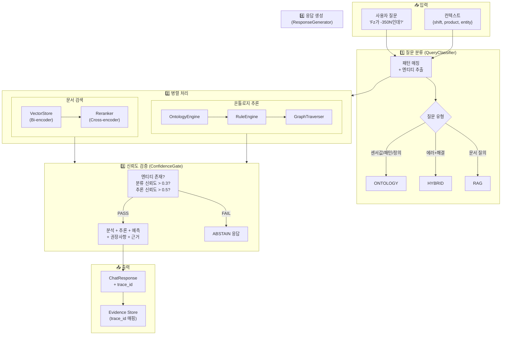
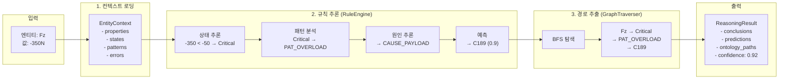
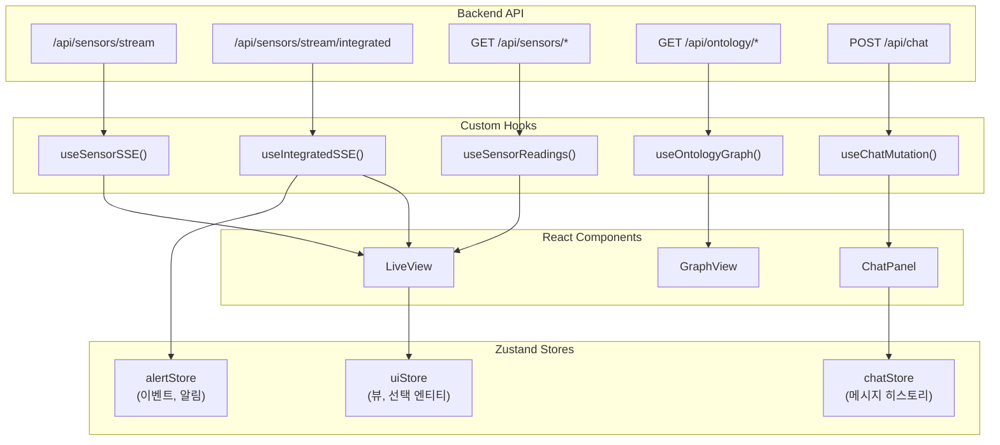
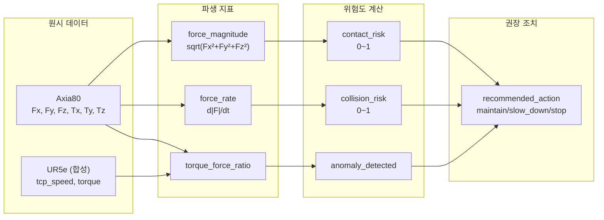

# 시스템 파이프라인 아키텍처

> **버전**: v2.1 (실제 구현 기준)
> **최종 업데이트**: 2025-01

---

## 0. PoC 구현 vs 목표 아키텍처

> ⚠️ **중요**: 이 문서는 **현재 PoC 구현**을 기준으로 작성되었습니다.
> 설계 다이어그램에 표시된 기술 스택과 실제 구현이 다를 수 있습니다.

### Layer 3: 데이터 & 통합 계층 비교

| 구성요소 | 목표 아키텍처 (설계) | 현재 PoC 구현 | 비고 |
|----------|---------------------|---------------|------|
| **센서 시계열 DB** | TimescaleDB / InfluxDB | Parquet 파일 | `data/sensor/raw/*.parquet` |
| **온톨로지 그래프** | Neo4j / RDF Store | JSON + 인메모리 | `data/processed/ontology/ontology.json` |
| **벡터 저장소** | Milvus / Pinecone | ChromaDB | `stores/chroma/` (파일 기반) |
| **메시지 큐** | Kafka / RabbitMQ | 미구현 | PoC는 직접 호출 방식 |

### 왜 다른가?

**PoC 단계의 설계 철학:**
- **빠른 프로토타이핑**: 파일 기반 저장소로 설치/설정 오버헤드 최소화
- **단일 머신 실행**: 분산 시스템 없이 로컬에서 완전한 데모 가능
- **의존성 최소화**: Docker/외부 서비스 없이 `pip install`만으로 실행

**프로덕션 마이그레이션 시 고려사항:**
- TimescaleDB: 대용량 시계열 쿼리 성능 (현재 7일 → 수년간 데이터)
- Neo4j: 복잡한 그래프 쿼리, 온톨로지 확장성
- Milvus/Pinecone: 수백만 문서 임베딩, 분산 검색
- Kafka: 실시간 이벤트 스트리밍, 멀티 컨슈머

---

## 1. 전체 시스템 구조

```
┌─────────────────────────────────────────────────────────────────────────────┐
│                              Frontend (Next.js 16)                          │
│  ┌─────────────┐  ┌─────────────┐  ┌─────────────┐  ┌─────────────┐        │
│  │  LiveView   │  │  GraphView  │  │ HistoryView │  │  ChatPanel  │        │
│  │ (실시간)    │  │ (온톨로지)  │  │  (이력)     │  │  (AI 챗봇)  │        │
│  └──────┬──────┘  └──────┬──────┘  └──────┬──────┘  └──────┬──────┘        │
│         │                │                │                │               │
│         └────────────────┴────────────────┴────────────────┘               │
│                                    │                                        │
│                          React Query + Zustand                              │
│                                    │                                        │
│              ┌─────────────────────┼─────────────────────┐                  │
│              │ SSE (실시간)        │ REST (폴링/요청)    │                  │
└──────────────┼─────────────────────┼─────────────────────┼──────────────────┘
               │                     │                     │
               ▼                     ▼                     ▼
┌─────────────────────────────────────────────────────────────────────────────┐
│                              Backend (FastAPI)                              │
│                                                                             │
│  ┌─────────────────────────────────────────────────────────────────────┐   │
│  │                         API Routes (4개)                             │   │
│  │  /api/chat    /api/sensors/*    /api/ontology/*    /health         │   │
│  └─────────────────────────────────────────────────────────────────────┘   │
│                                    │                                        │
│         ┌──────────────────────────┼──────────────────────────┐            │
│         │                          │                          │            │
│         ▼                          ▼                          ▼            │
│  ┌─────────────┐          ┌─────────────┐          ┌─────────────┐        │
│  │    RAG      │          │  Ontology   │          │   Sensor    │        │
│  │  Pipeline   │          │   Engine    │          │   Engine    │        │
│  └─────────────┘          └─────────────┘          └─────────────┘        │
│                                                                             │
└─────────────────────────────────────────────────────────────────────────────┘
```

---

## 2. 백엔드 파이프라인

### 2.1 핵심 모듈 구조

```
src/
├── api/                           # FastAPI 라우터
│   ├── main.py                    # 앱 진입점, 싱글톤 초기화
│   └── routes/
│       ├── chat.py                # POST /api/chat (메인 챗봇)
│       ├── sensor.py              # GET /api/sensors/* (센서 데이터)
│       ├── ontology.py            # GET /api/ontology/* (그래프 탐색)
│       └── system.py              # GET /health (헬스체크)
│
├── rag/                           # RAG 파이프라인 (2,400+ 줄)
│   ├── query_classifier.py        # 질문 분류 (406줄)
│   ├── entity_extractor.py        # 엔티티 추출 (599줄)
│   ├── hybrid_retriever.py        # 하이브리드 검색 (400줄)
│   ├── confidence_gate.py         # 신뢰도 게이트 (245줄)
│   ├── response_generator.py      # 응답 생성 (920줄)
│   └── prompt_builder.py          # 프롬프트 구성 (220줄)
│
├── ontology/                      # 온톨로지 엔진 (3,800+ 줄)
│   ├── ontology_engine.py         # 추론 엔진 (1,940줄)
│   ├── rule_engine.py             # 규칙 엔진 (960줄)
│   ├── graph_traverser.py         # 그래프 탐색 (599줄)
│   └── loader.py                  # 온톨로지 로더 (216줄)
│
├── sensor/                        # 센서 처리
│   ├── sensor_store.py            # 시계열 저장소
│   ├── pattern_detector.py        # 패턴 감지
│   └── correlation_engine.py      # 이기종 상관분석
│
└── embedding/                     # 벡터 검색
    ├── vector_store.py            # ChromaDB (400줄)
    ├── embedder.py                # OpenAI 임베딩 (163줄)
    └── reranker.py                # Cross-Encoder (241줄)
```

### 2.2 채팅 파이프라인 (POST /api/chat)



### 2.3 질문 분류 상세 (QueryClassifier)

| 질문 유형 | 트리거 조건 | 가중치 | 예시 |
|----------|------------|--------|------|
| **ONTOLOGY** | 센서축 + 수치값 | 0.9 | "Fz가 -350N인데 뭐야?" |
| | 패턴/상태 질문 | 0.85 | "충돌 패턴이 뭐야?" |
| | 엔티티 정의 | 0.8 | "Fz가 뭐야?" |
| | 시간 맥락 | 0.75 | "최근 충돌 있어?" |
| **HYBRID** | 에러코드 + 해결 | 0.8 | "C153 해결 방법?" |
| | 에러 원인 | 0.75 | "C153 왜 나와?" |
| **RAG** | 사양/절차 | 0.8 | "UR5e 페이로드?" |
| | 일반 문서 | 0.6 | "설치 방법?" |

**분류 알고리즘:**
```python
# 1. 지표 점수 계산
ontology_score = Σ(matched_indicator.weight)  # 최대 1.0
hybrid_score = Σ(matched_indicator.weight)
rag_score = Σ(matched_indicator.weight)

# 2. 엔티티 보정 (+최대 0.5)
if MeasurementAxis + Value: ontology_score += 0.3
if Pattern: ontology_score += 0.2
if TimeExpression: ontology_score += 0.15

# 3. 최종 분류
query_type = argmax(ontology_score, hybrid_score, rag_score)
if max_score < 0.3: query_type = RAG  # 폴백
```

### 2.4 온톨로지 추론 상세 (OntologyEngine)



### 2.5 신뢰도 게이트 (ConfidenceGate)

```
┌─────────────────────────────────────────────────────────────┐
│                    신뢰도 다층 검증                          │
├─────────────────────────────────────────────────────────────┤
│                                                             │
│  Level 1: 엔티티 추출                                       │
│  ├─ 체크: classification.entities 존재?                    │
│  └─ 실패 시: "구체적인 센서/에러코드를 포함해주세요"        │
│                                                             │
│  Level 2: 분류 신뢰도                                       │
│  ├─ 체크: classification.confidence >= 0.3                 │
│  └─ 실패 시: "질문을 더 명확하게 표현해주세요"              │
│                                                             │
│  Level 3: 추론 결과                                         │
│  ├─ 체크: reasoning.conclusions 존재?                      │
│  └─ 실패 시: "온톨로지에 등록되지 않은 항목입니다"          │
│                                                             │
│  Level 4: 추론 신뢰도                                       │
│  ├─ 체크: reasoning.confidence >= 0.5                      │
│  └─ 실패 시: "추가 정보를 제공해주세요"                     │
│                                                             │
│  ═══════════════════════════════════════════════════════   │
│  모두 통과 → PASS (정상 응답 생성)                          │
│  하나라도 실패 → ABSTAIN (응답 거부 + 가이드 제공)          │
│                                                             │
└─────────────────────────────────────────────────────────────┘
```

### 2.6 응답 구조 (ChatResponse)

```typescript
interface ChatResponse {
  // 메타
  trace_id: string;           // 추적용 UUID
  query_type: 'ontology' | 'hybrid' | 'rag';
  abstain: boolean;           // 응답 거부 여부
  abstain_reason?: string;

  // 핵심 응답
  answer: string;             // 자연어 응답

  // 분석 결과
  analysis: {
    entity: string;           // "Fz"
    value: number;            // -350.0
    unit: string;             // "N"
    state: string;            // "State_Critical"
    normal_range: [number, number];
    deviation: string;        // "정상 대비 약 7배"
  };

  // 추론 결과
  reasoning: {
    confidence: number;       // 0.92
    pattern: string;          // "PAT_OVERLOAD"
    pattern_confidence: number;
    cause: string;            // "CAUSE_PAYLOAD_EXCEEDED"
    cause_confidence: number;
  };

  // 예측
  prediction: {
    error_code: string;       // "C189"
    probability: number;      // 0.9
    timeframe: string;        // "수분 내"
  };

  // 권장사항
  recommendation: {
    immediate: string;
    steps: string[];
  };

  // 근거
  evidence: {
    ontology_paths: OntologyPath[];
    document_refs: DocumentRef[];
  };

  // 시각화용 그래프
  graph: {
    nodes: GraphNode[];
    edges: GraphEdge[];
  };
}
```

---

## 3. 프론트엔드 파이프라인

### 3.1 컴포넌트 구조

```
frontend/src/
├── app/
│   ├── layout.tsx              # Root (Providers 초기화)
│   └── page.tsx                # 메인 페이지
│
├── components/
│   ├── layout/
│   │   ├── Header.tsx          # 네비게이션
│   │   └── SplitView.tsx       # 반응형 레이아웃
│   │
│   ├── live/                   # 실시간 모니터링
│   │   ├── LiveView.tsx        # 메인 컨테이너
│   │   ├── RiskAlertBar.tsx    # 위험 경고
│   │   ├── ObjectCard.tsx      # 센서 카드
│   │   ├── RealtimeChart.tsx   # 실시간 차트
│   │   └── CorrelationTable.tsx # 상관분석
│   │
│   ├── graph/                  # 온톨로지 탐색
│   │   ├── GraphView.tsx       # 그래프 뷰
│   │   └── SubGraph.tsx        # React Flow 렌더링
│   │
│   ├── chat/                   # AI 어시스턴트
│   │   └── ChatPanel.tsx       # 채팅 UI
│   │
│   └── evidence/
│       └── EvidenceDrawer.tsx  # 근거 상세
│
├── hooks/
│   ├── useApi.ts               # React Query 훅
│   ├── useSSE.ts               # SSE 스트리밍
│   └── useAnomalyAlert.ts      # 이상 감지
│
├── stores/                     # Zustand 상태
│   ├── uiStore.ts              # UI 상태
│   ├── chatStore.ts            # 채팅 히스토리
│   ├── alertStore.ts           # 알림/이벤트
│   └── apiKeyStore.ts          # API 키
│
└── lib/
    └── api.ts                  # API 클라이언트
```

### 3.2 데이터 흐름



### 3.3 실시간 데이터 흐름 (LiveView)

```
┌─────────────────────────────────────────────────────────────────┐
│                     실시간 센서 모니터링                         │
├─────────────────────────────────────────────────────────────────┤
│                                                                 │
│  1. SSE 스트림 수신                                             │
│     /api/sensors/stream/integrated (0.5초 간격)                │
│     ↓                                                          │
│     useIntegratedSSE()                                         │
│     ↓                                                          │
│     IntegratedStreamData {                                     │
│       scenario: { current: 'collision' }                       │
│       axia80: { Fz: -450, force_spike: true }                 │
│       ur5e: { tcp_speed: 0.05 }                               │
│       risk: { risk_level: 'critical' }                        │
│     }                                                          │
│                                                                 │
│  2. 이상 감지                                                   │
│     useAnomalyAlert(latestData)                                │
│     ↓                                                          │
│     시나리오 변경 감지: normal → collision                      │
│     ↓                                                          │
│     ├─ alertStore.addEvent(event)                             │
│     ├─ toast.error("충돌 감지!")                               │
│     └─ playAlert('critical')                                  │
│                                                                 │
│  3. UI 업데이트                                                 │
│     ├─ RiskAlertBar: critical 상태 표시                        │
│     ├─ ObjectCard: Fz 카드 빨간색                              │
│     ├─ RealtimeChart: 그래프 업데이트                          │
│     └─ EventDetectionCard: 충돌 이벤트 표시                    │
│                                                                 │
└─────────────────────────────────────────────────────────────────┘
```

### 3.4 채팅 데이터 흐름 (ChatPanel)

```
┌─────────────────────────────────────────────────────────────────┐
│                        AI 어시스턴트                            │
├─────────────────────────────────────────────────────────────────┤
│                                                                 │
│  1. 사용자 입력                                                 │
│     "Fz가 -350N인데 이게 뭐야?"                                │
│     + 컨텍스트 { selectedEntity: 'Fz', currentView: 'live' }  │
│                                                                 │
│  2. API 호출                                                    │
│     useChatMutation()                                          │
│     POST /api/chat                                             │
│     Header: X-OpenAI-API-Key: <user_api_key>                  │
│                                                                 │
│  3. 응답 처리                                                   │
│     normalizeChatResponse(raw)  // snake_case → camelCase     │
│     ↓                                                          │
│     chatStore.addMessage({                                     │
│       role: 'assistant',                                       │
│       content: answer,                                         │
│       response: ChatResponse                                   │
│     })                                                          │
│                                                                 │
│  4. UI 렌더링                                                   │
│     ├─ MessageBubble: 응답 텍스트                              │
│     ├─ ResponseMeta: 유형, 신뢰도                              │
│     ├─ EvidenceToggle: 근거 펼치기                             │
│     └─ Graph 렌더링 (관련 노드/엣지)                           │
│                                                                 │
└─────────────────────────────────────────────────────────────────┘
```

---

## 4. 이기종 상관분석 파이프라인

### 4.1 데이터 통합 흐름



### 4.2 시나리오별 특성

| 시나리오 | Fz 범위 | tcp_speed | 위험도 | 트리거 조건 |
|----------|---------|-----------|--------|-------------|
| `normal` | -30 ~ -10N | 0.2~0.4 m/s | 0.1~0.2 | 기본 상태 |
| `high_force` | -80 ~ -50N | 0.3~0.5 m/s | 0.4~0.6 | \|Fz\| > 50N |
| `contact` | -150 ~ -80N | 0.1~0.3 m/s | 0.6~0.8 | \|Fz\| > 80N |
| `collision` | -350 ~ -200N | 0~0.1 m/s | 0.8~1.0 | Fz < -200N (급락) |
| `overload` | -150N+ (지속) | 유지 | 0.7~0.9 | 5초 이상 지속 |
| `wear` | 드리프트 | 유지 | 0.5~0.7 | baseline 10%+ |

---

## 5. API 엔드포인트 요약

### 5.1 채팅 API

| 엔드포인트 | 메서드 | 설명 |
|-----------|--------|------|
| `/api/chat` | POST | 메인 챗봇 (RAG + 온톨로지) |
| `/api/evidence/{trace_id}` | GET | 근거 상세 조회 |

### 5.2 센서 API

| 엔드포인트 | 메서드 | 설명 |
|-----------|--------|------|
| `/api/sensors/readings` | GET | 센서값 (폴링) |
| `/api/sensors/events` | GET | 감지 이벤트 |
| `/api/sensors/patterns` | GET | 패턴 분석 |
| `/api/sensors/predictions` | GET | 예측 데이터 |
| `/api/sensors/stream` | GET | SSE 센서 스트림 |
| `/api/sensors/stream/integrated` | GET | SSE 통합 스트림 |

### 5.3 온톨로지 API

| 엔드포인트 | 메서드 | 설명 |
|-----------|--------|------|
| `/api/ontology/entities` | GET | 전체 엔티티 (199개) |
| `/api/ontology/entity/{id}` | GET | 엔티티 상세 |
| `/api/ontology/neighbors/{id}` | GET | 이웃 노드 |
| `/api/ontology/graph` | GET | 서브그래프 |

### 5.4 시스템 API

| 엔드포인트 | 메서드 | 설명 |
|-----------|--------|------|
| `/health` | GET | 헬스체크 |
| `/api/ontology/summary` | GET | 온톨로지 요약 |

---

## 6. 성능 특성

### 6.1 응답 시간 (채팅 API)

| 단계 | 소요 시간 | 비고 |
|------|----------|------|
| 질문 분류 | ~10ms | 패턴 매칭 |
| 문서 검색 (VectorStore) | ~100ms | Bi-encoder |
| 리랭킹 (Cross-encoder) | ~100ms | Top-20 → Top-5 |
| 온톨로지 추론 | ~50ms | 그래프 탐색 |
| 응답 생성 | ~30ms | 템플릿 조합 |
| **총합** | **~200-290ms** | 병렬 처리 시 |

### 6.2 최적화 기법

- **병렬 처리**: 문서 검색 + 온톨로지 추론 동시 실행 (40% 개선)
- **싱글톤 캐싱**: 모델 재로딩 방지 (VectorStore, OntologyEngine)
- **선택적 검색**: ONTOLOGY 질문은 Top-3만 검색
- **SSE 버퍼 관리**: 최신 60개만 유지

---

## 7. 기술 스택

### Backend (PoC 구현)

| 기술 | 용도 | 프로덕션 대안 |
|------|------|--------------|
| FastAPI | REST API 서버 | 동일 (스케일아웃) |
| **ChromaDB** | 벡터 데이터베이스 | Milvus / Pinecone |
| **Parquet** | 센서 시계열 저장 | TimescaleDB / InfluxDB |
| **JSON 파일** | 온톨로지 그래프 | Neo4j / RDF Store |
| OpenAI API | 임베딩 + 추론 | 동일 또는 Self-hosted |
| Cross-Encoder | 리랭킹 | 동일 (GPU 가속) |

### Frontend

| 기술 | 용도 |
|------|------|
| Next.js 16 | React 프레임워크 |
| React Query | 서버 상태 관리 |
| Zustand | 클라이언트 상태 |
| React Flow | 그래프 렌더링 |
| Recharts | 차트 |
| SSE | 실시간 스트리밍 |

### 데이터 저장소 상세

```
현재 PoC 파일 구조:

stores/
└── chroma/                    # ChromaDB (벡터)
    ├── chroma.sqlite3
    └── collections/

data/
├── sensor/
│   └── raw/
│       └── axia80_week_01.parquet   # 센서 시계열 (7일)
│
└── processed/
    └── ontology/
        └── ontology.json            # 온톨로지 그래프 (199 엔티티)
```

---

## 8. 파일 경로 요약

```
c:\Users\nugikim\Desktop\ur5e-ontology-rag\
├── src/
│   ├── api/main.py                    # 앱 진입점
│   ├── api/routes/chat.py             # 채팅 API
│   ├── rag/query_classifier.py        # 질문 분류
│   ├── rag/response_generator.py      # 응답 생성
│   ├── rag/hybrid_retriever.py        # 하이브리드 검색
│   ├── ontology/ontology_engine.py    # 온톨로지 추론
│   └── ontology/rule_engine.py        # 규칙 엔진
│
├── frontend/src/
│   ├── app/page.tsx                   # 메인 페이지
│   ├── components/live/LiveView.tsx   # 실시간 모니터링
│   ├── components/chat/ChatPanel.tsx  # AI 어시스턴트
│   ├── hooks/useApi.ts                # API 훅
│   └── hooks/useSSE.ts                # SSE 훅
│
├── data/processed/ontology/
│   └── ontology.json                  # 온톨로지 (199 엔티티)
│
└── configs/
    ├── inference_rules.yaml           # 추론 규칙
    └── pattern_thresholds.yaml        # 패턴 임계값
```
