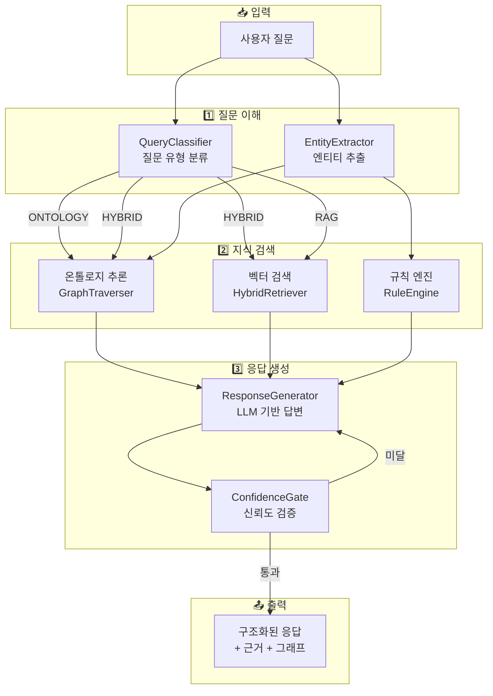

# 챗봇 파이프라인 아키텍처

> **문서 목적**: UR5e 온톨로지 RAG 챗봇의 전체 질의응답 처리 구조를 설명
> **최종 수정**: 2026-01-27
> **대상 독자**: 개발자, 시스템 이해가 필요한 사람

---

## 시스템 개요도



---

## 목차

1. [한눈에 보는 전체 구조](#1-한눈에-보는-전체-구조)
2. [질문 유형별 처리 경로](#2-질문-유형별-처리-경로)
3. [각 컴포넌트 상세 설명](#3-각-컴포넌트-상세-설명)
4. [데이터 흐름 예시](#4-데이터-흐름-예시)
5. [기술 스택 요약](#5-기술-스택-요약)

---

## 1. 한눈에 보는 전체 구조

### 1.1 전체 파이프라인 다이어그램

```
┌─────────────────────────────────────────────────────────────────────────────┐
│                                                                             │
│                         사용자 질문 입력                                    │
│                    "Fz가 -350N인데 이게 뭐야?"                              │
│                                                                             │
└─────────────────────────────────────────────────────────────────────────────┘
                                    │
                                    ▼
┌─────────────────────────────────────────────────────────────────────────────┐
│                                                                             │
│   ┌─────────────────────────────────────────────────────────────────────┐   │
│   │                    STEP 1: 질문 이해                                │   │
│   │  ═══════════════════════════════════════════════════════════════   │   │
│   │                                                                     │   │
│   │   ┌─────────────────────┐    ┌─────────────────────┐               │   │
│   │   │   QueryClassifier   │    │   EntityExtractor   │               │   │
│   │   │   ─────────────────│    │   ─────────────────│               │   │
│   │   │                     │    │                     │               │   │
│   │   │  질문 유형 분류     │    │  엔티티 추출        │               │   │
│   │   │  • ONTOLOGY         │    │  • Fz (센서축)      │               │   │
│   │   │  • HYBRID           │    │  • -350N (값)       │               │   │
│   │   │  • RAG              │    │  • C153 (에러코드)  │               │   │
│   │   │                     │    │  • 충돌 (패턴)      │               │   │
│   │   └─────────────────────┘    └─────────────────────┘               │   │
│   │                                                                     │   │
│   └─────────────────────────────────────────────────────────────────────┘   │
│                                                                             │
└─────────────────────────────────────────────────────────────────────────────┘
                                    │
                    ┌───────────────┼───────────────┐
                    │               │               │
                    ▼               ▼               ▼
┌─────────────────────────────────────────────────────────────────────────────┐
│                                                                             │
│   ┌─────────────────────────────────────────────────────────────────────┐   │
│   │                    STEP 2: 지식 검색                                │   │
│   │  ═══════════════════════════════════════════════════════════════   │   │
│   │                                                                     │   │
│   │   ┌───────────────┐  ┌───────────────┐  ┌───────────────┐          │   │
│   │   │   ONTOLOGY    │  │    HYBRID     │  │      RAG      │          │   │
│   │   │   ───────────│  │   ───────────│  │   ───────────│          │   │
│   │   │               │  │               │  │               │          │   │
│   │   │ 온톨로지 추론 │  │  온톨로지 +   │  │  벡터 검색    │          │   │
│   │   │ (그래프 탐색) │  │  벡터 검색    │  │  + 리랭킹     │          │   │
│   │   │               │  │               │  │               │          │   │
│   │   └───────────────┘  └───────────────┘  └───────────────┘          │   │
│   │          │                  │                  │                    │   │
│   │          ▼                  ▼                  ▼                    │   │
│   │   ┌─────────────────────────────────────────────────────────┐      │   │
│   │   │              통합된 컨텍스트 (Context)                  │      │   │
│   │   └─────────────────────────────────────────────────────────┘      │   │
│   │                                                                     │   │
│   └─────────────────────────────────────────────────────────────────────┘   │
│                                                                             │
└─────────────────────────────────────────────────────────────────────────────┘
                                    │
                                    ▼
┌─────────────────────────────────────────────────────────────────────────────┐
│                                                                             │
│   ┌─────────────────────────────────────────────────────────────────────┐   │
│   │                    STEP 3: 응답 생성                                │   │
│   │  ═══════════════════════════════════════════════════════════════   │   │
│   │                                                                     │   │
│   │   ┌─────────────────────┐    ┌─────────────────────┐               │   │
│   │   │        LLM          │    │  ResponseGenerator  │               │   │
│   │   │   ─────────────────│    │   ─────────────────│               │   │
│   │   │                     │    │                     │               │   │
│   │   │  GPT-4o-mini        │ → │  응답 포맷팅        │               │   │
│   │   │  자연어 생성        │    │  • answer (답변)    │               │   │
│   │   │                     │    │  • graph (그래프)   │               │   │
│   │   │                     │    │  • evidence (근거)  │               │   │
│   │   └─────────────────────┘    └─────────────────────┘               │   │
│   │                                                                     │   │
│   └─────────────────────────────────────────────────────────────────────┘   │
│                                                                             │
└─────────────────────────────────────────────────────────────────────────────┘
                                    │
                                    ▼
┌─────────────────────────────────────────────────────────────────────────────┐
│                                                                             │
│                            최종 응답 출력                                   │
│                                                                             │
│   • answer: "Fz -350N은 CRITICAL 상태입니다..."                            │
│   • graph: { nodes: [...], edges: [...] }                                  │
│   • evidence: { ontology_paths: [...], document_refs: [...] }              │
│   • prediction: { error_code: "C189", probability: 0.85 }                  │
│   • recommendation: { immediate: "그립 위치 확인" }                        │
│                                                                             │
└─────────────────────────────────────────────────────────────────────────────┘
```

### 1.2 핵심 개념 요약

| 개념 | 설명 | 비유 |
|------|------|------|
| **QueryClassifier** | 질문 유형을 분류하는 분류기 | 우체국 분류기 (편지를 지역별로 나눔) |
| **EntityExtractor** | 질문에서 핵심 정보를 추출 | 형광펜으로 중요 단어 표시 |
| **OntologyEngine** | 지식 그래프에서 관계를 탐색하고 추론 | 도서관에서 연관 책 찾기 |
| **VectorStore** | 문서에서 유사한 내용 검색 | 구글 검색 |
| **Reranker** | 검색 결과를 정밀하게 재정렬 | 검색 결과 중 가장 관련 있는 것 선별 |
| **LLM** | 자연어로 답변 생성 | 전문가가 설명해주는 것 |

---

## 2. 질문 유형별 처리 경로

### 2.1 질문 유형 3가지

```
┌─────────────────────────────────────────────────────────────────────────────┐
│                         질문 유형 분류 (QueryType)                          │
├─────────────────────────────────────────────────────────────────────────────┤
│                                                                             │
│   ┌─────────────────────────────────────────────────────────────────────┐   │
│   │                                                                     │   │
│   │   1. ONTOLOGY (온톨로지)                                           │   │
│   │   ═══════════════════════                                          │   │
│   │   • 관계/맥락 추론이 필요한 질문                                   │   │
│   │   • 예: "Fz가 -350N인데 이게 뭐야?"                                │   │
│   │   • 예: "C153 에러 원인이 뭐야?"                                   │   │
│   │   • 예: "최근 충돌 패턴이 있어?"                                   │   │
│   │                                                                     │   │
│   │   처리: 온톨로지 그래프 탐색 → 원인/결과 추론                      │   │
│   │                                                                     │   │
│   └─────────────────────────────────────────────────────────────────────┘   │
│                                                                             │
│   ┌─────────────────────────────────────────────────────────────────────┐   │
│   │                                                                     │   │
│   │   2. HYBRID (하이브리드)                                           │   │
│   │   ═══════════════════════                                          │   │
│   │   • 온톨로지 + 문서 검색이 모두 필요한 질문                        │   │
│   │   • 예: "C153이 자주 발생하는 이유와 해결법"                       │   │
│   │   • 예: "UR5e 사용법 알려줘"                                       │   │
│   │                                                                     │   │
│   │   처리: 온톨로지 추론 + 문서 검색 결합                             │   │
│   │                                                                     │   │
│   └─────────────────────────────────────────────────────────────────────┘   │
│                                                                             │
│   ┌─────────────────────────────────────────────────────────────────────┐   │
│   │                                                                     │   │
│   │   3. RAG (문서 검색)                                               │   │
│   │   ═══════════════════                                              │   │
│   │   • 단순 정보 조회 질문                                            │   │
│   │   • 예: "UR5e 페이로드가 몇 kg이야?"                               │   │
│   │   • 예: "안전 정지 방법 알려줘"                                    │   │
│   │                                                                     │   │
│   │   처리: 벡터 검색 → 리랭킹 → LLM 생성                              │   │
│   │                                                                     │   │
│   └─────────────────────────────────────────────────────────────────────┘   │
│                                                                             │
└─────────────────────────────────────────────────────────────────────────────┘
```

### 2.2 각 유형별 처리 파이프라인

#### ONTOLOGY 경로 (온톨로지 추론)

```
┌──────────────────────────────────────────────────────────────────────────┐
│                    ONTOLOGY 처리 파이프라인                              │
├──────────────────────────────────────────────────────────────────────────┤
│                                                                          │
│   질문: "Fz가 -350N인데 이게 뭐야?"                                      │
│                                                                          │
│   ┌─────────────┐                                                       │
│   │ 엔티티 추출 │  Fz(센서축), -350(값), N(단위)                        │
│   └──────┬──────┘                                                       │
│          │                                                              │
│          ▼                                                              │
│   ┌─────────────────────────────────────────────────────────────────┐   │
│   │                    온톨로지 그래프 탐색                          │   │
│   │                                                                  │   │
│   │   [Fz] ──HAS_STATE──→ [CRITICAL]                                │   │
│   │     │                      │                                     │   │
│   │     │                  INDICATES                                 │   │
│   │     │                      │                                     │   │
│   │     │                      ▼                                     │   │
│   │     │               [PAT_OVERLOAD]                               │   │
│   │     │                      │                                     │   │
│   │     │                  TRIGGERS                                  │   │
│   │     │                      │                                     │   │
│   │     │                      ▼                                     │   │
│   │     │                   [C189]                                   │   │
│   │     │                      │                                     │   │
│   │     │                RESOLVED_BY                                 │   │
│   │     │                      │                                     │   │
│   │     │                      ▼                                     │   │
│   │     │            [RES_REDUCE_PAYLOAD]                            │   │
│   │                                                                  │   │
│   └─────────────────────────────────────────────────────────────────┘   │
│          │                                                              │
│          ▼                                                              │
│   ┌─────────────┐                                                       │
│   │ 추론 결과   │                                                       │
│   │ ─────────── │                                                       │
│   │ • 상태: CRITICAL (정상 범위 -60~0N 초과)                           │
│   │ • 패턴: 과부하 (PAT_OVERLOAD)                                      │
│   │ • 예측: C189 에러 발생 가능성 85%                                  │
│   │ • 권장: 페이로드 감소                                              │
│   └─────────────┘                                                       │
│                                                                          │
└──────────────────────────────────────────────────────────────────────────┘
```

#### RAG 경로 (2단계 검색 + 리랭킹)

```
┌──────────────────────────────────────────────────────────────────────────┐
│                    RAG 처리 파이프라인 (2단계 검색)                      │
├──────────────────────────────────────────────────────────────────────────┤
│                                                                          │
│   질문: "C153 에러 해결 방법 알려줘"                                     │
│                                                                          │
│   ┌─────────────────────────────────────────────────────────────────┐   │
│   │                                                                  │   │
│   │   STAGE 1: Bi-encoder (빠른 후보 검색)                          │   │
│   │   ════════════════════════════════════                          │   │
│   │                                                                  │   │
│   │   Query: "C153 에러 해결 방법"                                   │   │
│   │              │                                                   │   │
│   │              ▼                                                   │   │
│   │   ┌─────────────────┐                                           │   │
│   │   │ OpenAI Embedding│  text-embedding-3-small                   │   │
│   │   │    (임베딩)     │  쿼리를 벡터로 변환                        │   │
│   │   └────────┬────────┘                                           │   │
│   │            │                                                     │   │
│   │            ▼                                                     │   │
│   │   ┌─────────────────┐                                           │   │
│   │   │   ChromaDB      │  722개 문서 청크에서                       │   │
│   │   │  (벡터 검색)    │  유사도 Top-20 추출                        │   │
│   │   └────────┬────────┘                                           │   │
│   │            │                                                     │   │
│   │            ▼                                                     │   │
│   │   20개 후보 문서 (점수순)                                        │   │
│   │   • doc_1: 0.85 | "C153 에러는 충돌로 인해..."                   │   │
│   │   • doc_2: 0.82 | "페이로드를 확인하세요..."                     │   │
│   │   • doc_3: 0.80 | "UR5e 스펙은 5kg..."                          │   │
│   │   • ... (17개 더)                                                │   │
│   │                                                                  │   │
│   └─────────────────────────────────────────────────────────────────┘   │
│                              │                                           │
│                              ▼                                           │
│   ┌─────────────────────────────────────────────────────────────────┐   │
│   │                                                                  │   │
│   │   STAGE 2: Cross-encoder (정밀 리랭킹)                          │   │
│   │   ════════════════════════════════════                          │   │
│   │                                                                  │   │
│   │   ┌─────────────────┐                                           │   │
│   │   │ BGE-reranker    │  쿼리-문서 쌍을 함께 분석                  │   │
│   │   │ (Cross-encoder) │  의미적 관련성 재계산                      │   │
│   │   └────────┬────────┘                                           │   │
│   │            │                                                     │   │
│   │            ▼                                                     │   │
│   │   5개 최종 결과 (리랭킹 후)                                      │   │
│   │   • doc_1: 0.977 | "C153 해결: 경로 확인 및 재시작"  ← 1위로!   │   │
│   │   • doc_2: 0.920 | "C153 원인: 충돌 감지됨"                      │   │
│   │   • doc_5: 0.850 | "보호 정지 해제 방법..."                      │   │
│   │   • doc_4: 0.720 | "에러 코드 목록..."                           │   │
│   │   • doc_3: 0.001 | "UR5e 스펙은 5kg..."  ← 관련 없음, 하위로!   │   │
│   │                                                                  │   │
│   └─────────────────────────────────────────────────────────────────┘   │
│                              │                                           │
│                              ▼                                           │
│   ┌─────────────────────────────────────────────────────────────────┐   │
│   │   LLM (GPT-4o-mini)                                             │   │
│   │   ─────────────────                                             │   │
│   │   고품질 컨텍스트를 바탕으로 자연어 응답 생성                    │   │
│   └─────────────────────────────────────────────────────────────────┘   │
│                                                                          │
└──────────────────────────────────────────────────────────────────────────┘
```

### 2.3 Bi-encoder vs Cross-encoder 비교

```
┌─────────────────────────────────────────────────────────────────────────────┐
│                    Bi-encoder vs Cross-encoder 비교                         │
├─────────────────────────────────────────────────────────────────────────────┤
│                                                                             │
│   ┌─────────────────────────────────┐   ┌─────────────────────────────────┐ │
│   │        Bi-encoder               │   │        Cross-encoder            │ │
│   │  (OpenAI text-embedding-3-small)│   │    (BGE-reranker-base)          │ │
│   ├─────────────────────────────────┤   ├─────────────────────────────────┤ │
│   │                                 │   │                                 │ │
│   │   Query    Document             │   │   Query + Document              │ │
│   │     │         │                 │   │         │                       │ │
│   │     ▼         ▼                 │   │         ▼                       │ │
│   │  ┌─────┐  ┌─────┐              │   │   ┌───────────┐                 │ │
│   │  │ Enc │  │ Enc │  독립 인코딩  │   │   │  Encoder  │  함께 분석     │ │
│   │  └──┬──┘  └──┬──┘              │   │   └─────┬─────┘                 │ │
│   │     │        │                  │   │         │                       │ │
│   │     ▼        ▼                  │   │         ▼                       │ │
│   │   [0.2]    [0.8]  벡터 생성    │   │      Score: 0.95  직접 점수     │ │
│   │      \     /                    │   │                                 │ │
│   │       \   /                     │   │                                 │ │
│   │    cosine sim                   │   │                                 │ │
│   │         │                       │   │                                 │ │
│   │         ▼                       │   │                                 │ │
│   │    Score: 0.85                  │   │                                 │ │
│   │                                 │   │                                 │ │
│   ├─────────────────────────────────┤   ├─────────────────────────────────┤ │
│   │  장점:                          │   │  장점:                          │ │
│   │  • 빠름 (~50ms)                 │   │  • 정확함 (+15-20% MRR)         │ │
│   │  • 대량 검색 가능               │   │  • 의미 이해 뛰어남             │ │
│   │                                 │   │                                 │ │
│   │  단점:                          │   │  단점:                          │ │
│   │  • 의미 파악 한계               │   │  • 느림 (~150ms)                │ │
│   │                                 │   │  • 소량만 처리 가능             │ │
│   └─────────────────────────────────┘   └─────────────────────────────────┘ │
│                                                                             │
│   ┌─────────────────────────────────────────────────────────────────────┐   │
│   │                                                                     │   │
│   │   우리 시스템: 둘 다 사용! (2단계 검색)                            │   │
│   │   ════════════════════════════════════                             │   │
│   │                                                                     │   │
│   │   1단계: Bi-encoder로 빠르게 20개 후보 추출                        │   │
│   │   2단계: Cross-encoder로 정밀하게 5개 최종 선별                    │   │
│   │                                                                     │   │
│   │   → 속도와 정확도 모두 확보!                                       │   │
│   │                                                                     │   │
│   └─────────────────────────────────────────────────────────────────────┘   │
│                                                                             │
└─────────────────────────────────────────────────────────────────────────────┘
```

---

## 3. 각 컴포넌트 상세 설명

### 3.1 QueryClassifier (질문 분류기)

```
┌─────────────────────────────────────────────────────────────────────────────┐
│                         QueryClassifier 상세                                │
├─────────────────────────────────────────────────────────────────────────────┤
│                                                                             │
│   파일: src/rag/query_classifier.py (406줄)                                │
│                                                                             │
│   ┌─────────────────────────────────────────────────────────────────────┐   │
│   │                         분류 기준                                   │   │
│   │                                                                     │   │
│   │   ONTOLOGY 지표 (온톨로지로 분류되는 패턴)                         │   │
│   │   ─────────────────────────────────────────                        │   │
│   │   • 센서값 + 숫자: "Fz가 -350N"                                    │   │
│   │   • 에러코드 + 원인: "C153 원인이 뭐야"                            │   │
│   │   • 패턴 질문: "충돌 패턴이 있어?"                                 │   │
│   │   • 정의 질문: "Fz가 뭐야?"                                        │   │
│   │   • 비교 질문: "Fz와 Fx 비교해줘"                                  │   │
│   │                                                                     │   │
│   │   HYBRID 지표 (둘 다 필요한 패턴)                                  │   │
│   │   ─────────────────────────────────────                            │   │
│   │   • 해결 + 방법: "C153 해결 방법"                                  │   │
│   │   • 사용법: "UR5e 사용법"                                          │   │
│   │                                                                     │   │
│   │   RAG 지표 (문서 검색만 필요한 패턴)                               │   │
│   │   ─────────────────────────────────                                │   │
│   │   • 스펙 질문: "페이로드가 몇 kg?"                                 │   │
│   │   • 절차 질문: "점검 절차 알려줘"                                  │   │
│   │                                                                     │   │
│   └─────────────────────────────────────────────────────────────────────┘   │
│                                                                             │
│   ┌─────────────────────────────────────────────────────────────────────┐   │
│   │                         분류 흐름                                   │   │
│   │                                                                     │   │
│   │   질문 입력                                                        │   │
│   │       │                                                            │   │
│   │       ▼                                                            │   │
│   │   ┌─────────────────┐                                              │   │
│   │   │ 패턴 매칭       │  각 지표별 패턴 점수 계산                    │   │
│   │   └────────┬────────┘                                              │   │
│   │            │                                                        │   │
│   │            ▼                                                        │   │
│   │   ┌─────────────────┐                                              │   │
│   │   │ 점수 비교       │  ONTOLOGY=0.8, HYBRID=0.3, RAG=0.2          │   │
│   │   └────────┬────────┘                                              │   │
│   │            │                                                        │   │
│   │            ▼                                                        │   │
│   │   ┌─────────────────┐                                              │   │
│   │   │ 최종 분류       │  → ONTOLOGY (가장 높은 점수)                 │   │
│   │   └─────────────────┘                                              │   │
│   │                                                                     │   │
│   └─────────────────────────────────────────────────────────────────────┘   │
│                                                                             │
└─────────────────────────────────────────────────────────────────────────────┘
```

### 3.2 EntityExtractor (엔티티 추출기)

```
┌─────────────────────────────────────────────────────────────────────────────┐
│                         EntityExtractor 상세                                │
├─────────────────────────────────────────────────────────────────────────────┤
│                                                                             │
│   파일: src/rag/entity_extractor.py (599줄)                                │
│                                                                             │
│   ┌─────────────────────────────────────────────────────────────────────┐   │
│   │                         추출 가능한 엔티티                          │   │
│   │                                                                     │   │
│   │   ┌────────────────┬────────────────┬────────────────────────┐     │   │
│   │   │ 엔티티 타입    │ 예시           │ 패턴                   │     │   │
│   │   ├────────────────┼────────────────┼────────────────────────┤     │   │
│   │   │ MeasurementAxis│ Fz, Fx, Tx     │ 정규식 + 한국어 조사   │     │   │
│   │   │ Value          │ -350N, 5kg     │ 숫자 + 단위            │     │   │
│   │   │ ErrorCode      │ C153, C119     │ C + 숫자               │     │   │
│   │   │ TimeExpression │ 어제, 14시     │ 시간 키워드            │     │   │
│   │   │ Pattern        │ 충돌, 과부하   │ 패턴 키워드 목록       │     │   │
│   │   │ Shift          │ 주간, 야간     │ 교대 키워드            │     │   │
│   │   │ Product        │ PART-A         │ 제품 ID 패턴           │     │   │
│   │   │ Joint          │ Joint1         │ Joint + 숫자 (별명)    │     │   │
│   │   │ ErrorCategory  │ joint position │ 에러 카테고리 키워드   │     │   │
│   │   └────────────────┴────────────────┴────────────────────────┘     │   │
│   │                                                                     │   │
│   └─────────────────────────────────────────────────────────────────────┘   │
│                                                                             │
│   ┌─────────────────────────────────────────────────────────────────────┐   │
│   │                         추출 예시                                   │   │
│   │                                                                     │   │
│   │   입력: "Fz가 -350N인데 최근 충돌 패턴이 있어?"                    │   │
│   │                                                                     │   │
│   │   추출 결과:                                                        │   │
│   │   ┌─────────────────────────────────────────────────────────┐      │   │
│   │   │ • MeasurementAxis: Fz (신뢰도: 0.95)                    │      │   │
│   │   │ • Value: -350 (단위: N, 신뢰도: 0.9)                    │      │   │
│   │   │ • TimeExpression: 최근 (신뢰도: 0.8)                    │      │   │
│   │   │ • Pattern: 충돌 (신뢰도: 0.9)                           │      │   │
│   │   └─────────────────────────────────────────────────────────┘      │   │
│   │                                                                     │   │
│   └─────────────────────────────────────────────────────────────────────┘   │
│                                                                             │
│   ┌─────────────────────────────────────────────────────────────────────┐   │
│   │                         특수 기능                                   │   │
│   │                                                                     │   │
│   │   • 한국어 조사 처리: "Fz가", "Fz는", "Fz를" → 모두 "Fz"로 인식   │   │
│   │   • 모멘트→토크 변환: Mx→Tx, My→Ty, Mz→Tz 자동 변환              │   │
│   │   • 별명 지원: "긴급 정지" → C159, "Joint1" → Joint_1             │   │
│   │                                                                     │   │
│   └─────────────────────────────────────────────────────────────────────┘   │
│                                                                             │
└─────────────────────────────────────────────────────────────────────────────┘
```

### 3.3 OntologyEngine (온톨로지 추론 엔진)

```
┌─────────────────────────────────────────────────────────────────────────────┐
│                         OntologyEngine 상세                                 │
├─────────────────────────────────────────────────────────────────────────────┤
│                                                                             │
│   파일: src/ontology/ontology_engine.py (1,941줄)                          │
│                                                                             │
│   ┌─────────────────────────────────────────────────────────────────────┐   │
│   │                         핵심 기능                                   │   │
│   │                                                                     │   │
│   │   1. 그래프 탐색 (GraphTraverser 활용)                             │   │
│   │      • BFS (너비 우선 탐색)으로 관련 엔티티 찾기                   │   │
│   │      • 관계 체인 따라가기: Fz → State → Pattern → Error           │   │
│   │                                                                     │   │
│   │   2. 상태 판단                                                     │   │
│   │      • 센서값이 정상 범위인지 확인                                 │   │
│   │      • 상태 결정: IDLE, NORMAL, WARNING, CRITICAL                  │   │
│   │                                                                     │   │
│   │   3. 패턴 매칭                                                     │   │
│   │      • 감지된 패턴과 온톨로지 패턴 연결                            │   │
│   │      • 패턴 → 원인 → 해결책 경로 탐색                             │   │
│   │                                                                     │   │
│   │   4. 에러 예측                                                     │   │
│   │      • 현재 상태에서 발생 가능한 에러 예측                         │   │
│   │      • 확률 및 시간대 추정                                         │   │
│   │                                                                     │   │
│   └─────────────────────────────────────────────────────────────────────┘   │
│                                                                             │
│   ┌─────────────────────────────────────────────────────────────────────┐   │
│   │                         온톨로지 관계 타입                          │   │
│   │                                                                     │   │
│   │   [장비 관계]                                                      │   │
│   │   • HAS_COMPONENT: UR5e → Joint (로봇이 관절을 가짐)              │   │
│   │   • MOUNTED_ON: Axia80 → ToolFlange (센서가 플랜지에 장착)        │   │
│   │   • MEASURES: Axia80 → Fz (센서가 축을 측정)                      │   │
│   │                                                                     │   │
│   │   [상태/패턴 관계]                                                 │   │
│   │   • HAS_STATE: Fz → CRITICAL (축이 상태를 가짐)                   │   │
│   │   • INDICATES: CRITICAL → PAT_OVERLOAD (상태가 패턴을 나타냄)     │   │
│   │   • TRIGGERS: PAT_OVERLOAD → C189 (패턴이 에러를 유발)            │   │
│   │                                                                     │   │
│   │   [문제해결 관계]                                                  │   │
│   │   • CAUSED_BY: C189 → CAUSE_GRIP (에러의 원인)                    │   │
│   │   • RESOLVED_BY: CAUSE_GRIP → RES_ADJUST (원인의 해결책)          │   │
│   │                                                                     │   │
│   └─────────────────────────────────────────────────────────────────────┘   │
│                                                                             │
└─────────────────────────────────────────────────────────────────────────────┘
```

### 3.4 VectorStore + Reranker (2단계 검색)

```
┌─────────────────────────────────────────────────────────────────────────────┐
│                         VectorStore + Reranker 상세                         │
├─────────────────────────────────────────────────────────────────────────────┤
│                                                                             │
│   파일: src/embedding/vector_store.py (400줄)                              │
│         src/embedding/reranker.py (241줄)                                  │
│                                                                             │
│   ┌─────────────────────────────────────────────────────────────────────┐   │
│   │                         VectorStore                                 │   │
│   │                                                                     │   │
│   │   저장소: ChromaDB (stores/chroma/)                                │   │
│   │   문서 수: 722 chunks                                              │   │
│   │   임베딩 모델: OpenAI text-embedding-3-small                       │   │
│   │   거리 함수: Cosine Similarity                                     │   │
│   │                                                                     │   │
│   │   주요 메서드:                                                     │   │
│   │   • search(query, top_k=5): 기본 벡터 검색                         │   │
│   │   • search_with_rerank(query, initial_top_k=20, final_top_n=5):   │   │
│   │     2단계 검색 (리랭킹 포함)                                       │   │
│   │                                                                     │   │
│   └─────────────────────────────────────────────────────────────────────┘   │
│                                                                             │
│   ┌─────────────────────────────────────────────────────────────────────┐   │
│   │                         Reranker                                    │   │
│   │                                                                     │   │
│   │   모델: BAAI/bge-reranker-base                                     │   │
│   │   특징: 한국어 지원, Cross-Encoder 아키텍처                        │   │
│   │   디바이스: GPU 자동 감지 (없으면 CPU)                             │   │
│   │                                                                     │   │
│   │   주요 메서드:                                                     │   │
│   │   • rerank(query, documents, top_n): 문서 리랭킹                   │   │
│   │   • rerank_search_results(query, search_results, top_n):          │   │
│   │     SearchResult 리스트 리랭킹                                     │   │
│   │                                                                     │   │
│   └─────────────────────────────────────────────────────────────────────┘   │
│                                                                             │
│   ┌─────────────────────────────────────────────────────────────────────┐   │
│   │                         성능 지표                                   │   │
│   │                                                                     │   │
│   │   ┌────────────────────┬────────────────────────────────────┐      │   │
│   │   │ 지표               │ 값                                 │      │   │
│   │   ├────────────────────┼────────────────────────────────────┤      │   │
│   │   │ Bi-encoder 지연    │ ~50ms                              │      │   │
│   │   │ + Cross-encoder    │ ~150-250ms (CPU), ~100ms (GPU)     │      │   │
│   │   │ 정확도 향상        │ MRR +15-20%                        │      │   │
│   │   │ 모델 크기          │ ~400MB (BGE-reranker-base)         │      │   │
│   │   └────────────────────┴────────────────────────────────────┘      │   │
│   │                                                                     │   │
│   └─────────────────────────────────────────────────────────────────────┘   │
│                                                                             │
└─────────────────────────────────────────────────────────────────────────────┘
```

### 3.5 HybridRetriever (하이브리드 검색기) - 2026-01-26 추가

```
┌─────────────────────────────────────────────────────────────────────────────┐
│                         HybridRetriever 상세                                │
├─────────────────────────────────────────────────────────────────────────────┤
│                                                                             │
│   파일: src/rag/hybrid_retriever.py (355줄)                                │
│                                                                             │
│   ┌─────────────────────────────────────────────────────────────────────┐   │
│   │                         핵심 역할                                   │   │
│   │                                                                     │   │
│   │   VectorStore + Reranker를 통합하여                                │   │
│   │   질문 유형에 따라 최적의 검색 전략을 적용                         │   │
│   │                                                                     │   │
│   │   ┌───────────────────────────────────────────────────────────┐    │   │
│   │   │  이전: VectorStore/Reranker 구현만 있고 파이프라인 미연결  │    │   │
│   │   │  이후: HybridRetriever가 chat.py와 연결하여 통합 검색     │    │   │
│   │   └───────────────────────────────────────────────────────────┘    │   │
│   │                                                                     │   │
│   └─────────────────────────────────────────────────────────────────────┘   │
│                                                                             │
│   ┌─────────────────────────────────────────────────────────────────────┐   │
│   │                         질문 유형별 전략                            │   │
│   │                                                                     │   │
│   │   ┌──────────────┬──────────────────────────────────────────┐      │   │
│   │   │ QueryType    │ 검색 전략                                │      │   │
│   │   ├──────────────┼──────────────────────────────────────────┤      │   │
│   │   │ ONTOLOGY     │ top_n = 3 (최소 문서, 온톨로지 중심)     │      │   │
│   │   │ HYBRID       │ top_n = 5 (표준 검색, 둘 다 활용)        │      │   │
│   │   │ RAG          │ top_n = 5 (문서 중심 검색)               │      │   │
│   │   └──────────────┴──────────────────────────────────────────┘      │   │
│   │                                                                     │   │
│   └─────────────────────────────────────────────────────────────────────┘   │
│                                                                             │
│   ┌─────────────────────────────────────────────────────────────────────┐   │
│   │                         내부 흐름                                   │   │
│   │                                                                     │   │
│   │   retrieve(query, query_type)                                      │   │
│   │       │                                                            │   │
│   │       ▼                                                            │   │
│   │   ┌──────────────────────────────────────────────────────────┐    │   │
│   │   │  use_reranker == True?                                   │    │   │
│   │   └────────────┬───────────────────────────┬─────────────────┘    │   │
│   │                │ Yes                       │ No                   │   │
│   │                ▼                           ▼                      │   │
│   │   ┌────────────────────────┐   ┌────────────────────────┐        │   │
│   │   │ _search_with_rerank()  │   │ _search_basic()        │        │   │
│   │   │ • Bi-encoder Top-20    │   │ • Bi-encoder Top-N     │        │   │
│   │   │ • Cross-encoder Top-N  │   │ • reranked=False       │        │   │
│   │   │ • reranked=True/False  │   │                        │        │   │
│   │   │   (폴백 시 False) ✅   │   │                        │        │   │
│   │   └────────────────────────┘   └────────────────────────┘        │   │
│   │                │                           │                      │   │
│   │                └───────────┬───────────────┘                      │   │
│   │                            ▼                                      │   │
│   │               _convert_to_document_refs()                         │   │
│   │               • SearchResult → DocumentReference                  │   │
│   │               • similarity_threshold 필터링 (0.3)                 │   │
│   │                            │                                      │   │
│   │                            ▼                                      │   │
│   │               RetrievalResult (document_refs, reranked, time)    │   │
│   │                                                                     │   │
│   └─────────────────────────────────────────────────────────────────────┘   │
│                                                                             │
│   ┌─────────────────────────────────────────────────────────────────────┐   │
│   │                         설정 (settings.yaml)                        │   │
│   │                                                                     │   │
│   │   retrieval:                                                       │   │
│   │     similarity_threshold: 0.3  # 유사도 임계값                     │   │
│   │                                                                     │   │
│   │   rerank:                                                          │   │
│   │     enabled: true              # 리랭킹 활성화                     │   │
│   │     model: "bge-reranker-base" # Cross-Encoder 모델                │   │
│   │     initial_top_k: 20          # 1단계 후보 수                     │   │
│   │     final_top_n: 5             # 최종 반환 수                      │   │
│   │                                                                     │   │
│   └─────────────────────────────────────────────────────────────────────┘   │
│                                                                             │
└─────────────────────────────────────────────────────────────────────────────┘
```

### 3.6 ResponseGenerator (응답 생성기)

```
┌─────────────────────────────────────────────────────────────────────────────┐
│                         ResponseGenerator 상세                              │
├─────────────────────────────────────────────────────────────────────────────┤
│                                                                             │
│   파일: src/rag/response_generator.py (920줄)                              │
│                                                                             │
│   ┌─────────────────────────────────────────────────────────────────────┐   │
│   │                         출력 구조                                   │   │
│   │                                                                     │   │
│   │   {                                                                 │   │
│   │     "trace_id": "uuid-xxx",        // 추적 ID                      │   │
│   │     "query_type": "ontology",      // 질문 유형                    │   │
│   │                                                                     │   │
│   │     "answer": "Fz -350N은...",     // 자연어 답변                  │   │
│   │                                                                     │   │
│   │     "analysis": {                  // 분석 결과                    │   │
│   │       "entity": "Fz",                                              │   │
│   │       "value": -350,                                               │   │
│   │       "state": "CRITICAL"                                          │   │
│   │     },                                                              │   │
│   │                                                                     │   │
│   │     "reasoning": {                 // 추론 과정                    │   │
│   │       "pattern": "PAT_OVERLOAD",                                   │   │
│   │       "cause": "CAUSE_GRIP",                                       │   │
│   │       "confidence": 0.85                                           │   │
│   │     },                                                              │   │
│   │                                                                     │   │
│   │     "prediction": {                // 예측                         │   │
│   │       "error_code": "C189",                                        │   │
│   │       "probability": 0.85,                                         │   │
│   │       "timeframe": "24시간 내"                                     │   │
│   │     },                                                              │   │
│   │                                                                     │   │
│   │     "recommendation": {            // 권장 조치                    │   │
│   │       "immediate": "그립 위치 확인",                               │   │
│   │       "reference": "Service Manual p.45"                           │   │
│   │     },                                                              │   │
│   │                                                                     │   │
│   │     "evidence": {                  // 근거                         │   │
│   │       "ontology_paths": [...],                                     │   │
│   │       "document_refs": [...]                                       │   │
│   │     },                                                              │   │
│   │                                                                     │   │
│   │     "graph": {                     // 시각화 그래프                │   │
│   │       "nodes": [...],                                              │   │
│   │       "edges": [...]                                               │   │
│   │     },                                                              │   │
│   │                                                                     │   │
│   │     "abstain": false,              // 답변 거부 여부               │   │
│   │     "abstain_reason": null,        // ABSTAIN 사유 (상세화됨) ✅   │   │
│   │     "confidence": 0.95             // 전체 신뢰도                  │   │
│   │   }                                                                 │   │
│   │                                                                     │   │
│   │   ┌─────────────────────────────────────────────────────────────┐  │   │
│   │   │  ABSTAIN 응답 상세화 (2026-01-26 개선) ✅                   │  │   │
│   │   │  • "no entities extracted" → 구체적 항목 포함 요청 + 예시   │  │   │
│   │   │  • "confidence too low" → 질문 명확화 요청                  │  │   │
│   │   │  • "no reasoning chain" → 온톨로지 등록 항목 안내           │  │   │
│   │   └─────────────────────────────────────────────────────────────┘  │   │
│   │                                                                     │   │
│   └─────────────────────────────────────────────────────────────────────┘   │
│                                                                             │
└─────────────────────────────────────────────────────────────────────────────┘
```

---

## 4. 데이터 흐름 예시

### 4.1 예시 1: "Fz가 -350N인데 이게 뭐야?"

```
┌─────────────────────────────────────────────────────────────────────────────┐
│               데이터 흐름 예시: "Fz가 -350N인데 이게 뭐야?"                 │
├─────────────────────────────────────────────────────────────────────────────┤
│                                                                             │
│   1. 질문 입력                                                             │
│   ════════════                                                             │
│   "Fz가 -350N인데 이게 뭐야?"                                              │
│                                                                             │
│   2. 엔티티 추출 (EntityExtractor)                                         │
│   ════════════════════════════════                                         │
│   • Fz → MeasurementAxis (센서축)                                          │
│   • -350 → Value (숫자값)                                                  │
│   • N → Unit (단위)                                                        │
│                                                                             │
│   3. 질문 분류 (QueryClassifier)                                           │
│   ════════════════════════════════                                         │
│   • 센서축 + 값 패턴 감지                                                  │
│   • 결과: ONTOLOGY (신뢰도 0.9)                                            │
│                                                                             │
│   4. 온톨로지 추론 (OntologyEngine)                                        │
│   ════════════════════════════════                                         │
│   • Fz 정상 범위 조회: -60N ~ 0N                                           │
│   • -350N 상태 판단: CRITICAL (정상의 약 6배)                              │
│   • 그래프 탐색:                                                           │
│     Fz → CRITICAL → PAT_OVERLOAD → C189 → RES_REDUCE_PAYLOAD              │
│   • 이력 패턴 매칭: 유사 이벤트 3건 발견                                   │
│   • 예측: 24시간 내 C189 발생 확률 85%                                     │
│                                                                             │
│   5. LLM 응답 생성                                                         │
│   ════════════════                                                         │
│   컨텍스트를 바탕으로 자연어 답변 생성                                     │
│                                                                             │
│   6. 최종 응답                                                             │
│   ════════════                                                             │
│   {                                                                        │
│     "answer": "Fz -350N은 정상 범위(-60~0N)를 크게 초과한 CRITICAL        │
│                상태입니다. 과부하(PAT_OVERLOAD) 패턴이 감지되었으며,       │
│                24시간 내 C189 에러 발생 확률이 85%입니다.                  │
│                그립 위치를 확인해주세요.",                                  │
│     "prediction": { "error_code": "C189", "probability": 0.85 },          │
│     "recommendation": { "immediate": "그립 위치 확인" },                   │
│     "graph": { "nodes": [...], "edges": [...] }                           │
│   }                                                                        │
│                                                                             │
└─────────────────────────────────────────────────────────────────────────────┘
```

### 4.2 예시 2: "C153 에러 해결 방법 알려줘"

```
┌─────────────────────────────────────────────────────────────────────────────┐
│              데이터 흐름 예시: "C153 에러 해결 방법 알려줘"                 │
├─────────────────────────────────────────────────────────────────────────────┤
│                                                                             │
│   1. 질문 입력                                                             │
│   ════════════                                                             │
│   "C153 에러 해결 방법 알려줘"                                             │
│                                                                             │
│   2. 엔티티 추출 (EntityExtractor)                                         │
│   ════════════════════════════════                                         │
│   • C153 → ErrorCode (에러코드)                                            │
│                                                                             │
│   3. 질문 분류 (QueryClassifier)                                           │
│   ════════════════════════════════                                         │
│   • 에러코드 + "해결 방법" 패턴 감지                                       │
│   • 결과: HYBRID (온톨로지 + RAG 모두 필요)                                │
│                                                                             │
│   4-A. 온톨로지 추론 (OntologyEngine)                                      │
│   ════════════════════════════════════                                      │
│   • C153 정보 조회:                                                        │
│     - 이름: "Safety System Violation"                                      │
│     - 심각도: High                                                         │
│   • 원인 탐색 (CAUSED_BY):                                                 │
│     - CAUSE_COLLISION (충돌)                                               │
│     - CAUSE_OVERLOAD (과부하)                                              │
│     - CAUSE_POSITION_ERROR (위치 오류)                                     │
│   • 해결책 탐색 (RESOLVED_BY):                                             │
│     - RES_CLEAR_PATH (경로 정리)                                           │
│     - RES_REDUCE_PAYLOAD (페이로드 감소)                                   │
│                                                                             │
│   4-B. 벡터 검색 + 리랭킹 (VectorStore + Reranker)                         │
│   ════════════════════════════════════════════════                         │
│   • Stage 1: Bi-encoder로 20개 후보 검색                                   │
│   • Stage 2: Cross-encoder로 5개 최종 선별                                 │
│   • 결과:                                                                  │
│     1. "C153 해결: 로봇 경로 확인 및 장애물 제거" (0.977)                  │
│     2. "C153 원인: 안전 시스템 위반 감지" (0.920)                          │
│     3. "보호 정지 해제 절차" (0.850)                                       │
│                                                                             │
│   5. 컨텍스트 통합                                                         │
│   ════════════════                                                         │
│   온톨로지 추론 결과 + 문서 검색 결과 병합                                 │
│                                                                             │
│   6. LLM 응답 생성                                                         │
│   ════════════════                                                         │
│   통합된 컨텍스트로 자연어 답변 생성                                       │
│                                                                             │
│   7. 최종 응답                                                             │
│   ════════════                                                             │
│   {                                                                        │
│     "answer": "C153 에러는 안전 시스템 위반으로 발생합니다.\n             │
│                원인:\n                                                     │
│                - 충돌 감지\n                                               │
│                - 과부하\n                                                  │
│                - 위치 오류\n                                               │
│                해결 방법:\n                                                │
│                1. 로봇 이동 경로를 확인하고 장애물을 제거하세요.\n         │
│                2. 페이로드가 5kg 이하인지 확인하세요.",                     │
│     "evidence": {                                                          │
│       "ontology_paths": [                                                  │
│         "C153 →[CAUSED_BY]→ CAUSE_COLLISION →[RESOLVED_BY]→ RES_CLEAR"    │
│       ],                                                                   │
│       "document_refs": [                                                   │
│         { "doc_id": "service_manual", "page": 45 }                        │
│       ]                                                                    │
│     }                                                                      │
│   }                                                                        │
│                                                                             │
└─────────────────────────────────────────────────────────────────────────────┘
```

---

## 5. 기술 스택 요약

### 5.1 전체 기술 스택

```
┌─────────────────────────────────────────────────────────────────────────────┐
│                              기술 스택 요약                                 │
├─────────────────────────────────────────────────────────────────────────────┤
│                                                                             │
│   ┌─────────────────────────────────────────────────────────────────────┐   │
│   │                         Frontend                                    │   │
│   │                                                                     │   │
│   │   • Next.js 16 (App Router)                                        │   │
│   │   • React + TypeScript                                             │   │
│   │   • Tailwind CSS + shadcn/ui                                       │   │
│   │   • React Flow (그래프 시각화)                                     │   │
│   │   • Recharts (차트)                                                │   │
│   │   • TanStack Query (데이터 캐싱)                                   │   │
│   │                                                                     │   │
│   └─────────────────────────────────────────────────────────────────────┘   │
│                                    │                                        │
│                                    ▼                                        │
│   ┌─────────────────────────────────────────────────────────────────────┐   │
│   │                         Backend API                                 │   │
│   │                                                                     │   │
│   │   • FastAPI (Python 3.10+)                                         │   │
│   │   • Uvicorn (ASGI 서버)                                            │   │
│   │   • SSE (Server-Sent Events)                                       │   │
│   │                                                                     │   │
│   └─────────────────────────────────────────────────────────────────────┘   │
│                                    │                                        │
│           ┌────────────────────────┼────────────────────────┐               │
│           ▼                        ▼                        ▼               │
│   ┌───────────────┐       ┌───────────────┐       ┌───────────────┐        │
│   │   Ontology    │       │  Vector DB    │       │    AI/ML      │        │
│   │               │       │               │       │               │        │
│   │ • JSON/YAML   │       │ • ChromaDB    │       │ • OpenAI API  │        │
│   │ • 50개 엔티티 │       │ • 722 chunks  │       │   - GPT-4o    │        │
│   │ • 100개 관계  │       │ • cosine sim  │       │   - embedding │        │
│   │               │       │               │       │               │        │
│   │               │       │               │       │ • BGE-reranker│        │
│   │               │       │               │       │   (로컬 모델) │        │
│   └───────────────┘       └───────────────┘       └───────────────┘        │
│                                                                             │
└─────────────────────────────────────────────────────────────────────────────┘
```

### 5.2 핵심 파일 목록

| 모듈 | 파일 | 라인 수 | 역할 |
|------|------|---------|------|
| **질문 처리** | `src/rag/query_classifier.py` | 406 | 질문 유형 분류 |
| | `src/rag/entity_extractor.py` | 599 | 엔티티 추출 |
| **온톨로지** | `src/ontology/ontology_engine.py` | 1,941 | 온톨로지 추론 |
| | `src/ontology/graph_traverser.py` | 599 | 그래프 탐색 |
| **검색** | `src/embedding/vector_store.py` | 400 | 벡터 검색 |
| | `src/embedding/reranker.py` | 241 | Cross-encoder 리랭킹 |
| | `src/rag/hybrid_retriever.py` | 355 | 하이브리드 검색 (벡터+리랭킹) |
| **응답 생성** | `src/rag/response_generator.py` | 920 | 응답 포맷팅 |
| **설정** | `src/config.py` | 290+ | 전체 설정 관리 (환경변수 검증 포함) |

### 5.3 설정 파일 (configs/settings.yaml)

```yaml
# 검색 설정
retrieval:
  top_k: 5
  similarity_threshold: 0.7

# 리랭커 설정
rerank:
  enabled: true
  model: "bge-reranker-base"
  initial_top_k: 20    # 1단계 후보 수
  final_top_n: 5       # 2단계 최종 수

# LLM 설정
llm:
  model: "gpt-4o-mini"
  temperature: 0.0
  max_tokens: 1024

# 임베딩 설정
embedding:
  model: "text-embedding-3-small"
  batch_size: 100
```

---

## 부록: 용어 정리

| 용어 | 설명 |
|------|------|
| **온톨로지** | 도메인의 엔티티(개념)와 관계를 정의한 지식 그래프 |
| **RAG** | Retrieval-Augmented Generation, 검색 기반 생성 |
| **Bi-encoder** | 쿼리와 문서를 독립적으로 인코딩하는 임베딩 방식 |
| **Cross-encoder** | 쿼리와 문서를 함께 분석하는 리랭킹 방식 |
| **리랭킹** | 검색 결과를 재정렬하여 정확도를 높이는 기법 |
| **MRR** | Mean Reciprocal Rank, 검색 품질 평가 지표 |
| **ABSTAIN** | 충분한 근거가 없을 때 답변을 거부하는 것 |

---

---

## 변경 이력

| 날짜 | 버전 | 변경 내용 |
|------|------|----------|
| 2026-01-26 | v1.0 | 최초 작성 |
| 2026-01-26 | v1.1 | Phase 1 수정 반영 |
| | | - HybridRetriever: 폴백 시 `reranked` 플래그 정확히 반환 |
| | | - ResponseGenerator: ABSTAIN 응답 상세화 (`_build_abstain_message()`) |
| | | - chat.py: 컴포넌트 getter None 체크, API 에러 응답 형식 통일 |
| 2026-01-26 | v1.2 | Phase 2 코드 점검 반영 |
| | | - rule_engine.py: 예외 무시(`pass`) → 로깅 추가 |
| | | - chat.py: 하드코딩 URL → `settings.api.internal_base_url` |
| | | - data_loader.py: 무제한 캐시 → LRU 캐시 (max 5) |
| | | - config.py: 환경변수 검증 함수 추가 |
| | | - sensor.py: Magic Number 상수화, 중복 함수 통합 |
| 2026-01-27 | v1.3 | 테스트 확장 반영 |
| | | - 핵심 파일 목록 라인 수 업데이트 |
| | | - hybrid_retriever.py 추가 (355줄) |
| | | - 단위 테스트 97개 → 150개로 확장 |

---

**문서 버전**: v1.3
**최종 업데이트**: 2026-01-27
