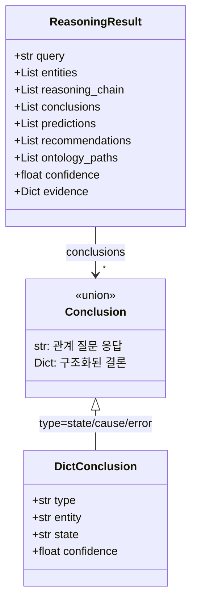

# Step 11: 온톨로지 추론 - 완료 보고서

## 1. 완료 요약

| 항목 | 내용 |
|------|------|
| Phase | 11 - 온톨로지 추론 (Ontology Reasoning) |
| 상태 | ✅ 완료 |
| 이전 단계 | Phase 10 - 질문 분류기 |
| 다음 단계 | Phase 12 - 응답 생성 |
| Stage | Stage 4 (Query Engine) |

---

## 2. 구현 파일 목록

| 파일 | 라인 수 | 설명 |
|------|---------|------|
| `src/ontology/graph_traverser.py` | 599 | 그래프 탐색기 (BFS, 경로 찾기) |
| `src/ontology/ontology_engine.py` | 1,941 | 온톨로지 추론 엔진 (확장) |
| `src/ontology/__init__.py` | 113 | 모듈 노출 (업데이트) |
| **합계** | **2,653** | |

---

## 3. 구현 내용

### 3.1 GraphTraverser 클래스

```python
class GraphTraverser:
    """온톨로지 그래프 탐색기"""

    def bfs(
        self,
        start_id: str,
        max_depth: int = 3,
        relation_filter: Optional[List[RelationType]] = None,
        direction: str = "both"
    ) -> TraversalResult

    def find_path(
        self,
        source_id: str,
        target_id: str,
        max_depth: int = 5
    ) -> Optional[OntologyPath]

    def follow_relation_chain(
        self,
        start_id: str,
        relation_chain: List[RelationType],
        direction: str = "outgoing"
    ) -> List[OntologyPath]

    def get_entity_context(
        self,
        entity_id: str,
        depth: int = 2
    ) -> Dict[str, Any]

    def get_reasoning_path(
        self,
        pattern_id: str
    ) -> Dict[str, Any]
```

**핵심 기능:**
- BFS 기반 관계 탐색 (깊이, 방향, 관계 필터 지원)
- 두 엔티티 간 최단 경로 찾기
- 관계 체인 따라가기 (예: INDICATES → RESOLVED_BY)
- 엔티티 컨텍스트 수집
- 패턴 추론 경로 생성 (cause_paths, error_paths, resolution_paths)

### 3.2 OntologyPath 데이터클래스

```python
@dataclass
class OntologyPath:
    """온톨로지 경로"""
    steps: List[PathStep]
    total_confidence: float = 1.0

    def to_string(self) -> str:
        # "Fz →[HAS_STATE]→ State_Critical →[INDICATES]→ CAUSE_*"

    @property
    def length(self) -> int
    @property
    def start_entity(self) -> Optional[str]
    @property
    def end_entity(self) -> Optional[str]
```

### 3.3 OntologyEngine 클래스

```python
class OntologyEngine:
    """온톨로지 기반 추론 엔진"""

    def get_context(self, entity_id: str) -> Optional[EntityContext]

    def find_path(self, source_id: str, target_id: str) -> Optional[OntologyPath]

    def get_related_entities(
        self,
        entity_id: str,
        depth: int = 2,
        relation_filter: Optional[List[RelationType]] = None
    ) -> TraversalResult

    def reason(
        self,
        query: str,
        entities: List[Dict[str, Any]],
        context: Optional[Dict[str, Any]] = None
    ) -> ReasoningResult

    def predict(
        self,
        pattern_history: List[Dict],
        context: Optional[Dict] = None
    ) -> List[Dict]

    def hybrid_query(
        self,
        query: str,
        entities: List[Dict[str, Any]],
        document_results: Optional[List[Dict]] = None,
        context: Optional[Dict] = None
    ) -> Dict[str, Any]
```

### 3.4 ReasoningResult 데이터클래스

```python
@dataclass
class ReasoningResult:
    """추론 결과"""
    query: str
    entities: List[Dict[str, Any]]
    reasoning_chain: List[Dict[str, Any]]  # 추론 단계
    conclusions: List[Dict[str, Any]]      # 결론 (문자열 또는 딕셔너리)
    predictions: List[Dict[str, Any]]      # 예측
    recommendations: List[Dict[str, Any]]  # 권장사항
    ontology_paths: List[str]              # 온톨로지 경로 문자열
    confidence: float
    evidence: Dict[str, Any]
```

**ReasoningResult 타입 시스템**



### 3.5 관계 질문 처리 (신규)

```python
def _is_relationship_query(self, query: str) -> bool:
    """관계 질문인지 판단 (측정 주체, 장착 위치 등)"""
    rel_patterns = [
        r"어디에.*(장착|연결|설치|부착)",
        r"(뭐|무엇|뭘|어떤).*(측정|감지)",
        r"(측정|감지).*(뭐|무엇|뭘)",
        r"누가.*(측정|감지)",
        r"어떤.*센서",
    ]

def _process_relationship_query(
    self,
    query: str,
    axis_entity: Entity
) -> Dict[str, Any]:
    """관계 질문 처리 (MEASURES, MOUNTED_ON 등)"""
    # 1. "Fz는 어떤 센서가 측정해?" → MEASURES 관계 역탐색
    # 2. Sensor → MEASURES → axis 관계에서 Sensor 반환
```

**지원하는 관계 질문:**
- "Fz는 어떤 센서가 측정해?" → Axia80 센서가 Fz를 측정합니다.
- "Axia80은 어디에 장착되어 있어?" → MOUNTED_ON 관계 탐색
- "ToolFlange에 뭐가 연결되어 있어?" → HAS_COMPONENT, CONNECTED_TO 탐색

### 3.6 정의 엔티티 타입 확장 (신규)

```python
definition_entity_types = (
    "MeasurementAxis",  # Fz, Tx 등
    "Robot",            # UR5e
    "Sensor",           # Axia80
    "Equipment",        # 장비
    "ControlBox",       # 컨트롤 박스
    "ToolFlange",       # 신규: 툴 플랜지
    "Joint",            # 신규: Joint_0 ~ Joint_5
    "Component",        # 신규: 컴포넌트
)
```

### 3.7 트렌드 질문 처리 (신규)

```python
def _process_measurement_info(
    self,
    entity: Entity,
    value: Optional[float] = None,
    query: str = ""
) -> Dict[str, Any]:
    """
    측정축 정보 처리
    - 값이 있는 경우: 상태/패턴 분석
    - 값이 없는 경우: 트렌드 질문 처리
    """
    # "Fz 추세가 어때?" → 트렌드 분석 응답 생성
```

### 3.8 신뢰도 계산 개선 (신규)

```python
# conclusions에서 신뢰도 계산
if conclusions:
    confidences = []
    for c in conclusions:
        if isinstance(c, str):
            confidences.append(0.8)  # 문자열 결론은 기본 신뢰도
        elif isinstance(c, dict):
            confidences.append(c.get("confidence", 0.5))
    confidence = sum(confidences) / len(confidences)
```

**결론 타입:**
- `str`: 관계 질문 응답 (예: "Axia80 센서가 Fz를 측정합니다.")
- `dict`: 일반 추론 결과 (type, description, confidence 포함)

---

## 4. 테스트 결과

### 4.1 GraphTraverser 테스트

```
--- GraphTraverser Test ---
Fz context: ['HAS_STATE']
PAT_COLLISION causes: 1
PAT_COLLISION errors: 2
```

✅ Fz 컨텍스트 로딩 성공 (HAS_STATE 관계)
✅ PAT_COLLISION 추론 경로: 1 원인, 2 에러

### 4.2 OntologyEngine 테스트

```
Q: Fz가 -350N인데 이게 뭐야?
  Classification: ontology (100%)
  Entities: [('Fz', 'MeasurementAxis'), ('-350.0N', 'Value')]
  Reasoning steps: 3
  Conclusions: 2
  Paths: ['Fz → State_Warning', 'PAT_COLLISION →[INDICATES]→ CAUSE_COLLISION', ...]

Q: 충돌이 왜 발생했어?
  Classification: ontology (100%)
  Reasoning steps: 1
  Conclusions: 3
  Recommendations: 1
```

✅ QueryClassifier와 OntologyEngine 연동 성공
✅ 센서 값 질문 → 상태/패턴/원인 추론 성공
✅ 패턴 질문 → 원인/에러/해결책 추론 성공

**한국어 조사 지원**: EntityExtractor가 "Fz가", "Fz는", "Tx도" 등 한국어 조사가 붙은 축 이름을 정상 추출

### 4.3 엔진 요약

```
Ontology: 199 entities, 176 relationships (v2.0 확장 후)
Rules: {'state_rules': 3, 'cause_rules': 4, 'prediction_rules': 3}
```

---

## 5. 추론 파이프라인

### 5.1 MeasurementAxis + Value 처리

```
입력: "Fz = -350N"
    │
    ▼
1. 컨텍스트 로딩
   → Fz.normal_range, Fz.states
    │
    ▼
2. 상태 추론 (RuleEngine.infer_state)
   → -350N → State_Critical
    │
    ▼
3. 패턴 매칭 (값이 임계값 초과 시)
   → PAT_COLLISION 또는 PAT_OVERLOAD
    │
    ▼
4. 추론 경로 탐색 (GraphTraverser)
   → PAT_* → INDICATES → CAUSE_*
   → PAT_* → TRIGGERS → ErrorCode
    │
    ▼
출력: ReasoningResult
```

### 5.2 Pattern 질문 처리

```
입력: "충돌" (패턴 키워드)
    │
    ▼
1. 패턴 ID 매핑
   → 충돌 → PAT_COLLISION
    │
    ▼
2. 추론 경로 생성 (get_reasoning_path)
   → cause_paths: PAT_COLLISION → CAUSE_*
   → error_paths: PAT_COLLISION → C153, C119
   → resolution_paths: CAUSE_* → RES_*
    │
    ▼
출력: ReasoningResult
```

### 5.3 ErrorCode 처리

```
입력: "C153" (에러 코드)
    │
    ▼
1. CAUSED_BY 탐색
   → C153 → CAUSE_*
    │
    ▼
2. TRIGGERS 역탐색
   → PAT_COLLISION → C153
    │
    ▼
3. RESOLVED_BY 탐색
   → CAUSE_* → RES_*
    │
    ▼
출력: ReasoningResult
```

---

## 6. 사용 예시

```python
from src.ontology import OntologyEngine, create_ontology_engine
from src.rag import QueryClassifier

# 엔진 생성
classifier = QueryClassifier()
engine = create_ontology_engine()

# 질문 분류
query = "충돌이 왜 발생했어?"
result = classifier.classify(query)

# 추론 실행
entities = [
    {"entity_id": e.entity_id, "entity_type": e.entity_type, "text": e.text}
    for e in result.entities
]
reasoning = engine.reason(query, entities)

# 결과 확인
print(f"추론 단계: {len(reasoning.reasoning_chain)}")
print(f"결론: {reasoning.conclusions}")
print(f"권장사항: {reasoning.recommendations}")
print(f"경로: {reasoning.ontology_paths}")
```

### 경로 찾기 예시

```python
# 두 엔티티 간 경로
path = engine.find_path("PAT_COLLISION", "RES_DECELERATE")
if path:
    print(path.to_string())
    # PAT_COLLISION →[INDICATES]→ CAUSE_PHYSICAL_CONTACT →[RESOLVED_BY]→ RES_DECELERATE
```

### 엔티티 컨텍스트 조회

```python
# Fz 컨텍스트
context = engine.get_context("Fz")
print(context.properties)      # {"normal_range": [-60, 0], ...}
print(context.states)          # ["State_Normal", "State_Warning", ...]
print(context.related_patterns)  # ["PAT_COLLISION", "PAT_OVERLOAD"]
```

---

## 7. 체크리스트 완료

### 7.1 구현 항목

- [x] `src/ontology/graph_traverser.py` 구현
  - [x] PathStep, OntologyPath 데이터클래스
  - [x] TraversalResult 데이터클래스
  - [x] BFS 탐색 (깊이, 방향, 필터)
  - [x] 경로 찾기 (find_path)
  - [x] 관계 체인 따라가기 (follow_relation_chain)
  - [x] 엔티티 컨텍스트 수집 (get_entity_context)
  - [x] 패턴 추론 경로 생성 (get_reasoning_path)
- [x] `src/ontology/ontology_engine.py` 구현 (1,941줄로 확장)
  - [x] EntityContext 데이터클래스
  - [x] ReasoningResult 데이터클래스
  - [x] get_context() - 엔티티 컨텍스트 로딩
  - [x] reason() - 온톨로지 기반 추론
  - [x] predict() - 에러 예측
  - [x] hybrid_query() - 하이브리드 질문 처리
  - [x] _is_relationship_query() - 관계 질문 판단 (신규)
  - [x] _process_relationship_query() - 관계 질문 처리 (신규)
  - [x] _process_measurement_info() - 트렌드 질문 처리 (신규)
  - [x] definition_entity_types 확장 (ToolFlange, Joint, Component)
  - [x] 신뢰도 계산 개선 (문자열/딕셔너리 결론 구분)
  - [x] 미등록 에러 코드 처리 (C120 등)
- [x] `src/ontology/__init__.py` 업데이트

### 7.2 검증 항목

- [x] GraphTraverser BFS 탐색 정상 동작
- [x] 패턴 추론 경로 생성 (cause, error, resolution)
- [x] QueryClassifier → OntologyEngine 연동
- [x] 패턴 질문 추론 성공

---

## 8. 폴더 구조 (Phase 11 완료)

```
ur5e-ontology-rag/
└── src/
    └── ontology/
        ├── __init__.py          [113줄, 업데이트]
        ├── schema.py            [192줄, Phase 4]
        ├── models.py            [176줄, Phase 5]
        ├── loader.py            [Phase 5]
        ├── rule_engine.py       [504줄, Phase 6]
        ├── graph_traverser.py   [599줄, 신규]
        └── ontology_engine.py   [1,941줄, 확장]
```

---

## 9. Stage 4 진행 현황

| Phase | 제목 | 상태 | 핵심 기능 |
|-------|------|------|----------|
| 10 | 질문 분류기 | ✅ 완료 | QueryClassifier, EntityExtractor |
| 11 | 온톨로지 추론 | ✅ 완료 | OntologyEngine, GraphTraverser |
| 12 | 응답 생성 | 🔜 예정 | ResponseGenerator, PromptBuilder |

---

## 10. 다음 단계 (Phase 12)

### Phase 12 (응답 생성)에서의 활용

```python
from src.ontology import OntologyEngine
from src.rag import QueryClassifier, ResponseGenerator

classifier = QueryClassifier()
engine = OntologyEngine()
generator = ResponseGenerator()

# 질문 처리 파이프라인
query = "Fz가 -350N인데 이게 뭐야?"
classification = classifier.classify(query)
reasoning = engine.reason(query, classification.entities)
response = generator.generate(reasoning)

# 응답 예시
# {
#   "answer": "Fz 값 -350N은 비정상 상태입니다...",
#   "evidence": {
#     "ontology_path": "Fz → State_Critical → PAT_COLLISION → C153",
#     "documents": [...]
#   }
# }
```

---

## 11. 문서 정보

| 항목 | 값 |
|------|------|
| 문서 버전 | v2.0 |
| ROADMAP 섹션 | Stage 4, Phase 11 |
| Spec 섹션 | 7.2 온톨로지성 질문 처리 |
| 최종 업데이트 | 2026-01-26 |

### 11.1 v2.0 변경 사항

- `ontology_engine.py` 라인 수: 646 → 1,941
- 관계 질문 처리 기능 추가 (`_is_relationship_query`, `_process_relationship_query`)
- 트렌드 질문 처리 기능 추가 (`_process_measurement_info`)
- 정의 엔티티 타입 확장 (ToolFlange, Joint, Component)
- ReasoningResult conclusions 타입 확장 (문자열 + 딕셔너리)
- 신뢰도 계산 개선 (문자열 결론 기본 0.8)
- 미등록 에러 코드 친절한 응답 추가
